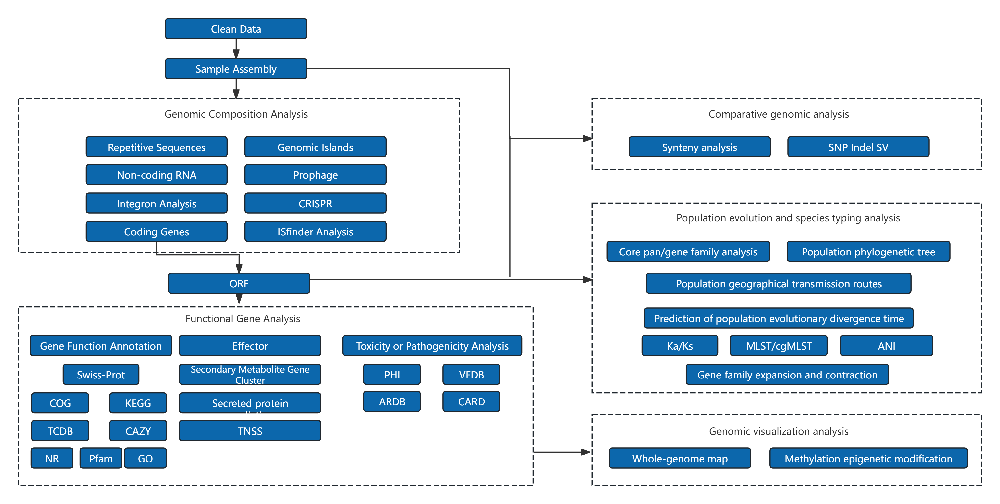

```{r setup, include=FALSE}
# set global chunk options
library(knitr)

# description of echo
opts_chunk$set(echo=FALSE)

# description of warning
opts_chunk$set(warning=FALSE)

# description of message
opts_chunk$set(message=FALSE)

# description of include
#opts_chunk$set(include=FALSE)

# description of cache
#opts_chunk$set(cache=TRUE)
```


```{r echo=FALSE}
library(knitr)
data <- read.delim('file/project_info.xls',sep='\t',header=T)
kable(data, table.attr = "class=\"nowrap\"","html") %>%
kable_styling(bootstrap_options=c("striped","hover","condensed"))
```


# overview of the workflow
##Experimental procedure


<p class='mark'>Figure 1-1: Project workflow</p>


### Library Construction, Quality Control and Sequencing
&emsp;&emsp;Large-fragment DNA was size-selected using the BluePippin automated nucleic acid fragment recovery system. End-repair was performed, followed by PCR-free barcode ligation using the EXP-NBD114.24 kit (Oxford Nanopore Technologies). Fragment size distribution was verified using the AATI automated capillary electrophoresis system. Samples were then pooled at equimolar ratios. Adapter ligation was conducted using the SQK-LSK114 Ligation Sequencing Kit (Oxford Nanopore Technologies) to construct 1D libraries. Sequencing was then performed on the Oxford Nanopore PromethION platform.


## Bioinformatics Analysis Workflow



<p class='mark'>Figure 1-2: Bioinformatics analysis workflow diagram</p>

Information analysis consists of several steps:
&emsp;&emsp;1. Raw data processing: This step filters out reads with low sequencing quality values, retains high-quality reads, and the filtered data is called Clean Data;

&emsp;&emsp;2. Sample assembly: Perform genome assembly to obtain sequence files that can reflect the sample genome;

&emsp;&emsp;3. Genomic composition analysis: After assembly, analyze the components of the sample genome, including the prediction of gene components such as coding genes, non-coding RNAs, repetitive sequences, prophages, genomic islands, and CRISPR;

&emsp;&emsp;4. Functional annotation: Conduct functional annotation of coding gene sequences in different databases, including commonly used KEGG, COG databases, and databases for pathogenic microorganisms;

&emsp;&emsp;5. Genome comparative analysis: This step compares the differences between the sample and the reference genome at both the genome and gene levels, including collinearity analysis, gene family construction, analysis of core/dispensable genes, and construction of species phylogenetic trees;

&emsp;&emsp;6. Genome visualization analysis: Combine the results of genome  component analysis and functional annotation to display the basic  research results of the genome.

&emsp;&emsp;Note: This analysis flow chart includes all analysis contents of the product. The blue dashed part in the chart is the advanced analysis content, and the specific analysis content of this project shall be subject to this report.


<h6 style="text-align:right">北京诺禾致源科技股份有限公司</h6>
<hr/>
</p>


# Results Presentation and Explanation

## Data overview

***

&emsp;&emsp;Raw sequencing data generated from the Nanopore PromethION platform were initially in FAST5 format. Basecalling was performed using Guppy (v6.4.2) to convert FAST5 files into FASTQ format. Demultiplexing was then conducted according to sample-specific barcodes to obtain raw data for each individual sample. The raw data of each sample were subjected to statistical analysis using NanoPlot (https://github.com/wdecoster/NanoPlot, version: 1.29.1). Detailed statistical information is shown in the table below:


<p class='mark'>Table 2-1 Sequencing Data Statistics</p>

```{r echo=FALSE}
library(DT)
data <- read.delim('file/01.Cleandata/all.Cleandata.stat.xls',sep='\t',header=T)
datatable(data,rownames=FALSE,extensions=c('KeyTable','Buttons','FixedColumns'),options=list(keys=T,scrollX=T,dom = 'Bfrtip',buttons = list('copy', 'print', list(extend = 'collection',buttons = c('csv', 'excel', 'pdf'),text = 'Download')),initComplete = JS("function(settings, json) {","$(this.api().table().header()).css({'background-color':'#4682B4','color': 'white'});","}")),class='nowrap')
```

- **Sample ID**：Sample name
- **Number of Reads**：Number of reads
- **Total Bases(bp)**：Total Bases
- **Mean Read Length(bp)**：Mean Read Length
- **N50 Read Length(bp)**：The read length at which 50% of the bases are in reads longer than, or equal to, this value
- **Mean Read quality**：Mean Read quality.

&emsp;&emsp;Result File Directory：Result/00.Rawdata。

&emsp;&emsp;

NanoPlot software was used to perform statistics on the data with quality threshold，The statistical information is shown in the table below:

```{r echo=FALSE}
library(DT)
data <- read.delim('file/01.Cleandata/pass.clean_data.xls',sep='\t',header=T)
datatable(data,rownames=FALSE,extensions=c('KeyTable','Buttons','FixedColumns'),options=list(keys=T,scrollX=T,dom = 'Bfrtip',buttons = list('copy', 'print', list(extend = 'collection',buttons = c('csv', 'excel', 'pdf'),text = 'Download')),initComplete = JS("function(settings, json) {","$(this.api().table().header()).css({'background-color':'#4682B4','color': 'white'});","}")),class='nowrap')
```

<p class='mark'>Table 2-2: Statistics of Sequencing Quality Control Data</p>

- **Sample ID**：Sample name
- **Number of Reads**：Number of reads
- **Total Bases(bp)**：Total Bases
- **Mean Read Length(bp)**：Mean Read Length
- **N50 Read Length(bp)**：The read length at which 50% of the bases are in reads longer than, or equal to, this value
- **Mean Read quality**：Mean Read quality.

&emsp;&emsp;The length distribution of Polymerase Read is shown in the following graph:

```{r echo=FALSE}
library(stringr)
library(bsselectR)
state_plots <- paste0(list.files("file/01.Cleandata/","*HistogramReadlength.png",full.names=TRUE))
names(state_plots) <- str_replace_all(state_plots,c("\\HistogramReadlength.png"="","file/01.Cleandata//"=""))
bsselect(state_plots,type="img",height='40%',width='60%',live_search=TRUE,show_tick=TRUE,style='btn-info')
```

<p class='mark'>Figure 2-1 shows the length distribution graph of reads: the x-axis represents the length, and the y-axis represents the number of reads (with the position of N50 indicated on the graph).）</p>
&emsp;&emsp;Result File Directory：Result/01.Clean_data。

<p>
<br/>

<h6 style="text-align:right">北京诺禾致源科技股份有限公司</h6>
<hr/>
</p>


## Genomic Overview

### Assembly analysis

***

&emsp;&emsp;Starting from the valid data after quality control of each sample, the Unicycler software (https://github.com/rrwick/Unicycler, version: 0.4.8)[6] was used to perform genome assembly with second-generation and third-generation data. Chromosomal and plasmid sequences were screened, and the chromosomal sequence was assembled into a circular genome (or a linear genome sequence if it is a linear genome), i.e., the final 0-gap complete graph sequence. The assembly results are shown in the following table:


<p class='mark'>Table 2-3 Statistics of sample genome assembly results</p>

```{r echo=FALSE}
library(DT)
data <- read.delim('file/02.Assembly/all.assembly.stat.xls',sep='\t',header=T)
datatable(data,rownames=FALSE,extensions=c('KeyTable','Buttons','FixedColumns'),options=list(keys=T,scrollX=T,dom = 'Bfrtip',buttons = list('copy', 'print', list(extend = 'collection',buttons = c('csv', 'excel', 'pdf'),text = 'Download')),initComplete = JS("function(settings, json) {","$(this.api().table().header()).css({'background-color':'#4682B4','color': 'white'});","}")),class='nowrap')
```

- **<font face="Arial">Sample ID</font>**：Sample name
- **<font face="Arial">Type</font>**：Type of assembly result
- **<font face="Arial">Contig ID</font>**：Contig number obtained from the assembly
- **<font face="Arial">Size(bp)</font>**：Size of the assembled sequence
- **<font face="Arial">GC%</font>**：GC content of the assembled contig
- **<font face="Arial">Circular</font>**:Whether the sequence is circularized.

###Plasmid Sequence Alignment
***
&emsp;&emsp;The assembled plasmid sequences were compared with the plasmid database, and the alignment results were analyzed. The statistics of the top 5 alignment results ranked by total score are as follows:

<p class='mark'>Table 2-4 Statistics of TOP 5 alignment results of sample plasmid sequences</p>

```{r echo=FALSE}
library(DT)
data <- read.delim('file/02.Assembly/all.plassmid.blast.stat.xls',sep='\t',header=T)
datatable(data,rownames=FALSE,extensions=c('KeyTable','Buttons','FixedColumns'),options=list(keys=T,scrollX=T,dom = 'Bfrtip',buttons = list('copy', 'print', list(extend = 'collection',buttons = c('csv', 'excel', 'pdf'),text = 'Download')),initComplete = JS("function(settings, json) {","$(this.api().table().header()).css({'background-color':'#4682B4','color': 'white'});","}")),class='nowrap')
```

- **<font face="Arial">Sample ID</font>**：Sample name
- **<font face="Arial">query_id</font>**：Sample plasmid ID
- **<font face="Arial">query_len</font>**：Plasmid length
- **<font face="Arial">subject_id</font>**：ID identification of the aligned target sequence
- **<font face="Arial">subject_len</font>**：Length of the subject sequence
- **<font face="Arial">max_score</font>**：The highest alignment score between the plasmid sequence and the aligned database plasmid sequence
- **<font face="Arial">total_score</font>**：Total alignment score
- **<font face="Arial">query_cover</font>**：Alignment coverage (percentage of aligned fragments to the plasmid sequence)
- **<font face="Arial">E_value</font>**：Expected value of the alignment result
- **<font face="Arial">identity</font>**：Percentage of sequence alignment consistency
- **<font face="Arial">descroption</font>**：Description information of the plasmid aligned to the database

&emsp;&emsp;Note: When the query cover value is less than 50%, the credibility of the sample plasmid alignment to the corresponding plasmid in NCBI is low.

&emsp;&emsp;Result File Directory：Result/02.Assembly/。

<p>
<br/>

<h6 style="text-align:right">北京诺禾致源科技股份有限公司</h6>
<hr/>
</p>


## Genomic Composition Analysis

&emsp;&emsp;The functional regions contained in microbial genomes are extremely rich. In addition to coding gene regions, there are also non-coding regions that perform functions such as transcriptional regulation, post-transcriptional regulation, translational regulation, and epigenetic regulation. Some functional regions are also related to the diversity of species evolution. 

&emsp;&emsp;Through various methods, predictions of coding genes, repetitive sequences, non-coding RNAs, etc. are carried out to obtain the composition of the target genome.


### Coding Genes
&emsp;&emsp;The GeneMarkS (Version 4.17) (http://topaz.gatech.edu/GeneMark/) software was used to predict coding genes in the newly sequenced genome. The statistical information of the gene prediction results is shown in the following table:


<p class='mark'>Table 2-5 Statistical table of predicted coding genes</p>

```{r echo=FALSE}
library(DT)
data <- read.delim('file/03.Genome_Component/gene.xls',sep='\t',header=T)
datatable(data,rownames=FALSE,extensions=c('KeyTable','Buttons','FixedColumns'),options=list(keys=T,scrollX=T,dom = 'Bfrtip',buttons = list('copy', 'print', list(extend = 'collection',buttons = c('csv', 'excel', 'pdf'),text = 'Download')),initComplete = JS("function(settings, json) {","$(this.api().table().header()).css({'background-color':'#4682B4','color': 'white'});","}")),class='nowrap')
```

- **Sample ID**: Sample name
- **Genome size**: Total length of the genome
- **Gene number**: Number of predicted coding genes
- **Gene total length**: Total length of all coding genes
- **Gene average length**: Average length of coding genes
- **Gene length / Genome**: Percentage of coding region length in the whole genome

&emsp;&emsp;The gene length distribution plot is shown below:

```{r echo=FALSE}
library(stringr)
library(bsselectR)
state_plots <- paste0(list.files("file/03.Genome_Component/","*.cds.png",full.names=TRUE))
names(state_plots) <- str_replace_all(state_plots,c("\\.cds.png"="","file/03.Genome_Component//"=""))
bsselect(state_plots,type="img",height='40%',width='60%',live_search=TRUE,show_tick=TRUE,style='btn-info')
```

<p class='mark'>Figure 2-3 Gene length distribution plot</p>
<p class='mark'>Note: The x-axis represents the gene length, and the y-axis represents the corresponding number of genes.</p>
&emsp;&emsp;Result file directory: Result/03.Genome_Component/*/Gene/

### Repetitive Sequences
&emsp;&emsp;Repetitive sequences are identical or complementary fragments present at different positions in the genome and are components of gene regulatory networks. According to the distribution of repetitive sequences in the genome, they are divided into interspersed repetitive sequences and tandem repetitive sequences.

&emsp;&emsp;Interspersed repetitive sequences are further divided into Short Interspersed Nuclear Elements (SINEs) and Long Interspersed Nuclear Elements (LINEs). Among them, Long Interspersed Nuclear Elements often have transposon activity. Tandem Repeats (TRs) refer to repetitive sequences where specific nucleic acid sequence patterns are adjacent and repeated two or more times. They are divided into Minisatellite DNA and Microsatellite DNA. Tandem repeat units have species-specific composition and can be used as genetic traits of species for studying evolutionary relationships.

&emsp;&emsp;The RepeatMasker software (Version open-4.0.5) was used to predict interspersed repetitive sequences, and TRF (Tandem Repeats Finder, Version 4.07b)[11] was used to search for tandem repetitive sequences in DNA sequences. The prediction results are shown in the following table:


<p class='mark'>Table 2-6 Statistics of interspersed repeat elements</p>

```{r echo=FALSE}
library(DT)
data <- read.delim('file/03.Genome_Component/rep.xls',sep='\t',header=T)
datatable(data,rownames=FALSE,extensions=c('KeyTable','Buttons','FixedColumns'),options=list(keys=T,scrollX=T,dom = 'Bfrtip',buttons = list('copy', 'print', list(extend = 'collection',buttons = c('csv', 'excel', 'pdf'),text = 'Download')),initComplete = JS("function(settings, json) {","$(this.api().table().header()).css({'background-color':'#4682B4','color': 'white'});","}")),class='nowrap')
```

- **Sample ID**: Sample name
- **Type**: Type of interspersed repeats
- **Number (#)**: Number of repeats
- **Total Length (bp)**: Total length of repeats
- **In genome (%)**: Percentage of the genome occupied by repeats
- **Average length (bp)**: Average length of repeats
- **LTR**: Long terminal repeats
- **DNA**: DNA transposons
- **LINE**: Long interspersed nuclear elements
- **SINE**: Short interspersed nuclear elements
- **RC**: Rolling-circle 

<p class='mark'>Table 2-7 Statistics of tandem repeats results</p>

```{r echo=FALSE}
library(DT)
data <- read.delim('file/03.Genome_Component/TR.xls',sep='\t',header=T)
datatable(data,rownames=FALSE,extensions=c('KeyTable','Buttons','FixedColumns'),options=list(keys=T,scrollX=T,dom = 'Bfrtip',buttons = list('copy', 'print', list(extend = 'collection',buttons = c('csv', 'excel', 'pdf'),text = 'Download')),initComplete = JS("function(settings, json) {","$(this.api().table().header()).css({'background-color':'#4682B4','color': 'white'});","}")),class='nowrap')
```

- **Sample ID**: Sample name
- **Type**: Type of tandem repeats
- **Number (#)**: Number of repeats
- **Repeat Size (bp)**: Range of repeat sizes
- **Total Length (bp)**: Total length of repeats
- **In genome (%)**: Percentage of the genome occupied by repeats
- **TR**: Tandem repeats
- **Minisatellite DNA**: Minisatellite DNA
- **Microsatellite DNA**: Microsatellite DNA

 &emsp;&emsp;Result file directory: Result/03.Genome_Component/*/Repeat/


### Non-coding RNA
&emsp;&emsp;Non-coding RNAs (ncRNAs) are a class of RNA molecules that perform various biological functions. They do not carry information for translation into proteins and act directly at the RNA level in life activities. For microorganisms, the commonly studied ones include sRNA, rRNA, and tRNA: 

&emsp;&emsp;tRNA: tRNA was predicted using the tRNAscan-SE software (Version 2.0.9).

&emsp;&emsp;rRNA: namely ribosomal RNA, which is highly conserved among related species. There are two methods for rRNA prediction. One is to find rRNA by comparing with the rRNA library of closely related reference sequences, and the other is to predict rRNA using the rRNAmmer software [13] (Version 1.2).

&emsp;&emsp;sRNA:  small RNA. First, a BLAST against the Rfam database [14][15] was  performed for annotation, and then the cmsearch program (Version 1.1rc4)  (with default parameters) was used to determine the final sRNA.


<p class='mark'>Table 2-8 Statistical results of ncRNA after de-replication</p>

```{r echo=FALSE}
library(DT)
data <- read.delim('file/03.Genome_Component/ncRNA.xls',sep='\t',header=T)
datatable(data,rownames=FALSE,extensions=c('KeyTable','Buttons','FixedColumns'),options=list(keys=T,scrollX=T,dom = 'Bfrtip',buttons = list('copy', 'print', list(extend = 'collection',buttons = c('csv', 'excel', 'pdf'),text = 'Download')),initComplete = JS("function(settings, json) {","$(this.api().table().header()).css({'background-color':'#4682B4','color': 'white'});","}")),class='nowrap')
```

- **Sample ID**: Sample name
- **Type**: Types of ncRNA
- **Number (#)**: Number of ncRNAs
- **Average length (bp)**: Average length of ncRNAs
- **Total length (bp)**: Total length of ncRNAs

&emsp;&emsp;Result file directory: Result/03.Genome_Component/*/ncRNA/

### Genomic Islands（GIs）
&emsp;&emsp;Genomic Islands (GIs) are genomic segments in some bacteria, phages, or plasmids that are integrated into the microbial genome through horizontal gene transfer. A genomic island can be related to various biological functions such as pathogenic mechanisms and organismal adaptability. Comparative genomic analysis methods can be used to study the specificity and functional origin of special functions in microorganisms.
&emsp;&emsp;Based on sequence composition, the IslandPath-DIOMB software [16] (Version 0.2) was used to predict genomic islands. It identifies genomic islands and potential horizontal gene transfers by detecting dinucleotide bias (phylogenetically bias) and mobility genes (such as transposases or integrases) in the sequence. The statistical results are shown in the following table:


<p class='mark'>Table 2-9 Genomic island prediction statistics</p>


```{r echo=FALSE}
library(DT)
data <- read.delim('file/03.Genome_Component/GIs.xls',sep='\t',header=T)
datatable(data,rownames=FALSE,extensions=c('KeyTable','Buttons','FixedColumns'),options=list(keys=T,scrollX=T,dom = 'Bfrtip',buttons = list('copy', 'print', list(extend = 'collection',buttons = c('csv', 'excel', 'pdf'),text = 'Download')),initComplete = JS("function(settings, json) {","$(this.api().table().header()).css({'background-color':'#4682B4','color': 'white'});","}")),class='nowrap')
```

- **Sample ID**: Sample name
- **GIs number**: Number of GIs
- **GIs total length (bp)**: Total Length of GIs
- **GIs Average length (bp)**: Average Length of GIs

&emsp;&emsp;Genomic island gene distribution statistics are as follows:


```{r echo=FALSE}
library(stringr)
library(bsselectR)
state_plots <- paste0(list.files("file/03.Genome_Component/","*.GI.png",full.names=TRUE))
names(state_plots) <- str_replace_all(state_plots,c("\\.GI.png"="","file/03.Genome_Component//"=""))
bsselect(state_plots,type="img",height='40%',width='60%',live_search=TRUE,show_tick=TRUE,style='btn-info')
```

<p class='mark'>Figure 2-4 Genomic island gene distribution statistics</p>
<p class='mark'>Note: The x-axis represents the length scale (showing genomic islands with lengths smaller than 15kb).</p>


&emsp;&emsp;Result file directory: Result/03.Genome_Component/*/Genomic_Island/

### Prophages
&emsp;&emsp;The nucleic acid of temperate phages integrated into the host genome is called a prophage, which can replicate synchronously with the host bacterial DNA or be passed on through cell division. The presence of prophage sequences may enable some bacteria to acquire antibiotic resistance, enhance environmental adaptability, improve adhesiveness, or become pathogenic bacteria.
&emsp;&emsp;The phiSpy software [17] (Version 2.3) was used to predict prophages in the sample genome, and the prediction results are shown in Table 2-10:


<p class='mark'>Table 2-10 Prophage prediction result statistics</p>


```{r echo=FALSE}
library(DT)
data <- read.delim('file/03.Genome_Component/Prophage.xls',sep='\t',header=T)
datatable(data,rownames=FALSE,extensions=c('KeyTable','Buttons','FixedColumns'),options=list(keys=T,scrollX=T,dom = 'Bfrtip',buttons = list('copy', 'print', list(extend = 'collection',buttons = c('csv', 'excel', 'pdf'),text = 'Download')),initComplete = JS("function(settings, json) {","$(this.api().table().header()).css({'background-color':'#4682B4','color': 'white'});","}")),class='nowrap')
```

- **Sample ID**: Sample name
- **Prophage_Num**: Number of prophages
- **Total_length**: Total length of prophages
- **Average_length**: Average length of prophages


&emsp;&emsp;Result file directory: Result/03.Genome_Component/*/Prophage/

### CRISPR
&emsp;&emsp;CRISPR (Clustered Regularly Interspaced Short Palindromic Repeat Sequences) are short repetitive sequences homologous to phages or plasmids. They confer resistance to phages by acting on foreign homologous DNA and are part of the prokaryotic immune system.
&emsp;&emsp;The front end of CRISPR contains CRISPR-associated genes (Cas genes), which combine with CRISPR to perform immune functions, such as CRISPR/Cas9. The study of CRISPR can help analyze functional differences among different strains, especially in terms of environmental adaptability and strain pathogenicity.
&emsp;&emsp;CRISPRdigger [18] (Version 1.0) was used to predict CRISPR in the sample genome, and the statistical results of the prediction are shown in the following table:


<p class='mark'>Table 2-11 CRISPR prediction result statistics</p>


```{r echo=FALSE}
library(DT)
data <- read.delim('file/03.Genome_Component/CRISPR.xls',sep='\t',header=T)
datatable(data,rownames=FALSE,extensions=c('KeyTable','Buttons','FixedColumns'),options=list(keys=T,scrollX=T,dom = 'Bfrtip',buttons = list('copy', 'print', list(extend = 'collection',buttons = c('csv', 'excel', 'pdf'),text = 'Download')),initComplete = JS("function(settings, json) {","$(this.api().table().header()).css({'background-color':'#4682B4','color': 'white'});","}")),class='nowrap')
```

- **Sample ID**: Sample name
- **CRISPR_Num number**: Predicted total number of CRISPRs 
- **Total_length**: Total length of CRISPRs
- **Average_length**: Average length of CRISPRs 


&emsp;&emsp;Result file directory: Result/03.Genome_Component/*/CRISPR/

### ISfinder Analysis

&emsp;&emsp;IS (Insertion Sequence) refers to relatively short and compact DNA fragments (ranging from 0.7 to 2.5 kb). They only encode functions related to mobility and are a major group of mobile genetic elements (MGEs). The ISfinder database (https://www-is.biotoul.fr/) was used to predict bacterial insertion sequences.

&emsp;&emsp;The Blast software was employed to align the assembled sequences with the ISfinder database, and the prediction results of insertion sequences were obtained.

&emsp;&emsp;Result file directory: Result/03.Genome_Component/*/ISfinder/


###Integron Analysis

&emsp;&emsp;Integron is a mobile DNA molecule with a unique structure that can capture and integrate exogenous genes, converting them into functional gene expression units. It enables the horizontal transmission of multiple drug resistance genes among bacteria through transposons or conjugative plasmids. Integrons exist in many bacteria, localized on chromosomes, plasmids, or transposons. They are an inherent genetic unit of bacteria and enhance the adaptability of bacteria for survival by capturing exogenous genes. The INTEGRALL database (http://integrall.bio.ua.pt/) was used to predict integrons in the genome.
&emsp;&emsp;The Blast software was used to align the assembled sequences with the INTEGRALL database, and the integron prediction results were obtained.
&emsp;&emsp;Result file directory: Result/03.Genome_Component/*/Integron/


<p>
<br/>

<h6 style="text-align:right">Novogene Co., Ltd.</h6>
<hr/>
</p>

## Functional Gene Analysis

### Effector

#### Secreted protein prediction
&emsp;&emsp;Secreted proteins refer to proteins that are synthesized intracellularly and then secreted outside the cell through the cell membrane under the guidance of signal peptides to function. Many of the secreted proteins are important enzymes required for life activities. The N-terminus of a secreted protein is a signal peptide composed of 15-30 amino acids, which plays a leading role in the secretion of the secreted protein.
&emsp;&emsp;The SignalP [27] (Version 4.1) and TMHMM (Version 2.0c) tools were used for prediction to detect the presence of signal peptides and transmembrane structures, and comprehensively predict whether the protein sequence is a secreted protein.

<p class='mark'>Table 2-12 Secreted protein identification statistics</p>


```{r echo=FALSE}
library(DT)
data <- read.delim('file/04.Genome_Function/SP.xls',sep='\t',header=T)
datatable(data,rownames=FALSE,extensions=c('KeyTable','Buttons','FixedColumns'),options=list(keys=T,scrollX=T,dom = 'Bfrtip',buttons = list('copy', 'print', list(extend = 'collection',buttons = c('csv', 'excel', 'pdf'),text = 'Download')),initComplete = JS("function(settings, json) {","$(this.api().table().header()).css({'background-color':'#4682B4','color': 'white'});","}")),class='nowrap')
```

- **Sample ID**: Sample name
- **SignalP Protein**: Number of proteins with signal peptide structures
- **TMHMM Protein**: Number of proteins with transmembrane domains
- **Secretory Protein**: Number of predicted secretory proteins

&emsp;&emsp;Result file directory: Result/04.Genome_Function/*/Effector/Secretory_Protein/

#### Secretion Systems and T3SS Effector Prediction

&emsp;&emsp;Pathogenic bacteria secrete effector proteins into the extracellular environment or host cells through the type N secretion systems (TNSS, currently 7 types identified: Type I-VII). These proteins induce pathological responses by regulating immune responses and cell death. Among them, the Type III secretion system (T3SS) of Gram-negative bacteria is widely studied at the molecular level to investigate pathogenic mechanisms, infection processes, and virulence factors.
&emsp;&emsp;For the TNSS system, proteins related to secretion systems were annotated by extracting relevant entries from functional protein databases. Additionally, for Gram-negative bacteria, the EffectiveT3 software [28] (Version 1.0.1) was used to predict T3SS effector proteins.
&emsp;&emsp;The Type VI secretion system (T6SS) is a newly discovered, widely distributed secretion system with complex structures and diverse functions. T6SS plays crucial roles in bacterial pathogenesis, environmental adaptation, and inter-bacterial competition. The T6SS was predicted using the t6ss_finder.py tool from the SecReT6 v3.0 database (https://bioinfo-mml.sjtu.edu.cn/SecReT6/index.php).


<p class='mark'>Table 2-13 TNSS results statistics</p>

```{r echo=FALSE}
library(DT)
data <- read.delim('file/04.Genome_Function/TNSS.xls',sep='\t',header=T)
datatable(data,rownames=FALSE,extensions=c('KeyTable','Buttons','FixedColumns'),options=list(keys=T,scrollX=T,dom = 'Bfrtip',buttons = list('copy', 'print', list(extend = 'collection',buttons = c('csv', 'excel', 'pdf'),text = 'Download')),initComplete = JS("function(settings, json) {","$(this.api().table().header()).css({'background-color':'#4682B4','color': 'white'});","}")),class='nowrap')
```

- **Sample ID**: Sample name
- **Total_Gene_Num**: Total number of encoding genes
- **TNSS**: Number of proteins predicted as type I to VII secretion system effector proteins

Result file directory: Result/04.Genome_Function/*/Effector/TNSS/

<p class='mark'>Table 2-14 Statistical results of T3SS secretion system protein predictions</p>
```{r echo=FALSE}
library(DT)
data <- read.delim('file/04.Genome_Function/T3SS.xls',sep='\t',header=T)
datatable(data,rownames=FALSE,extensions=c('KeyTable','Buttons','FixedColumns'),options=list(keys=T,scrollX=T,dom = 'Bfrtip',buttons = list('copy', 'print', list(extend = 'collection',buttons = c('csv', 'excel', 'pdf'),text = 'Download')),initComplete = JS("function(settings, json) {","$(this.api().table().header()).css({'background-color':'#4682B4','color': 'white'});","}")),class='nowrap')
```

- **Sample ID**: Sample name
- **Total Protein**: Total number of encoding genes
- **T3SS effective true**: Number of proteins predicted as T3SS effector proteins
- **T3SS effective false**: Number of proteins predicted as non-T3SS effector proteins

Result file directory: Result/04.Genome_Function/*/Effector/T3SS/

<p class='mark'>Table 2-15 T6SS effector protein prediction statistics</p>
```{r echo=FALSE}
library(DT)
data <- read.delim('file/04.Genome_Function/T6SS.xls',sep='\t',header=T)
datatable(data,rownames=FALSE,extensions=c('KeyTable','Buttons','FixedColumns'),options=list(keys=T,scrollX=T,dom = 'Bfrtip',buttons = list('copy', 'print', list(extend = 'collection',buttons = c('csv', 'excel', 'pdf'),text = 'Download')),initComplete = JS("function(settings, json) {","$(this.api().table().header()).css({'background-color':'#4682B4','color': 'white'});","}")),class='nowrap')
```

- **Sample**: Sample name
- **Contig**: Contig ID
- **Coordinates**: Genomic location of the target amino acid sequence
- **Strand**: Orientation of the target sequence (+/−)
- **Length**: Length of the target sequence (amino acids)
- **PID**: Unique identifier in the reference database
- **Locus_tag**: Locus tag of the target sequence
- **Product**: Functional description of the protein
- **T6CP_ID**: T6CP identifier in the reference database
- **Identities (%)**: Percentage identity from sequence alignment
- **E-value**: Expectation value from sequence alignment
- **Bit_score**: Alignment bit score
- **Description**: Additional annotation information


#### Secondary Metabolite Gene Cluster Analysis
&emsp;&emsp;Secondary metabolites are substances synthesized by microorganisms at a certain growth stage using primary metabolites as precursors. They have no clear function in the life activities of microorganisms and are not essential for growth and reproduction. The antiSMASH program [29] (version 4.0.2) was used to predict secondary metabolites in the genome.
&emsp;&emsp;PKS can be divided into three types: Type I, also known as modular PKS, is a multifunctional enzyme complex composed of multiple domains. Type II, also known as aromatic PKS, mainly synthesizes aromatic compounds. Type III is also known as chalcone-type PKS. The antiSMASH-4.0.2 program was used to predict PKS in the genome, and the statistical results of the prediction are shown in the following table:


<p class='mark'>Table 2-16 Statistics of secondary metabolite gene clusters and gene numbers</p>


```{r echo=FALSE}
library(DT)
data <- read.delim('file/04.Genome_Function/sm.xls',sep='\t',header=T)
datatable(data,rownames=FALSE,extensions=c('KeyTable','Buttons','FixedColumns'),options=list(keys=T,scrollX=T,dom = 'Bfrtip',buttons = list('copy', 'print', list(extend = 'collection',buttons = c('csv', 'excel', 'pdf'),text = 'Download')),initComplete = JS("function(settings, json) {","$(this.api().table().header()).css({'background-color':'#4682B4','color': 'white'});","}")),class='nowrap')
```

- **Sample ID**: Sample name
- **cluster**: Gene cluster name
- **Clusters number**: Number of gene clusters
- **Gene number**: Number of genes in the gene cluster

```{r echo=FALSE}
library(stringr)
library(bsselectR)
state_plots <- paste0(list.files("file/04.Genome_Function/","*.cluster_num.png",full.names=TRUE))
names(state_plots) <- str_replace_all(state_plots,c("\\.cluster_num.png"="","file/04.Genome_Function//"=""))
bsselect(state_plots,type="img",height='40%',width='60%',live_search=TRUE,show_tick=TRUE,style='btn-info')
```

<p class='mark'>Figure 2-5 Statistics of sample gene clusters and corresponding gene numbers</p>
&emsp;&emsp;Result file directory: Result/04.Genome_Function/*/Effector/Secondary_Metabolism/


### Gene Function Annotation
&emsp;&emsp;Currently, the commonly used functional databases for annotation include NR, GO, KEGG, COG, TCDB, CAZY, Pfam, and Swiss-Prot.

&emsp;&emsp;The basic steps of functional annotation are as follows:

&emsp;&emsp;1) Use the Diamond tool to compare the predicted gene protein sequences with various functional databases (evalue ≤ 1e-5);

&emsp;&emsp;2) Filter the comparison results: For each sequence's comparison: results, select the comparison result with the highest score (defaultidentity>=40%，coverage>=40%) for annotation.

#### NR Annotation
&emsp;&emsp;NR, whose full name is Non-Redundant Protein Database [23], is a non-redundant protein database created and maintained by NCBI. It is characterized by comprehensive content, and the annotation results include species information, which can be used for species classification. According to the species information annotated by the genes, the annotated species and the number of genes were counted, and the statistical results are shown in the following figure:


```{r echo=FALSE}
library(stringr)
library(bsselectR)
state_plots <- paste0(list.files("file/04.Genome_Function/","*.nr.anno.png",full.names=TRUE))
names(state_plots) <- str_replace_all(state_plots,c("\\.nr.anno.png"="","file/04.Genome_Function//"=""))
bsselect(state_plots,type="img",height='40%',width='60%',live_search=TRUE,show_tick=TRUE,style='btn-info')
```

<p class='mark'>Figure 2-6 Sample NR database species annotation statistics chart</p>
<p class='mark'>Note: The x-axis represents the species ID, and the y-axis represents the number of genes annotated.</p>
&emsp;&emsp;Result file directory: Result/04.Genome_Function/*/General_Gene_Annotation/NR/

#### GO Annotation
&emsp;&emsp;GO, whose full name is Gene Ontology [19], is an internationally standardized classification system for describing gene functions. GO is divided into three major categories: 1) Cellular Component: used to describe subcellular structures, locations, and macromolecular complexes, such as nucleoli, telomeres, and initiation recognition complexes; 2) Molecular Function: used to describe the functions of individual genes and gene products, such as carbohydrate binding or ATP hydrolase activity; 3) Biological Process: used to describe the biological processes in which gene-encoded products participate, such as mitosis or purine metabolism. The statistical results of the three major categories in the GO database are shown in the following figure:


```{r echo=FALSE}
library(stringr)
library(bsselectR)
state_plots <- paste0(list.files("file/04.Genome_Function/","*.go.png",full.names=TRUE))
names(state_plots) <- str_replace_all(state_plots,c("\\.go.png"="","file/04.Genome_Function//"=""))
bsselect(state_plots,type="img",height='40%',width='60%',live_search=TRUE,show_tick=TRUE,style='btn-info')
```

<p class='mark'>Figure 2-7 GO annotation classification</p>
<p class='mark'>Note: The x-axis represents the sub-terms of GO terms for the three main categories of GO, and the y-axis represents the number of genes annotated to this term (including the sub-terms of the term). The three different classifications represent the three fundamental classifications of GO terms (from left to right: biological process, cellular component, molecular function).</p>
&emsp;&emsp;Result file directory: Result/04.Genome_Function/*/General_Gene_Annotation/GO/

#### KEGG Annotation
&emsp;&emsp;KEGG, whose full name is Kyoto Encyclopedia of Genes and Genomes [20][21], is a database that systematically analyzes the metabolic pathways of gene products and compounds in cells, as well as the functions of these gene products. It integrates data on genomes, chemical molecules, biochemical systems, etc., including metabolic pathways (KEGG PATHWAY), drugs (KEGG DRUG), diseases (KEGG DISEASE), functional models (KEGG MODULE), gene sequences (KEGG GENES), and genomes (KEGG GENOME), among others. The KO (KEGG ORTHOLOG) system connects various KEGG annotation systems, and KEGG has established a complete KO annotation system that can complete the functional annotation of genomes or transcriptomes of newly sequenced species. For details, see http://www.genome.jp/kegg/.
&emsp;&emsp;The statistical chart of the number of annotated genes in the KEGG database is drawn as follows:


```{r echo=FALSE}
library(stringr)
library(bsselectR)
state_plots <- paste0(list.files("file/04.Genome_Function/","*kegg.functional_classification.png",full.names=TRUE))
names(state_plots) <- str_replace_all(state_plots,c("\\.kegg.functional_classification.png"="","file/04.Genome_Function//"=""))
bsselect(state_plots,type="img",height='40%',width='60%',live_search=TRUE,show_tick=TRUE,style='btn-info')
```

<p class='mark'>Figure 2-8 KEGG metabolic pathway classification</p>
&emsp;&emsp;Note: The numbers on the bar graph represent the number of annotated genes. The y-axis represents the codes of level 1 functional categories, with their explanations detailed in the corresponding legend. 

&emsp;&emsp;Result file directory: Result/04.Genome_Function/*/General_Gene_Annotation/KEGG/

#### COG Annotation
&emsp;&emsp;COG, whose full name is Cluster of Orthologous Groups of proteins [22], is a protein database created and maintained by NCBI. It is constructed based on the phylogenetic classification of encoded proteins from complete genomes of bacteria, algae, and eukaryotes. By means of alignment, a certain protein sequence can be annotated to a specific COG. Each COG cluster consists of orthologous sequences, thus enabling the inference of the function of the sequence. The COG database can be divided into 26 categories according to functions; for details, see http://www.ncbi.nlm.nih.gov/COG/.

&emsp;&emsp;The COG database is divided into 26 categories by function, and the statistical results are shown in the following figure:


```{r echo=FALSE}
library(stringr)
library(bsselectR)
state_plots <- paste0(list.files("file/04.Genome_Function/","*.cog.class.png",full.names=TRUE))
names(state_plots) <- str_replace_all(state_plots,c("\\.cog.class.png"="","file/04.Genome_Function//"=""))
bsselect(state_plots,type="img",height='40%',width='60%',live_search=TRUE,show_tick=TRUE,style='btn-info')
```

<p class='mark'>Figure 2-9 Annotation of KOG/COG database</p>
<p class='mark'>Note: The x-axis denotes the names of the twenty-six groups of KOG/COG, while the y-axis represents the proportion of genes annotated to each group compared to the total number of annotated genes.

&emsp;&emsp;Result file directory: Result/04.Genome_Function/*/General_Gene_Annotation/COG/

#### CAZy Annotation
&emsp;&emsp;CAZy [26], whose full name is Carbohydrate-Active enZYmes Database, is a professional database related to carbohydrate-active enzymes. It includes enzyme families that can catalyze the degradation, modification, and biosynthesis of carbohydrates. It consists of five main categories: Glycoside Hydrolases (GHs), GlycosylTransferases (GTs), Polysaccharide Lyases (PLs), Carbohydrate Esterases (CEs), and Auxiliary Activities (AAs). For details, see http://www.cazy.org/.

&emsp;&emsp;The classification annotation result statistical table and the count statistical chart of the CAZy database are shown as follows:


<p class='mark'>Table 2-17 CAZy annotation results</p>


```{r echo=FALSE}
library(DT)
data <- read.delim('file/04.Genome_Function/CAZy.xls',sep='\t',header=T)
datatable(data,rownames=FALSE,extensions=c('KeyTable','Buttons','FixedColumns'),options=list(keys=T,scrollX=T,dom = 'Bfrtip',buttons = list('copy', 'print', list(extend = 'collection',buttons = c('csv', 'excel', 'pdf'),text = 'Download')),initComplete = JS("function(settings, json) {","$(this.api().table().header()).css({'background-color':'#4682B4','color': 'white'});","}")),class='nowrap')
```

- **Sample ID**: Sample name
- **CBM**: Number of genes related to carbohydrate-binding modules (CBMs)
- **CE**: Number of genes related to carbohydrate esterases (CEs)
- **GH**: Number of genes related to glycoside hydrolases (GHs)
- **GT**: Number of genes related to glycosyl transferases (GTs)
- **PL**: Number of genes related to polysaccharide lyases (PLs)
- **AA**: Number of genes related to auxiliary activities (AAs)


```{r echo=FALSE}
library(stringr)
library(bsselectR)
state_plots <- paste0(list.files("file/04.Genome_Function/","*.single_CAZy_class.png",full.names=TRUE))
names(state_plots) <- str_replace_all(state_plots,c("\\.single_CAZy_class.png"="","file/04.Genome_Function//"=""))
bsselect(state_plots,type="img",height='40%',width='60%',live_search=TRUE,show_tick=TRUE,style='btn-info')
```
<p class='mark'>Figure 2-10 CAZy functional classification and gene count statistics</p>
<p class='mark'>Note: The x-axis represents CAZy database classification categories, and the y-axis indicates the number of annotated genes.</p>

&emsp;&emsp;Carbohydrate-binding domains are non-catalytic domains that can fold into specific three-dimensional structures and have the function of binding carbohydrates. Recent studies have shown that carbohydrate-binding domains can enhance the activity of the catalytic domains of carbohydrate-active enzymes on substrates by binding to the substrates of carbohydrate-active enzymes.

&emsp;&emsp;Result file directory: Result/04.Genome_Function/*/General_Gene_Annotation/CAZy/
												  

#### TCDB Annotation
&emsp;&emsp;TCDB, whose full name is Transporter Classification Database [24], is a classification database for transporter proteins and a classification system (TC system) for membrane transporters, including ion channels. The TCDB database's transport system is classified at 5 levels, and the statistical results of the first level are shown in the following figure:


```{r echo=FALSE}
library(stringr)
library(bsselectR)
state_plots <- paste0(list.files("file/04.Genome_Function/","*tcdb.class.catalog.png",full.names=TRUE))
names(state_plots) <- str_replace_all(state_plots,c("\\.tcdb.class.catalog.png"="","file/04.Genome_Function//"=""))
bsselect(state_plots,type="img",height='40%',width='60%',live_search=TRUE,show_tick=TRUE,style='btn-info')
```

<p class='mark'> Figure 2-11 Sample gene function annotation TCDB functional classification chart</p>
<p class='mark'> Note: X-axis (TCDB first-level classification types); Y-axis (number of annotated genes) </p>
&emsp;&emsp;Result file directory: Result/04.Genome_Function/*/General_Gene_Annotation/TCDB/


#### Pfam Annotation
&emsp;&emsp;Proteins are generally composed of one or more functional regions, which are usually called domains. Different combinations of domains result in different protein structures. Therefore, the identification of protein domains is particularly important for analyzing protein functions.

&emsp;&emsp;The Pfam database consists of two parts: Pfam-A and Pfam-B. Among them, Pfam-A has been manually screened and has high quality. For details, see http://pfam.xfam.org/.

&emsp;&emsp;Result file directory: Result/04.Genome_Function/*/General_Gene_Annotation/Pfam/


#### Swiss-Prot Annotation
&emsp;&emsp;Swiss-Prot [25] is a curated protein sequence database that provides a high level of annotation results, such as descriptions of a protein's function, its domain structure, post-translational modifications, variations, etc. For details, see http://www.ebi.ac.uk/uniprot/.

&emsp;&emsp;Result file directory: Result/04.Genome_Function/*/General_Gene_Annotation/Swiss-Prot/


### Toxicity or Pathogenicity Analysis
#### Pathogen Host Interactions (PHI) Annotation

&emsp;&emsp;PHI, whose full name is Pathogen Host Interactions Database [30], is a database of pathogen-host interactions. It mainly originates from fungal, oomycete, and bacterial pathogens, and the infected hosts include animals, plants, fungi, and insects. This database plays an important role in the research of finding target genes for drug intervention. At the same time, it also includes antifungal compounds and corresponding target genes. Each gene in the database contains nucleic acid and amino acid sequences, as well as a detailed description of the predicted protein function during host infection.

&emsp;&emsp;The statistical situation of the number of genes with different PHI phenotypic mutation types in pathogens is shown in the following figure:


```{r echo=FALSE}
library(stringr)
library(bsselectR)
state_plots <- paste0(list.files("file/04.Genome_Function/","*phi.class.png",full.names=TRUE))
names(state_plots) <- str_replace_all(state_plots,c("\\.phi.class.png"="","file/04.Genome_Function//"=""))
bsselect(state_plots,type="img",height='40%',width='60%',live_search=TRUE,show_tick=TRUE,style='btn-info')
```

<p class='mark'>Figure 2-12 Sample gene function annotation pathogen PHI phenotype mutation type distribution chart</p>
<p class='mark'>Note: The x-axis represents phenotype mutation types, and the y-axis represents the number of annotated genes.</p>

&emsp;&emsp;Result file directory: Result/04.Genome_Function/*/Pathogenicity/PHI/

#### Virulence Factors of Pathogenic Bacteria (VFDB) Annotation
&emsp;&emsp;VFDB database [31], whose full name is Virulence Factors of Pathogenic Bacteria, is a database specially used for studying the virulence factors of pathogenic bacteria, chlamydia and mycoplasma. In addition to collecting species information and basic characteristic descriptions of virulence genes, it also provides detailed descriptions of the functions of virulence genes and pathogenic mechanisms. As of November 2017, the pathogenic bacteria collected in this database include 74 genera, 1796 types of virulence factors, 926 related strains, and 30178 VF-related genes (non-redundant).

&emsp;&emsp;The Diamond software was used to align the amino acid sequences of the target species with the VFDB database, and the genes of the target species were combined with their corresponding virulence factor function annotation information to obtain the annotation results.

&emsp;&emsp;Result file directory: Result/04.Genome_Function/*/Pathogenicity/VFDB/
												  


#### Antibiotic Resistance Genes (ARDB, CARD) Annotation
&emsp;&emsp;ARDB database [32], whose full name is Antibiotic Resistance Genes Database, through the annotation of this database, information such as the names of antibiotic resistance-related genes and the types of antibiotics they resist can be found.

&emsp;&emsp;The Diamond software was used to align the amino acid sequences of the target species with the ARDB database, and the genes of the target species were combined with their corresponding drug resistance function annotation information to obtain the annotation results.

&emsp;&emsp;Result file directory：Result/04.Genome_Function/*/Pathogenicity/ARDB/

&emsp;&emsp;CARD database [33], whose full name is Comprehensive Antibiotic Research Database, is a newly emerged antibiotic resistance gene database in recent years. It has advantages such as comprehensive information, user-friendliness, and timely updates and maintenance. The core component of this database is the Antibiotic Resistance Ontology (ARO), which integrates information including sequences, antibiotic resistance, mechanisms of action, and associations between AROs. Through the annotation of this database, information such as the names of antibiotic resistance-related genes and the types of antibiotics they resist can be found.

&emsp;&emsp;The RGI (v5.1.0) software was used to align the amino acid sequences of the target species with the CARD database (v3.2.5), and the genes of the target species were combined with their corresponding drug resistance function annotation information to obtain the annotation results.

&emsp;&emsp;Result file directory:Result/04.Genome_Function/*/Pathogenicity/CARD/
																										  


<p>
<br/>

<h6 style="text-align:right">Novogene Co., Ltd.</h6>
<hr/>
</p>


## Genome Visualization Analysis

### Whole-Genome Circular Map

***
&emsp;&emsp;For the assembled genome sequence of the sequenced sample, combined with the prediction results of coding genes, the Circos software [38] was used to display the sample genome. If the analysis of non-coding RNA and gene function annotation was also carried out, the relevant analysis results would also be shown on the map. The whole-genome map is as follows:


```{r echo=FALSE}
library(stringr)
library(bsselectR)
state_plots <- paste0(list.files("file/05.Genome_Drawing/Chr/","*.Overview.png",full.names=TRUE))
names(state_plots) <- str_replace_all(state_plots,c("\\.Overview.png"="","file/05.Genome_Drawing/Chr//"=""))
bsselect(state_plots,type="img",height='40%',width='60%',live_search=TRUE,show_tick=TRUE,style='btn-info')
```

<p class='mark'>Figure 2-13 Whole-genome circular map</p>
<p class='mark'>Note: The outermost circle represents the genomic sequence position coordinates. From outer to inner, they are the results of gene function annotation (including COG (KOG) annotation results information based on the actual project situation), ncRNA, and genome GC content. The blue region inwards represents regions with GC content lower than the average GC content of the whole genome, while the red region outwards represents the opposite. The higher the peak, the greater the difference from the average GC content. The genome GC skew value: window size (chromosome length / 1000) bp, step size (chromosome length / 1000) bp. The specific algorithm is (G-C)/(G+C). The green region inwards represents regions with a lower G content than C, while the orange region outwards represents the opposite.</p>


&emsp;&emsp;Result file directory: Result/05.Genome_Drawing/Genome_Overview/

<p>
<br/>

<h6 style="text-align:right">Novogene Co., Ltd.</h6>
<hr/>
</p>


***
&emsp;&emsp;Plasmid circular diagram is shown as follows:

```{r echo=FALSE}
library(stringr)
library(bsselectR)
state_plots <- paste0(list.files("file/05.Genome_Drawing/Plas/","*.Overview.png",full.names=TRUE))
names(state_plots) <- str_replace_all(state_plots,c("\\.Overview.png"="","file/05.Genome_Drawing/Plas//"=""))
bsselect(state_plots,type="img",height='40%',width='60%',live_search=TRUE,show_tick=TRUE,style='btn-info')
```

<p class='mark'>Figure 2-14 Plasmid circular map</p>
<p class='mark'>Note: From outer to inner, the image consists of COG functional annotation classified genes (arrows represent the coding genes in the clockwise direction), genomic sequence position coordinates, genome GC content. The GC content is calculated with a window size of 500 bp and a step size of 20 bp. The blue region inwards represents regions with GC content lower than the average GC content of the whole genome, while the red region outwards represents the opposite. The higher the peak, the greater the difference from the average GC content. The genome GC skew value is calculated with a window size of 500 bp and a step size of 20 bp. The specific algorithm is (G-C)/(G+C). The green region inwards represents regions with a lower G content than C, while the orange region outwards represents the opposite.</p>

&emsp;&emsp;Result file directory: Result/05.Genome_Drawing/Genome_Overview/

# Method Description
&emsp;&emsp;The following is a default process method description. Please update it according to the actual situation

[Method Description](src/method_B_C_ONT.pdf)

[Information Analysis](src/analysis_method_ONT_B_C_EN.pdf)

[Result File Directory Explanation](src/Result_file_directory_ONT_EN.pdf)

[FAQ](src/FAQ_ONT_EN.pdf)

[Prediction Software and Database Version Explanation](src/Version_information_EN.html)

# References


- **[1] Li R, Zhu H, Ruan J, et al. De novo assembly of human genomes with massively parallel short read sequencing[J]. Genome research, 2010, 20(2): 265-272.**
- **[2] Li R, Li Y, Kristiansen K, et al. SOAP: short oligonucleotide alignment program[J]. Bioinformatics, 2008, 24(5): 713-714.**
- **[3] Bankevich A, Nurk S, Antipov D, et al. SPAdes: a new genome assembly algorithm and its applications to single-cell sequencing[J]. Journal of Computational Biology, 2012, 19(5): 455-477.**
- **[4] Simpson JT, Wong K, Jackman SD, et al. ABySS: a parallel assembler for short read sequence data.[J]. Genome Research, 2009, 19(6):1117.**
- **[5] Lin S H, Liao Y C. CISA: contig integrator for sequence assembly of bacterial genomes[J]. PloS one, 2013, 8(3): e60843.**
- **[6] Wick RR, Judd LM, Gorrie CL, Holt KE. Unicycler: Resolving bacterial genome assemblies from short and long sequencing reads.[J]. PLoS Computational Biology, 2017 Jun 8:13(6).**
- **[7] Reiner J, Pisani L, Qiao W, et al. Cytogenomic identification and long-read single molecule real-time (SMRT) sequencing of aBardet–Biedl Syndrome 9(BBS9) deletion:[J]. Npj Genomic Medicine, 2018, 3(1).**
- **[8] Besemer J, Lomsadze A, Borodovsky M. GeneMarkS: a self-training method for prediction of gene starts in microbial genomes. Implications for finding sequence motifs in regulatory regions[J]. Nucleic Acids Research, 2001, 29(12): 2607-2618.**
- **[9] Stanke, M, Diekhans, M, Baertsch, RHaussler, D. Using native and syntenically mapped cDNA alignments to improve de novo gene finding[J]. Bioinformatics, 2008, 24(5):637-644.**
- **[10] Saha S, Bridges S, Magbanua Z V, et al. Empirical comparison of ab initio repeat finding programs[J]. Nucleic acids research, 2008, 36(7): 2284-2294.**
- **[11] Benson G. Tandem repeats finder: a program to analyze DNA sequences[J]. Nucleic acids research, 1999, 27(2): 573.**
- **[12] Lowe T M, Eddy S R. tRNAscan-SE: a program for improved detection of transfer RNA genes in genomic sequence[J]. Nucleic acids research, 1997, 25(5): 0955-964.**
- **[13] Lagesen K, Hallin P, Rødland E A, et al. RNAmmer: consistent and rapid annotation of ribosomal RNA genes[J]. Nucleic acids research, 2007, 35(9): 3100-3108.**
- **[14] Gardner P P, Daub J, Tate J G, et al. Rfam: updates to the RNA families database[J]. Nucleic acids research, 2009, 37(suppl 1): D136-D140.**
- **[15] Nawrocki EP, Kolbe DL, Eddy SR: Infernal 1.0: inference of RNA alignments. Bioinformatics 2009, 25(10):1335-1337.**
- **[16] Hsiao W, Wan I, Jones S J, et al. IslandPath: aiding detection of genomic islands in prokaryotes[J]. Bioinformatics, 2003, 19(3): 418-420.**
- **[17]You Z, YJ Liang, Karlene L, et al. PHAST: A Fast Phage Search Tool Nucl. Acids Res, 2011 **
- **[18] Grissa I, Vergnaud G, Pourcel C. CRISPRFinder: a web tool to identify clustered regularly interspaced short palindromic repeats[J]. Nucleic acids research, 2007, 35(suppl 2): W52-W57.**
- **[19] Ashburner M, Ball C A, Blake J A, et al. Gene Ontology: tool for the unification of biology[J]. Nature genetics, 2000, 25(1): 25-29.**
- **[20] Kanehisa M, Goto S, Kawashima S, et al. The KEGG resource for deciphering the genome[J]. Nucleic acids research, 2004, 32(suppl 1): D277-D280.**
- **[21] Kanehisa M, Goto S, Hattori M, et al. From genomics to chemical genomics: new developments in KEGG[J]. Nucleic acids research, 2006, 34(suppl 1): D354-D357.**
- **[22] Galperin MY, Makarova KS, Wolf YI, et al. Expanded microbial genome coverage and improved protein family annotation in the COG database[J]. Nucleic Acids Research, 2015, 43(Database issue):261-9.**
- **[23] Li W, Jaroszewski L, Godzik A. Tolerating some redundancy significantly speeds up clustering of large protein databases[J]. Bioinformatics, 2002, 18(1): 77-82.**
- **[24] Milton SJ, Vamsee SR, Dorjee GT, et al. The Transporter Classification Database. Nucleic Acids Research, 2014 **
- **[25] Amos B, Rolf A. The SWISS-PROT protein sequence database and its supplement TrEMBL in 2000. Nucleic Acids Res. 2000, 28(1): 45-48.**
- **[26] Cantarel B L, Coutinho P M, Rancurel C, et al. The Carbohydrate-Active EnZymes database (CAZy): an expert resource for glycogenomics[J]. Nucleic acids research, 2009, 37(suppl 1): D233-D238.**
- **[27] Petersen T N, Brunak S, von Heijne G, et al. SignalP 4.0: discriminating signal peptides from transmembrane regions[J]. Nature methods. 2011, 8(10): 785-786.**
- **[28] Eichinger V, Nussbaumer T, Platzer A, et al. Effective DB-updates and novel features for a better annotation of bacterial secreted proteins and Type III, IV, VI secretion systems. 2016, Nucleic Acids Res. **
- **[29] Medema M H, Blin K, Cimermancic P, et al. antiSMASH: rapid identification, annotation and analysis of secondary metabolite biosynthesis gene clusters in bacterial and fungal genome sequences[J]. Nucleic acids research, 2011, 39(suppl 2): W339-W346.**
- **[30] Martin U, Rashmi P, Arathi R et al. The Pathogen-Host Interactions database (PHI-base): additions and future developments. Nucleic Acids Research. 2015 **
- **[31] Chen L, Xiong Z, Sun L, et al. VFDB 2012 update: toward the genetic diversity and molecular evolution of bacterial virulence factors[J]. Nucleic acids research, 2012, 40(D1): D641-D645.**
- **[32] Liu B, Pop M. ARDB-antibiotic resistance genes database[J]. Nucleic acids research, 2009, 37(suppl 1): D443-D447.**
- **[33] Jia B, Raphenya A R, Alcock B, et al. CARD 2017: expansion and model-centric curation of the comprehensive antibiotic resistance database[J]. Nucleic Acids Research, 2017, 45(Database issue):D566-D573.**
- **[34] Kurtz S, Phillippy A, Delcher A L, et al. Versatile and open software for comparing large genomes[J]. Genome biology, 2004, 5(2): R12.**
- **[35] Harris R S. Improved pairwise alignment of genomic DNA[M]. ProQuest, 2007.**
- **[36] Chiaromonte F, Yap V B, Miller W. Scoring pairwise genomic sequence alignments[C]//Pacific Symposium on Biocomputing. 2001, 7: 115.**
- **[37] Altschul S F, Gish W, Miller W, et al. Basic local alignment search tool[J]. Journal of molecular biology, 1990, 215(3): 403-410.**
- **[38] Krzywinski, M. et al. Circos: an Information Aesthetic for Comparative Genomics. Genome Res (2009) 19:1639-1645**
