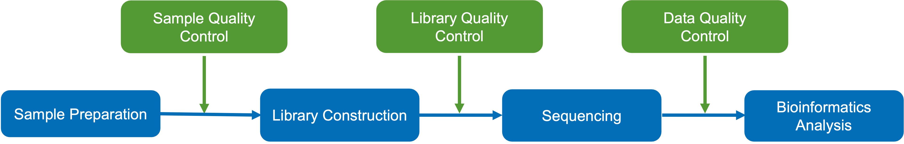
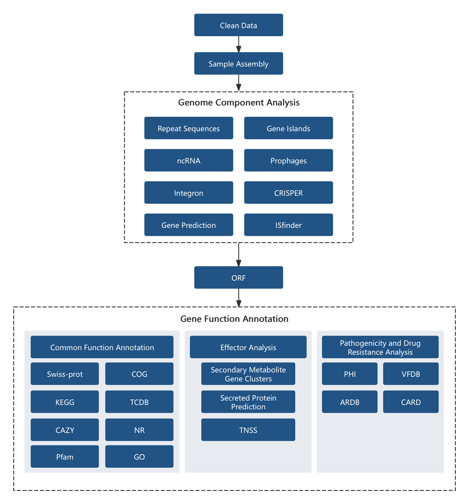

```{r setup, include=FALSE}
# set global chunk options
library(knitr)

# description of echo
opts_chunk$set(echo=FALSE)

# description of warning
opts_chunk$set(warning=FALSE)

# description of message
opts_chunk$set(message=FALSE)

# description of include
#opts_chunk$set(include=FALSE)

# description of cache
#opts_chunk$set(cache=TRUE)
```


```{r echo=FALSE}
library(knitr)
data <- read.delim('file/project_info.xls',sep='\t',header=T)
kable(data, table.attr = "class=\"nowrap\"","html") %>%
kable_styling(bootstrap_options=c("striped","hover","condensed"))
```


# Overview of the Workflow
## Experimental Procedure



<p class='mark'>Figure 1-1 Project workflow</p>

### Sample Quality Control

&emsp;&emsp;Please refer to Novogene’s sample QC report.

### Library Construction, Quality Control and Sequencing

&emsp;&emsp;SMRTbell libraries were prepared using the SMRTbell® Prep Kit 3.0. Qualified DNA samples were sheared to target sizes using Covaris g-TUBE, followed by DNA damage repair and end polishing. Hairpin adapters were ligated to DNA fragments using DNA ligase, with subsequent purification using AMPure PB beads. Size selection was performed using BluePippin, followed by additional AMPure PB bead purification. After final DNA damage repair and another AMPure PB bead clean-up, completed libraries were quantified by Qubit and fragment size distribution was analyzed using Agilent Femto Pulse. Polymerase and primers were then bound, and sequencing was performed on the PacBio Revio platform.

## Bioinformatics Analysis Workflow



<p class='mark'>Figure 1-2 Bioinformatics analysis workflow diagram</p>

Information analysis consists of several steps:

&emsp;&emsp;1. Raw data processing: This step involves filtering out low-quality reads and retaining high-quality reads. The filtered data is referred to as Clean Data.

&emsp;&emsp;2. Sample assembly: Genomic assembly is performed to obtain fasta that reflect the sample's genome.

&emsp;&emsp;3. Genomic composition analysis: After assembly, the composition of the sample's genome is analyzed, including predictions of coding genes, non-coding RNAs, repetitive sequences, prophages, genomic islands, CRISPR, and other genomic components.

&emsp;&emsp;4. Functional annotation: Functional annotation is performed on the coding gene sequences using different databases, including commonly used databases such as KEGG, COG, and databases specific to pathogenic microorganisms.


<h6 style="text-align:right">Novogene Co., Ltd.</h6>
<hr/>
</p>


# Results Presentation and Explanation

## Data Overview 

***

&emsp;&emsp;Sequencing statistics from the PacBio platform:


<p class='mark'>Table 2-1. Sequencing data statistics</p>

```{r echo=FALSE}
library(DT)
data <- read.delim('file/01.Cleandata/clean_data.xls',sep='\t',header=T)
datatable(data,rownames=FALSE,extensions=c('KeyTable','Buttons','FixedColumns'),options=list(keys=T,scrollX=T,dom = 'Bfrtip',buttons = list('copy', 'print', list(extend = 'collection',buttons = c('csv', 'excel', 'pdf'),text = 'Download')),initComplete = JS("function(settings, json) {","$(this.api().table().header()).css({'background-color':'#4682B4','color': 'white'});","}")),class='nowrap')
```


- **Sample ID**: Sample name  
- **num_seqs**: Number of reads  
- **sum_len (bp)**: Total base pairs  
- **min_len (bp)**: Minimum read length  
- **N50_len (bp)**: The read length at which 50% of the bases are in reads longer than, or equal to, this value  
- **max_len (bp)**: Maximum read length

&emsp;&emsp;<font face="Arial">The length distribution of HiFi reads is as follows:</font>

```{r echo=FALSE}
library(stringr)
library(bsselectR)
state_plots <- paste0(list.files("file/01.Cleandata/","*.subreads_distri.png",full.names=TRUE))
names(state_plots) <- str_replace_all(state_plots,c("\\.subreads_distri.png"="","file/01.Cleandata//"=""))
bsselect(state_plots,type="img",height='40%',width='60%',live_search=TRUE,show_tick=TRUE,style='btn-info')
```

<p class='mark'>Figure 2-1 Length distribution of HiFi reads</p>

<p class='mark'>Note: Number of reads (y-axis) against HiFi reads sequence length (x-axis).</p>

&emsp;&emsp;Result file directory: Result/01.Cleandata/

<p>
<br/>

<h6 style="text-align:right">Novogene Co., Ltd.</h6>
<hr/>
</p>


## Genomic Overview

### Assembly AnalysisAssembly Analysis 

***

&emsp;&emsp;Genome assembly was performed using HiFiasm (https://github.com/chhylp123/hifiasm,v0.14.2-r315) with PacBio sequencing data. HiFiasm does not require polishing tools such as Pilon or Racon, which simplifies the assembly pipeline and reduces overall running time. Assembly statistics are provided in the table below.


<p class='mark'>Table 2-2 Statistics of sample genome assembly results</p>

```{r echo=FALSE}
library(DT)
data <- read.delim('file/02.Assembly/all.assembly.stat.xls',sep='\t',header=T)
datatable(data,rownames=FALSE,extensions=c('KeyTable','Buttons','FixedColumns'),options=list(keys=T,scrollX=T,dom = 'Bfrtip',buttons = list('copy', 'print', list(extend = 'collection',buttons = c('csv', 'excel', 'pdf'),text = 'Download')),initComplete = JS("function(settings, json) {","$(this.api().table().header()).css({'background-color':'#4682B4','color': 'white'});","}")),class='nowrap')
```

- **<font face="Arial">Sample ID</font>**: Sample name
- **<font face="Arial">Type</font>**: Type of assembly result
- **<font face="Arial">Contig ID</font>**: Contig number obtained from the assembly
- **<font face="Arial">Size(bp)</font>**: Size of the assembled sequence
- **<font face="Arial">GC%</font>**: GC content of the assembled contig
- **<font face="Arial">Circular</font>**: Whether the sequence is circularized

### Plasmid Sequence Alignment
***
&emsp;&emsp;The assembled plasmid sequence is mapped to a plasmid reference database. The top 5 matches ranked by alignment total score are summarized as follows:
<p class='mark'>Table 2-3 Statistical analysis of the top 5 results of plasmid sequence alignment for Sample</p>
```{r echo=FALSE}
library(DT)
data <- read.delim('file/02.Assembly/all.plassmid.blast.stat.xls',sep='\t',header=T)
datatable(data,rownames=FALSE,extensions=c('KeyTable','Buttons','FixedColumns'),options=list(keys=T,scrollX=T,dom = 'Bfrtip',buttons = list('copy', 'print', list(extend = 'collection',buttons = c('csv', 'excel', 'pdf'),text = 'Download')),initComplete = JS("function(settings, json) {","$(this.api().table().header()).css({'background-color':'#4682B4','color': 'white'});","}")),class='nowrap')
```


- **<font face="Arial">Sample ID</font>**: Sample name
- **<font face="Arial">query_id</font>**: Sample plasmid ID
- **<font face="Arial">query_len</font>**: Plasmid length
- **<font face="Arial">subject_id</font>**: ID identification of the aligned target sequence
- **<font face="Arial">subject_len</font>**: Length of the subject sequence
- **<font face="Arial">max_score</font>**: The highest alignment score between the plasmid sequence and the aligned database plasmid sequence
- **<font face="Arial">total_score</font>**: Total alignment score
- **<font face="Arial">query_cover</font>**: Alignment coverage (percentage of aligned fragments to the plasmid sequence)
- **<font face="Arial">E_value</font>**: Expected value of the alignment result
- **<font face="Arial">identity</font>**: Percentage of sequence alignment consistency
- **<font face="Arial">descroption</font>**: Description information of the plasmid aligned to the database

&emsp;&emsp;Note: When the query cover value is less than 50%, the credibility of the sample plasmid alignment to the corresponding plasmid in NCBI is low.

### Assembly Evaluation

#### BUSCO Evaluation

&emsp;&emsp;BUSCO (Benchmarking Universal Single-Copy Orthologs; http://busco.ezlab.org/) analysis is performed using a single-copy ortholog database, with the metaeuk and hmmer software packages employed to assess genome assembly completeness.
<p class='mark'>Table 2-4 Genome assembly BUSCO evaluation results</p>
```{r echo=FALSE}
library(DT)
data <- read.delim('file/02.Assembly/BUSCO_stat.xls',sep='\t',header=T)
datatable(data,rownames=FALSE,extensions=c('KeyTable','Buttons','FixedColumns'),options=list(keys=T,scrollX=T,dom = 'Bfrtip',buttons = list('copy', 'print', list(extend = 'collection',buttons = c('csv', 'excel', 'pdf'),text = 'Download')),initComplete = JS("function(settings, json) {","$(this.api().table().header()).css({'background-color':'#4682B4','color': 'white'});","}")),class='nowrap')
```

- **<font face="Arial">Sample ID</font>**: Sample Name
- **<font face="Arial">C</font>**: Complete BUSCOs
- **<font face="Arial">S</font>**: Complete and single-copy BUSCOs
- **<font face="Arial">D</font>**: Complete Duplicated BUSCOs
- **<font face="Arial">F</font>**: Fragmented BUSCOs
- **<font face="Arial">M</font>**: Missing BUSCOs
- **<font face="Arial">n</font>**: Total BUSCO groups searched

```{r echo=FALSE}
library(stringr)
library(bsselectR)
state_plots <- paste0(list.files("file/02.Assembly/","*.busco_figure.png",full.names=TRUE))
names(state_plots) <- str_replace_all(state_plots,c("\\.busco_figure.png"="","file/02.Assembly//"=""))
bsselect(state_plots,type="img",height='40%',width='60%',live_search=TRUE,show_tick=TRUE,style='btn-info')
```

<p class='mark'>Figure 2-2 BUSCO assessment results</p>


&emsp;&emsp;Result file directory: Result/02.Assembly/

<p>
<br/>

<h6 style="text-align:right">Novogene Co., Ltd.</h6>
<hr/>
</p>


## Genomic Composition Analysis

&emsp;&emsp;The microbial genome is composed of diverse functional regions. Beyond protein-coding sequences, non-coding regions are involved in transcriptional regulation, post-transcriptional regulation, translational regulation, and epigenetic control, with some functional elements linked to evolutionary diversity.

&emsp;&emsp;Protein-coding genes, repetitive sequences, and non-coding RNAs are predicted through multiple computational approaches to characterize the genomic composition.

### Coding Genes
&emsp;&emsp;Use GeneMarkS (Version 4.17) (http://topaz.gatech.edu/GeneMark/) software to predict coding genes in the newly sequenced genome. The statistical information of the gene prediction results is shown in the table below:

<p class='mark'>Table 2-5 Statistical table of predicted coding genes</p>

```{r echo=FALSE}
library(DT)
data <- read.delim('file/03.Genome_Component/gene.xls',sep='\t',header=T)
datatable(data,rownames=FALSE,extensions=c('KeyTable','Buttons','FixedColumns'),options=list(keys=T,scrollX=T,dom = 'Bfrtip',buttons = list('copy', 'print', list(extend = 'collection',buttons = c('csv', 'excel', 'pdf'),text = 'Download')),initComplete = JS("function(settings, json) {","$(this.api().table().header()).css({'background-color':'#4682B4','color': 'white'});","}")),class='nowrap')
```

- **Sample ID**: Sample name
- **Genome size**: Total length of the genome
- **Gene number**: Number of predicted coding genes
- **Gene total length**: Total length of all coding genes
- **Gene average length**: Average length of coding genes
- **Gene length / Genome**: Percentage of coding region length in the whole genome

&emsp;&emsp;The gene length distribution plot is shown below:

```{r echo=FALSE}
library(stringr)
library(bsselectR)
state_plots <- paste0(list.files("file/03.Genome_Component/","*.cds.png",full.names=TRUE))
names(state_plots) <- str_replace_all(state_plots,c("\\.cds.png"="","file/03.Genome_Component//"=""))
bsselect(state_plots,type="img",height='40%',width='60%',live_search=TRUE,show_tick=TRUE,style='btn-info')
```

<p class='mark'>Figure 2-3 Gene length distribution plot</p>
<p class='mark'>Note: The x-axis represents the gene length, and the y-axis represents the corresponding number of genes.</p>
&emsp;&emsp;Result file directory: Result/03.Genome_Component/*/Gene/

### Repetitive Sequences
&emsp;&emsp;Repeated sequences (also known as repetitive elements, repeating units or repeats) are short or long patterns that occur in multiple copies throughout the genome. These sequences are classified into two major categories based on their distribution patterns: interspersed repeats and tandem repeats.

&emsp;&emsp;Interspersed repeats are further categorized into Short Interspersed Nuclear Elements (SINEs) and Long Interspersed Nuclear Elements (LINEs). Among these, LINEs are typically associated with transpositional activity. Tandem Repeats (TR) refer to repeats of specific nucleotide sequences that occur adjacently and are repeated two or more times. Tandem repeats are further classified into Minisatellite DNA and Microsatellite DNA. Tandem repeat units exhibit species-specific compositional characteristics and can be utilized as genetic traits for studying evolutionary relationships.

&emsp;&emsp;Interspersed repeats are predicted using RepeatMasker (version open-4.0.5), while tandem repeats in DNA sequences are identified through Tandem Repeats Finder (TRF, version 4.07b). The prediction results are provided in the table below.

<p class='mark'>Table 2-6 Statistics of interspersed repeat elements</p>

```{r echo=FALSE}
library(DT)
data <- read.delim('file/03.Genome_Component/rep.xls',sep='\t',header=T)
datatable(data,rownames=FALSE,extensions=c('KeyTable','Buttons','FixedColumns'),options=list(keys=T,scrollX=T,dom = 'Bfrtip',buttons = list('copy', 'print', list(extend = 'collection',buttons = c('csv', 'excel', 'pdf'),text = 'Download')),initComplete = JS("function(settings, json) {","$(this.api().table().header()).css({'background-color':'#4682B4','color': 'white'});","}")),class='nowrap')
```

- **Sample ID**: Sample name
- **Type**: Type of interspersed repeats
- **Number (#)**: Number of repeats
- **Total Length (bp)**: Total length of repeats
- **In genome (%)**: Percentage of the genome occupied by repeats
- **Average length (bp)**: Average length of repeats
- **LTR**: Long terminal repeats
- **DNA**: DNA transposons
- **LINE**: Long interspersed nuclear elements
- **SINE**: Short interspersed nuclear elements
- **RC**: Rolling-circle 

<p class='mark'>Table 2-7 Statistics of tandem repeats results</p>

```{r echo=FALSE}
library(DT)
data <- read.delim('file/03.Genome_Component/TR.xls',sep='\t',header=T)
datatable(data,rownames=FALSE,extensions=c('KeyTable','Buttons','FixedColumns'),options=list(keys=T,scrollX=T,dom = 'Bfrtip',buttons = list('copy', 'print', list(extend = 'collection',buttons = c('csv', 'excel', 'pdf'),text = 'Download')),initComplete = JS("function(settings, json) {","$(this.api().table().header()).css({'background-color':'#4682B4','color': 'white'});","}")),class='nowrap')
```

- **Sample ID**: Sample name
- **Type**: Type of tandem repeats
- **Number (#)**: Number of repeats
- **Repeat Size (bp)**: Range of repeat sizes
- **Total Length (bp)**: Total length of repeats
- **In genome (%)**: Percentage of the genome occupied by repeats
- **TR**: Tandem repeats
- **Minisatellite DNA**: Minisatellite DNA
- **Microsatellite DNA**: Microsatellite DNA

 &emsp;&emsp;Result file directory: Result/03.Genome_Component/*/Repeat/


### Non-coding RNA
&emsp;&emsp;Non-coding RNAs (ncRNAs) are functional RNA molecules that regulate biological processes at the RNA level without encoding proteins. In microorganisms, the most extensively studied ncRNAs include sRNAs, rRNAs, and tRNAs.

&emsp;&emsp;tRNA prediction: tRNAs are identified using tRNAscan-SE (Version 2.0.9).

&emsp;&emsp;rRNA prediction: Ribosomal RNAs (rRNAs) are detected through alignment with reference rRNA databases of closely related species or by computational prediction using rRNAmmer (Version 1.2), given their high conservation among related species.

&emsp;&emsp;sRNA prediction: Small RNAs (sRNAs) are annotated through Rfam database screening followed by confirmation with cmsearch (Version 1.1rc4) using default parameters.


<p class='mark'>Table 2-8 Statistical results of ncRNA after de-replication</p>

```{r echo=FALSE}
library(DT)
data <- read.delim('file/03.Genome_Component/ncRNA.xls',sep='\t',header=T)
datatable(data,rownames=FALSE,extensions=c('KeyTable','Buttons','FixedColumns'),options=list(keys=T,scrollX=T,dom = 'Bfrtip',buttons = list('copy', 'print', list(extend = 'collection',buttons = c('csv', 'excel', 'pdf'),text = 'Download')),initComplete = JS("function(settings, json) {","$(this.api().table().header()).css({'background-color':'#4682B4','color': 'white'});","}")),class='nowrap')
```

- **Sample ID**: Sample name
- **Type**: Types of ncRNA
- **Number (#)**: Number of ncRNAs
- **Average length (bp)**: Average length of ncRNAs
- **Total length (bp)**: Total length of ncRNAs

&emsp;&emsp;Result file directory: Result/03.Genome_Component/*/ncRNA/

### Genomic Islands（GIs）
&emsp;&emsp;A genomic island (GI) is part of a genome that has evidence of A GI can code for many functions, can be involved in symbiosis or pathogenesis, and may help an organism's adaptation. The same GI can occur in distantly related species as a result of various types of horizontal gene transfer (transformation, conjugation, transduction). This can be determined by base composition analysis, as well as phylogeny estimations.

&emsp;&emsp;Genomic islands are predicted using IslandPath-DIOMB (Version 0.2), which identifies potential horizontally acquired regions through detection of dinucleotide composition bias (phylogenetically atypical patterns) and mobility genes (e.g., transposases or integrases). The prediction results are summarized in the table below:

<p class='mark'>Table 2-9 Genomic island prediction statistics</p>


```{r echo=FALSE}
library(DT)
data <- read.delim('file/03.Genome_Component/GIs.xls',sep='\t',header=T)
datatable(data,rownames=FALSE,extensions=c('KeyTable','Buttons','FixedColumns'),options=list(keys=T,scrollX=T,dom = 'Bfrtip',buttons = list('copy', 'print', list(extend = 'collection',buttons = c('csv', 'excel', 'pdf'),text = 'Download')),initComplete = JS("function(settings, json) {","$(this.api().table().header()).css({'background-color':'#4682B4','color': 'white'});","}")),class='nowrap')
```

- **Sample ID**: Sample name
- **GIs number**: Number of GIs
- **GIs total length (bp)**: Total Length of GIs
- **GIs Average length (bp)**: Average Length of GIs

&emsp;&emsp;Genomic island gene distribution statistics are as follows:


```{r echo=FALSE}
library(stringr)
library(bsselectR)
state_plots <- paste0(list.files("file/03.Genome_Component/","*.GI.png",full.names=TRUE))
names(state_plots) <- str_replace_all(state_plots,c("\\.GI.png"="","file/03.Genome_Component//"=""))
bsselect(state_plots,type="img",height='40%',width='60%',live_search=TRUE,show_tick=TRUE,style='btn-info')
```

<p class='mark'>Figure 2-4 Genomic island gene distribution statistics</p>
<p class='mark'>Note: The x-axis represents the length scale (showing genomic islands with lengths smaller than 15kb).</p>


&emsp;&emsp;Result file directory: Result/03.Genome_Component/*/Genomic_Island/

### Prophages
&emsp;&emsp;Prophages are temperate phage genomes integrated into host DNA. They can replicate or segregate synchronously with the host bacterial DNA. The presence of prophage sequences may enable bacteria to acquire antibiotic resistance, enhance adaptability to the environment, increase adhesion, or transform bacteria into pathogens.


&emsp;&emsp;PhiSpy software (Version 2.3) was used to predict prophages in the sample genome. The prediction results are shown in Table 2-19:

<p class='mark'>Table 2-10 Prophage prediction result statistics</p>


```{r echo=FALSE}
library(DT)
data <- read.delim('file/03.Genome_Component/Prophage.xls',sep='\t',header=T)
datatable(data,rownames=FALSE,extensions=c('KeyTable','Buttons','FixedColumns'),options=list(keys=T,scrollX=T,dom = 'Bfrtip',buttons = list('copy', 'print', list(extend = 'collection',buttons = c('csv', 'excel', 'pdf'),text = 'Download')),initComplete = JS("function(settings, json) {","$(this.api().table().header()).css({'background-color':'#4682B4','color': 'white'});","}")),class='nowrap')
```

- **Sample ID**: Sample name
- **Prophage_Num**: Number of prophages
- **Total_length**: Total length of prophages
- **Average_length**: Average length of prophages


&emsp;&emsp;Result file directory: Result/03.Genome_Component/*/Prophage/

### CRISPR
&emsp;&emsp;CRISPR (Clustered Regularly Interspaced Short Palindromic Repeats) are DNA sequences in prokaryotes (bacteria/archaea) containing phage-derived fragments from past infections. These sequences guide the detection and destruction of matching phage DNA in future encounters, forming an acquired, heritable antiviral defense system. CRISPR systems occur in ~50% of bacterial and ~90% of archaeal genomes.

&emsp;&emsp;CRISPR prediction is performed using CRISPRdigger (Version 1.0), with the results summarized in the following table:

<p class='mark'>Table 2-11 CRISPR prediction result statistics</p>


```{r echo=FALSE}
library(DT)
data <- read.delim('file/03.Genome_Component/CRISPR.xls',sep='\t',header=T)
datatable(data,rownames=FALSE,extensions=c('KeyTable','Buttons','FixedColumns'),options=list(keys=T,scrollX=T,dom = 'Bfrtip',buttons = list('copy', 'print', list(extend = 'collection',buttons = c('csv', 'excel', 'pdf'),text = 'Download')),initComplete = JS("function(settings, json) {","$(this.api().table().header()).css({'background-color':'#4682B4','color': 'white'});","}")),class='nowrap')
```

- **Sample ID**: Sample name
- **CRISPR_Num number**: Predicted total number of CRISPRs 
- **Total_length**: Total length of CRISPRs
- **Average_length**: Average length of CRISPRs 


&emsp;&emsp;Result file directory: Result/03.Genome_Component/*/CRISPR/

### ISfinder Analysis

&emsp;&emsp;The ISfinder database identifies insertion sequences (IS) - short DNA sequences ranging from 0.7 to 2.5 kb that encode solely mobility-related functions. As a predominant category of mobile genetic elements (MGEs), these sequences can be predicted using the ISfinder database (https://isfinder.biotoul.fr/).

&emsp;&emsp;The assembly sequences are compared to the ISfinder database using Blast software to obtain the prediction results for insertion sequences.

&emsp;&emsp;Result file directory: Result/03.Genome_Component/*/ISfinder/

###Integron Analysis

&emsp;&emsp;Integron:Integron: Integrative element: Integrons are mobile DNA molecules with a unique structure that can capture and integrate exogenous genes, transforming them into functional gene expression units. They facilitate the horizontal transfer of multidrug resistance genes in bacteria through transposons or conjugative plasmids. Integrons are present in many bacteria, located on chromosomes, plasmids, or transposons. They are an inherent genetic unit in bacteria that enhances bacterial survival by capturing exogenous genes. The INTEGRALL database (http://integrall.bio.ua.pt/)is used to predict integrons in the genome.


&emsp;&emsp;Blast software is used to compare the assembly sequences with the INTEGRALL database to obtain the integron prediction results.

&emsp;&emsp;Result file directory: Result/03.Genome_Component/*/Integron/

<p>
<br/>

<h6 style="text-align:right">Novogene Co., Ltd.</h6>
<hr/>
</p>

## Functional Gene Analysis

### Effector

#### Secreted protein prediction
&emsp;&emsp;Secretory proteins are defined as proteins synthesized intracellularly and translocated across the membrane via signal peptides to exert extracellular functions, many of which are essential enzymes. The N-terminal signal peptide (15-30 amino acids) is required for secretion.

&emsp;&emsp;Prediction is performed using SignalP (Version 4.1) and TMHMM (Version 2.0c) to identify signal peptides and transmembrane domains, respectively. Combined results determine secretory protein candidates.

<p class='mark'>Table 2-12 Secreted protein identification statistics</p>


```{r echo=FALSE}
library(DT)
data <- read.delim('file/04.Genome_Function/SP.xls',sep='\t',header=T)
datatable(data,rownames=FALSE,extensions=c('KeyTable','Buttons','FixedColumns'),options=list(keys=T,scrollX=T,dom = 'Bfrtip',buttons = list('copy', 'print', list(extend = 'collection',buttons = c('csv', 'excel', 'pdf'),text = 'Download')),initComplete = JS("function(settings, json) {","$(this.api().table().header()).css({'background-color':'#4682B4','color': 'white'});","}")),class='nowrap')
```

- **Sample ID**: Sample name
- **SignalP Protein**: Number of proteins with signal peptide structures
- **TMHMM Protein**: Number of proteins with transmembrane domains
- **Secretory Protein**: Number of predicted secretory proteins

&emsp;&emsp;Result file directory: Result/04.Genome_Function/*/Effector/Secretory_Protein/

#### Secretion Systems and T3SS Effector Prediction

&emsp;&emsp;Pathogenic bacteria secrete this type of protein to the extracellular or host cells through the secretion system TNSS (type N secretion systems, currently known to have 7 types, types I to VII), and control immune response reactions and cell death to cause pathological reactions. The T3SS of gram-negative bacteria is usually used to study the molecular level of pathogens, infection mechanisms, virulence, etc., and is a secretion system that has been studied more.

&emsp;&emsp;For the TNSS system, secretion system-related proteins are extracted from the protein sequence functional database annotation results for annotation. For gram-negative bacteria, the EffectiveT3 software (Version 1.0.1) is used to predict T3SS effector proteins.

&emsp;&emsp;The type VI secretion system (T6SS), a widely distributed and structurally complex system, plays critical roles in bacterial pathogenicity, environmental adaptation, and interbacterial competition. T6SS prediction is conducted using the t6ss_finder.py tool from the SecReT6 v3.0 database (https://bioinfo-mml.sjtu.edu.cn/SecReT6/index.php).

<p class='mark'>Table 2-13 TNSS results statistics</p>

```{r echo=FALSE}
library(DT)
data <- read.delim('file/04.Genome_Function/TNSS.xls',sep='\t',header=T)
datatable(data,rownames=FALSE,extensions=c('KeyTable','Buttons','FixedColumns'),options=list(keys=T,scrollX=T,dom = 'Bfrtip',buttons = list('copy', 'print', list(extend = 'collection',buttons = c('csv', 'excel', 'pdf'),text = 'Download')),initComplete = JS("function(settings, json) {","$(this.api().table().header()).css({'background-color':'#4682B4','color': 'white'});","}")),class='nowrap')
```

- **Sample ID**: Sample name
- **Total_Gene_Num**: Total number of encoding genes
- **TNSS**: Number of proteins predicted as type I to VII secretion system effector proteins

Result file directory: Result/04.Genome_Function/*/Effector/TNSS/

<p class='mark'>Table 2-14 Statistical results of T3SS secretion system protein predictions</p>
```{r echo=FALSE}
library(DT)
data <- read.delim('file/04.Genome_Function/T3SS.xls',sep='\t',header=T)
datatable(data,rownames=FALSE,extensions=c('KeyTable','Buttons','FixedColumns'),options=list(keys=T,scrollX=T,dom = 'Bfrtip',buttons = list('copy', 'print', list(extend = 'collection',buttons = c('csv', 'excel', 'pdf'),text = 'Download')),initComplete = JS("function(settings, json) {","$(this.api().table().header()).css({'background-color':'#4682B4','color': 'white'});","}")),class='nowrap')
```

- **Sample ID**: Sample name
- **Total Protein**: Total number of encoding genes
- **T3SS effective true**: Number of proteins predicted as T3SS effector proteins
- **T3SS effective false**: Number of proteins predicted as non-T3SS effector proteins

Result file directory: Result/04.Genome_Function/*/Effector/T3SS/

<p class='mark'>Table 2-15 T6SS effector protein prediction statistics</p>
```{r echo=FALSE}
library(DT)
data <- read.delim('file/04.Genome_Function/T6SS.xls',sep='\t',header=T)
datatable(data,rownames=FALSE,extensions=c('KeyTable','Buttons','FixedColumns'),options=list(keys=T,scrollX=T,dom = 'Bfrtip',buttons = list('copy', 'print', list(extend = 'collection',buttons = c('csv', 'excel', 'pdf'),text = 'Download')),initComplete = JS("function(settings, json) {","$(this.api().table().header()).css({'background-color':'#4682B4','color': 'white'});","}")),class='nowrap')
```

- **Sample**: Sample name
- **Contig**: Contig ID
- **Coordinates**: Genomic location of the target amino acid sequence
- **Strand**: Orientation of the target sequence (+/−)
- **Length**: Length of the target sequence (amino acids)
- **PID**: Unique identifier in the reference database
- **Locus_tag**: Locus tag of the target sequence
- **Product**: Functional description of the protein
- **T6CP_ID**: T6CP identifier in the reference database
- **Identities (%)**: Percentage identity from sequence alignment
- **E-value**: Expectation value from sequence alignment
- **Bit_score**: Alignment bit score
- **Description**: Additional annotation information


#### Secondary Metabolite Gene Cluster Analysis
&emsp;&emsp;Secondary metabolites are non-essential compounds produced during specific growth phases. The antiSMASH program (version 4.0.2) is used to predict the gene clusters in the genome.

&emsp;&emsp;PKS can be divided into three types: type I, also known as modular PKS, is a multifunctional enzyme complex composed of multiple domains. Type II, also known as aromatic PKS, mainly synthesizes aromatic compounds. Type III, also known as chalcone PKS. The antiSMASH-4.0.2 program is used to predict the genome, and the prediction results are summarized in the following table:

<p class='mark'>Table 2-16 Statistics of secondary metabolite gene clusters and gene numbers</p>


```{r echo=FALSE}
library(DT)
data <- read.delim('file/04.Genome_Function/sm.xls',sep='\t',header=T)
datatable(data,rownames=FALSE,extensions=c('KeyTable','Buttons','FixedColumns'),options=list(keys=T,scrollX=T,dom = 'Bfrtip',buttons = list('copy', 'print', list(extend = 'collection',buttons = c('csv', 'excel', 'pdf'),text = 'Download')),initComplete = JS("function(settings, json) {","$(this.api().table().header()).css({'background-color':'#4682B4','color': 'white'});","}")),class='nowrap')
```

- **Sample ID**: Sample name
- **cluster**: Gene cluster name
- **Clusters number**: Number of gene clusters
- **Gene number**: Number of genes in the gene cluster

```{r echo=FALSE}
library(stringr)
library(bsselectR)
state_plots <- paste0(list.files("file/04.Genome_Function/","*.cluster_num.png",full.names=TRUE))
names(state_plots) <- str_replace_all(state_plots,c("\\.cluster_num.png"="","file/04.Genome_Function//"=""))
bsselect(state_plots,type="img",height='40%',width='60%',live_search=TRUE,show_tick=TRUE,style='btn-info')
```

<p class='mark'>Figure 2-5 Statistics of sample gene clusters and corresponding gene numbers</p>
&emsp;&emsp;Result file directory: Result/04.Genome_Function/*/Effector/Secondary_Metabolism/


### Gene Function Annotation
&emsp;&emsp;Currently, the commonly used functional databases for annotation include NR, GO, KEGG, COG, TCDB, CAZY, Pfam, and Swiss-Prot.

&emsp;&emsp;The basic steps of functional annotation are as follows:

&emsp;&emsp;1) Use the Diamond tool to compare the predicted gene protein sequences with various functional databases (evalue ≤ 1e-5);

&emsp;&emsp;2) Filter the comparison results: For each sequence's comparison: results, select the comparison result with the highest score (defaultidentity>=40%，coverage>=40%) for annotation.

#### NR Annotation
&emsp;&emsp;The Non-Redundant Protein Database (NR), established and maintained by the National Center for Biotechnology Information (NCBI), represents a comprehensive repository of non-redundant protein sequences. Its annotations encompass species-specific information, facilitating taxonomical classification. Leveraging NR database annotations affords access to functional insights into the genes of the respective species.The annotation results are classified as follows:


```{r echo=FALSE}
library(stringr)
library(bsselectR)
state_plots <- paste0(list.files("file/04.Genome_Function/","*.nr.anno.png",full.names=TRUE))
names(state_plots) <- str_replace_all(state_plots,c("\\.nr.anno.png"="","file/04.Genome_Function//"=""))
bsselect(state_plots,type="img",height='40%',width='60%',live_search=TRUE,show_tick=TRUE,style='btn-info')
```

<p class='mark'>Figure 2-6 Sample NR database species annotation statistics chart</p>
<p class='mark'>Note: The x-axis represents the species ID, and the y-axis represents the number of genes annotated.</p>
&emsp;&emsp;Result file directory: Result/04.Genome_Function/*/General_Gene_Annotation/NR/

#### GO Annotation
&emsp;&emsp;GO (Gene Ontology) is the established standard for gene function annotation. The GO provides controlled vocabularies to classify different gene functions: Biological Process (BP), Molecular Function (MF) and Cellular Component (CC). GO term is the basic unit of GO system. Each term has a unique identifier. The relationship between the GO term of each ontology can form a Directed Acyclic Topology. More details could be found from the website, the annotation results are classified as follows:


```{r echo=FALSE}
library(stringr)
library(bsselectR)
state_plots <- paste0(list.files("file/04.Genome_Function/","*.go.png",full.names=TRUE))
names(state_plots) <- str_replace_all(state_plots,c("\\.go.png"="","file/04.Genome_Function//"=""))
bsselect(state_plots,type="img",height='40%',width='60%',live_search=TRUE,show_tick=TRUE,style='btn-info')
```

<p class='mark'>Figure 2-7 GO annotation classification</p>
<p class='mark'>Note: The x-axis represents the sub-terms of GO terms for the three main categories of GO, and the y-axis represents the number of genes annotated to this term (including the sub-terms of the term). The three different classifications represent the three fundamental classifications of GO terms (from left to right: biological process, cellular component, molecular function).</p>
&emsp;&emsp;Result file directory: Result/04.Genome_Function/*/General_Gene_Annotation/GO/

#### KEGG Annotation
&emsp;&emsp;The full name of KEGG is the Kyoto Encyclopedia of Genes and Genomes. It is a database that performs systematic analysis of the metabolic pathways of gene products and compounds within cells, as well as the functions of these gene products. KEGG integrates data from various aspects such as genomics, chemical molecules, and biochemical systems, including metabolic pathways (KEGG PATHWAY), drugs (KEGG DRUG), diseases (KEGG DISEASE), functional models (KEGG MODULE), gene sequences (KEGG GENES), and genomes (KEGG GENOME), among others. The KO (KEGG ORTHOLOG) system links various KEGG annotation systems together, and KEGG has established a comprehensive KO annotation system, which can complete functional annotation of the genome of new species. After annotating genes with KO, they can be classified according to the KEGG metabolic pathways in which they participate.

&emsp;&emsp;The statistical chart of the number of annotated genes in the KEGG database is shown below:


```{r echo=FALSE}
library(stringr)
library(bsselectR)
state_plots <- paste0(list.files("file/04.Genome_Function/","*kegg.functional_classification.png",full.names=TRUE))
names(state_plots) <- str_replace_all(state_plots,c("\\.kegg.functional_classification.png"="","file/04.Genome_Function//"=""))
bsselect(state_plots,type="img",height='40%',width='60%',live_search=TRUE,show_tick=TRUE,style='btn-info')
```

<p class='mark'>Figure 2-8 KEGG metabolic pathway classification</p>
&emsp;&emsp;Note: The numbers on the bar graph represent the number of annotated genes. The y-axis represents the codes of level 1 functional categories, with their explanations detailed in the corresponding legend. 

&emsp;&emsp;Result file directory: Result/04.Genome_Function/*/General_Gene_Annotation/KEGG/

#### COG Annotation
&emsp;&emsp;COG, short for Cluster of Orthologous Groups of proteins, are divided into two categories: one is the prokaryotic organism database, commonly referred to as the COG database. This database is created and is maintained by NCBI, and is constructed based on the evolutionary relationships of encoded protein systems in complete genomes of bacteria, algae, and eukaryotes. By aligning a protein sequence to a specific KOG/COG, which is composed of orthologous sequences, one can infer the function of that sequence. The KOG/COG database can be classified into a total of twenty-six functional categories, and the annotation results of the KOG/COG database are as follows:

&emsp;&emsp;The COG database is divided into 26 functional categories, and the statistical results are shown in the following figure:


```{r echo=FALSE}
library(stringr)
library(bsselectR)
state_plots <- paste0(list.files("file/04.Genome_Function/","*.cog.class.png",full.names=TRUE))
names(state_plots) <- str_replace_all(state_plots,c("\\.cog.class.png"="","file/04.Genome_Function//"=""))
bsselect(state_plots,type="img",height='40%',width='60%',live_search=TRUE,show_tick=TRUE,style='btn-info')
```

<p class='mark'>Figure 2-9 Annotation of KOG/COG database</p>
<p class='mark'>Note: The x-axis denotes the names of the twenty-six groups of KOG/COG, while the y-axis represents the proportion of genes annotated to each group compared to the total number of annotated genes.

&emsp;&emsp;Result file directory: Result/04.Genome_Function/*/General_Gene_Annotation/COG/

#### CAZy Annotation
&emsp;&emsp;CAZy, short for Carbohydrate-Active enZYmes Database, is a specialized database related to carbohydrate-active enzymes. It includes enzyme families that catalyze carbohydrate degradation, modification, and biosynthesis. It consists of five main classifications: glycoside hydrolases (GHs), glycosyl transferases (GTs), polysaccharide lyases (PLs), carbohydrate esterases (CEs), and auxiliary activities (AAs). For more details, please refer to http://www.cazy.org/.

&emsp;&emsp;The classification annotation results and the number statistics graph of the CAZy database are shown below:

<p class='mark'>Table 2-17 CAZy annotation results</p>


```{r echo=FALSE}
library(DT)
data <- read.delim('file/04.Genome_Function/CAZy.xls',sep='\t',header=T)
datatable(data,rownames=FALSE,extensions=c('KeyTable','Buttons','FixedColumns'),options=list(keys=T,scrollX=T,dom = 'Bfrtip',buttons = list('copy', 'print', list(extend = 'collection',buttons = c('csv', 'excel', 'pdf'),text = 'Download')),initComplete = JS("function(settings, json) {","$(this.api().table().header()).css({'background-color':'#4682B4','color': 'white'});","}")),class='nowrap')
```

- **Sample ID**: Sample name
- **CBM**: Number of genes related to carbohydrate-binding modules (CBMs)
- **CE**: Number of genes related to carbohydrate esterases (CEs)
- **GH**: Number of genes related to glycoside hydrolases (GHs)
- **GT**: Number of genes related to glycosyl transferases (GTs)
- **PL**: Number of genes related to polysaccharide lyases (PLs)
- **AA**: Number of genes related to auxiliary activities (AAs)


```{r echo=FALSE}
library(stringr)
library(bsselectR)
state_plots <- paste0(list.files("file/04.Genome_Function/","*.single_CAZy_class.png",full.names=TRUE))
names(state_plots) <- str_replace_all(state_plots,c("\\.single_CAZy_class.png"="","file/04.Genome_Function//"=""))
bsselect(state_plots,type="img",height='40%',width='60%',live_search=TRUE,show_tick=TRUE,style='btn-info')
```
<p class='mark'>Figure 2-10 CAZy functional classification and gene count statistics</p>
<p class='mark'>Note: The x-axis represents CAZy database classification categories, and the y-axis indicates the number of annotated genes.</p>

&emsp;&emsp;Carbohydrate-binding domains are non-catalytic domains that can fold into specific three-dimensional structures and have the function of binding carbohydrates. Recent studies have shown that carbohydrate-binding domains can enhance the activity of carbohydrate-active enzymes by binding to the substrates of these enzymes.

&emsp;&emsp;Result file directory: Result/04.Genome_Function/*/General_Gene_Annotation/CAZy/


#### TCDB Annotation
&emsp;&emsp;TCDB, short for Transporter Classification Database, is a membrane transporter protein classification database that includes ion channels (TC system). The TCDB database classifies transport systems into 5 levels, and the statistical results for the first level are shown in the following figure:


```{r echo=FALSE}
library(stringr)
library(bsselectR)
state_plots <- paste0(list.files("file/04.Genome_Function/","*tcdb.class.catalog.png",full.names=TRUE))
names(state_plots) <- str_replace_all(state_plots,c("\\.tcdb.class.catalog.png"="","file/04.Genome_Function//"=""))
bsselect(state_plots,type="img",height='40%',width='60%',live_search=TRUE,show_tick=TRUE,style='btn-info')
```

<p class='mark'> Figure 2-11 Sample gene function annotation TCDB functional classification chart</p>
<p class='mark'> Note: X-axis (TCDB first-level classification types); Y-axis (number of annotated genes) </p>
&emsp;&emsp;Result file directory: Result/04.Genome_Function/*/General_Gene_Annotation/TCDB/


#### Pfam Annotation
&emsp;&emsp;Proteins are generally composed of one or more functional regions, which are often referred to as domains. Different combinations of domains result in different protein structures. Therefore, the identification of protein domains is particularly important for analyzing protein function.

&emsp;&emsp;The Pfam database consists of two components: Pfam-A and Pfam-B, with Pfam-A being manually curated and of higher quality. For more details, please refer to Pfam is now hosted by InterPro.

&emsp;&emsp;Result file directory: Result/04.Genome_Function/*/General_Gene_Annotation/Pfam/

#### Swiss-Prot Annotation
&emsp;&emsp;Swiss-Prot is a curated protein sequence database that provides high-level annotation results, such as protein function, domain structure, post-translational modifications, and variations. For more details, please refer to http://www.ebi.ac.uk/uniprot/.

&emsp;&emsp;Result file directory: Result/04.Genome_Function/*/General_Gene_Annotation/Swiss-Prot/

### Toxicity or Pathogenicity Analysis
#### Pathogen Host Interactions (PHI) Annotation

&emsp;&emsp; PHI, short for Pathogen Host Interactions Database, is a database of interactions between pathogens and hosts. It mainly includes fungal, oomycete, and bacterial pathogens, and their hosts include animals, plants, fungi, and insects. This database plays an important role in the identification of target genes for drug intervention. It also includes antifungal compounds and their corresponding target genes. Each gene in the database contains nucleotide and amino acid sequences, as well as detailed descriptions of predicted protein functions during the infection process.

&emsp;&emsp;The statistical distribution of the number of genes for each phenotype mutation type in the pathogen PHI is shown in the following figure:


```{r echo=FALSE}
library(stringr)
library(bsselectR)
state_plots <- paste0(list.files("file/04.Genome_Function/","*phi.class.png",full.names=TRUE))
names(state_plots) <- str_replace_all(state_plots,c("\\.phi.class.png"="","file/04.Genome_Function//"=""))
bsselect(state_plots,type="img",height='40%',width='60%',live_search=TRUE,show_tick=TRUE,style='btn-info')
```

<p class='mark'>Figure 2-12 Sample gene function annotation pathogen PHI phenotype mutation type distribution chart</p>
<p class='mark'>Note: The x-axis represents phenotype mutation types, and the y-axis represents the number of annotated genes.</p>

&emsp;&emsp;Result file directory: Result/04.Genome_Function/*/Pathogenicity/PHI/

#### Virulence Factors of Pathogenic Bacteria (VFDB) Annotation
&emsp;&emsp;The VFDB database, short for Virulence Factors of Pathogenic Bacteria, is a database specifically studying the virulence factors of pathogenic bacteria, chlamydiae, and rickettsiae. In addition to the species information and basic characteristics of virulence genes, it also provides detailed descriptions of virulence gene functions and pathogenic mechanisms. As of November 2017, the database has collected 74 genera of pathogenic bacteria with 1796 virulence factors, 926 related strains, and 30,178 VF-related genes (non-redundant).

&emsp;&emsp;Using the Diamond software, the amino acid sequences of the target species are aligned with the VFDB database to combine the genes of the target species with their corresponding virulence factor functional annotation information to obtain the annotation results.

&emsp;&emsp;Result file directory: Result/04.Genome_Function/*/Pathogenicity/VFDB/

#### Antibiotic Resistance Genes (ARDB, CARD) Annotation
&emsp;&emsp;The ARDB database, short for Antibiotic Resistance Genes Database, enables the identification of antibiotic resistance-related gene names and information about the types of antibiotics they can resist.

&emsp;&emsp;Using the Diamond software, the amino acid sequences of the target species are aligned with the ARDB database to combine the genes of the target species with their corresponding antibiotic resistance functional annotation information to obtain the annotation results.

&emsp;&emsp;Result file directory：Result/04.Genome_Function/*/Pathogenicity/ARDB/

&emsp;&emsp;The CARD database, short for Comprehensive Antibiotic Research Database, is a recently developed antibiotic resistance gene database that has advantages such as comprehensive information, user-friendliness, and timely updates. The core component of this database is Antibiotic Resistance Ontology (ARO), which integrates sequence, antibiotic resistance, mechanism of action, and associations between AROs. Through the annotation of this database, one can find information about antibiotic resistance-related gene names and the types of antibiotics they can resist.

&emsp;&emsp;Using the RGI (v5.1.0) software, the amino acid sequences of the target species are aligned with the CARD database (v3.2.5) to combine the genes of the target species with their corresponding antibiotic resistance functional annotation information to obtain the annotation results.

&emsp;&emsp;Result file directory:Result/04.Genome_Function/*/Pathogenicity/CARD/

<p>
<br/>

<h6 style="text-align:right">Novogene Co., Ltd.</h6>
<hr/>
</p>


## Genome Visualization Analysis

### Whole-Genome Circular Map

***
&emsp;&emsp;The assembled genome sequence of the sequenced sample, combined with the predicted results of coding genes, is visualized using the Circos software to display the sample genome. If analysis of non-coding RNA and gene function annotation is performed simultaneously, the relevant analysis results will also be displayed on the map. The Whole-genome circular map is shown as follows:

```{r echo=FALSE}
library(stringr)
library(bsselectR)
state_plots <- paste0(list.files("file/05.Genome_Drawing/Chr/","*.Overview.png",full.names=TRUE))
names(state_plots) <- str_replace_all(state_plots,c("\\.Overview.png"="","file/05.Genome_Drawing/Chr//"=""))
bsselect(state_plots,type="img",height='40%',width='60%',live_search=TRUE,show_tick=TRUE,style='btn-info')
```

<p class='mark'>Figure 2-13 Whole-genome circular map</p>
<p class='mark'>Note: The outermost circle represents the genomic sequence position coordinates. From outer to inner, they are the results of gene function annotation (including COG (KOG) annotation results information based on the actual project situation), ncRNA, and genome GC content. The blue region inwards represents regions with GC content lower than the average GC content of the whole genome, while the red region outwards represents the opposite. The higher the peak, the greater the difference from the average GC content. The genome GC skew value: window size (chromosome length / 1000) bp, step size (chromosome length / 1000) bp. The specific algorithm is (G-C)/(G+C). The green region inwards represents regions with a lower G content than C, while the orange region outwards represents the opposite.</p>


&emsp;&emsp;Result file directory: Result/05.Genome_Drawing/Genome_Overview/

<p>
<br/>

<h6 style="text-align:right">Novogene Co., Ltd.</h6>
<hr/>
</p>

## Methylation Analysis
### Epigenetic Modification
&emsp;&emsp;Using SMRT Link v25.2.0, methylation site detection and prediction of nucleotide motifs potentially recognized by methyltransferases were performed on the final genome assembly results. The predicted modification types include m6A, m4C,as well as unknown types (modified_base).

&emsp;&emsp;The result statistics are as follows:
<p class='mark'>Table 2-18 Statistics of modified sites in the sample genome</p>

```{r echo=FALSE}
library(DT)
data <- read.delim('file/02.Assembly/motif/motif_type.xls',sep='\t',header=T)
datatable(data,rownames=FALSE,extensions=c('KeyTable','Buttons','FixedColumns'),options=list(keys=T,scrollX=T,dom = 'Bfrtip',buttons = list('copy', 'print', list(extend = 'collection',buttons = c('csv', 'excel', 'pdf'),text = 'Download')),initComplete = JS("function(settings, json) {","$(this.api().table().header()).css({'background-color':'#4682B4','color': 'white'});","}")),class='nowrap')
```

- **Sample ID**: sample name
- **<font face="Arial">motifString</font>**: Nucleotide motif sequence recognized by methyltransferases
- **<font face="Arial">centerPos</font>**: Position of the modified base
- **<font face="Arial">ModificationType</font>**: Type of modification
- **<font face="Arial">fraction</font>**: Proportion of modified motifs in the entire genome for this motif
- **<font face="Arial">nDetected</font>**: Number of modified motifs
- **<font face="Arial">meanScore</font>**: Average score
- **<font face="Arial">objectiveScore</font>**: Total score of all motifs


<p class='mark'>Table 2-19 Statistics of motif sequences in the sample genome</p>
```{r echo=FALSE}
library(DT)
data <- read.delim('file/02.Assembly/motif/motif_sum.xls',sep='\t',header=T)
datatable(data,rownames=FALSE,extensions=c('KeyTable','Buttons','FixedColumns'),options=list(keys=T,scrollX=T,dom = 'Bfrtip',buttons = list('copy', 'print', list(extend = 'collection',buttons = c('csv', 'excel', 'pdf'),text = 'Download')),initComplete = JS("function(settings, json) {","$(this.api().table().header()).css({'background-color':'#4682B4','color': 'white'});","}")),class='nowrap')
```

- **Sample ID**: Sample name
- **<font face="Arial">Type</font>**: Type of modified site
- **<font face="Arial">Number</font>**: Number of modified sites
- **<font face="Arial">Percent%</font>**: Percentage of modified sites in all sites


### Distribution of Methylation Motifs in GRs/IGRs
<p class='mark'>Table 2-20 Distribution statistics of methylation motifs in GRs/IGRs</p>
```{r echo=FALSE}
library(DT)
data <- read.delim('file/02.Assembly/motif/motif_dis.xls',sep='\t',header=T)
datatable(data,rownames=FALSE,extensions=c('KeyTable','Buttons','FixedColumns'),options=list(keys=T,scrollX=T,dom = 'Bfrtip',buttons = list('copy', 'print', list(extend = 'collection',buttons = c('csv', 'excel', 'pdf'),text = 'Download')),initComplete = JS("function(settings, json) {","$(this.api().table().header()).css({'background-color':'#4682B4','color': 'white'});","}")),class='nowrap')
```

- **Sample ID**: Sample name
- **<font face="Arial">m4C.in genome</font>**: Number of m4C methylation types in the genome
- **<font face="Arial">m4C.in GR(%)</font>**: Number of m4C methylation types in gene regions
- **<font face="Arial">m4C.in IGR(%)</font>**: Number of m4C methylation types in intergenic regions
- **<font face="Arial">m6A.in genome</font>**: Number of m6A methylation types in the genome
- **<font face="Arial">m6A.in GR(%)</font>**: Number of m6A methylation types in gene regions
- **<font face="Arial">m6A.in IGR(%)</font>**: Number of m6A methylation types in intergenic regions
- **<font face="Arial">modified_base. in genome</font>**: Number of unknown types of methylation types in the genome
- **<font face="Arial">modified_base. in GR(%)</font>**: Number of unknown types of methylation types in gene regions
- **<font face="Arial">modified_base. in IGR(%)</font>**: Number of unknown types of methylation types in intergenic regions.

&emsp;&emsp;Result file directory: Result/02.Assembly/all.modifications.distribution.xls

### Motif Gene Annotation

&emsp;&emsp;The annotation of genes on each motif site in major databases such as NR, SwissProt, KEGG, GO, etc., is displayed.

&emsp;&emsp;Result file directory: Result/04.Genome_Function/motify.anno/*.motifs_anno.table.xls


### COG annotation Distribution Plot

&emsp;&emsp;COG annotation and plotting analysis of nucleotide motif sequences recognized by methyltransferases.

&emsp;&emsp;Result file directory: Result/04.Genome_Function/motify.anno/


### Methylation Circle Map
<p class='mark'>The distribution circle plot of epigenetic modifications is shown as follows:</p>
```{r echo=FALSE}
library(stringr)
library(bsselectR)
state_plots <- paste0(list.files("file/02.Assembly/motif/","*motifs.png",full.names=TRUE))
names(state_plots) <- str_replace_all(state_plots,c("\\motifs.png"="","file/02.Assembly/motif//"=""))
bsselect(state_plots,type="img",height='40%',width='60%',live_search=TRUE,show_tick=TRUE,style='btn-info')
```

<p class='mark'>Figure 2-15 Distribution circle plot of epigenetic modifications</p>
&emsp;&emsp;Explanation: Each circle in the figure represents, from outer to inner, the genomic position; the distribution of modified sites on the forward strand counted in 2000bp windows with a step size of 2000bp; the distribution of modified sites on the reverse strand counted in 2000bp windows with a step size of 2000bp; GC content: counted in 2000bp windows with a step size of 2000bp, the inner red region represents regions with GC content lower than the average GC content of the whole genome, while the outer green region represents the opposite, and the peak height indicates the difference from the average GC content; GC skewness: counted in 2000bp windows with a step size of 2000bp, calculated as (G-C)/(G+C), the inner pink region represents regions where the content of G is lower than that of C, while the outer light green region represents the opposite.


&emsp;&emsp;Result file directory: Result/02.Assembly/02.Modification_Overview。


# Method Description
&emsp;&emsp;The following is a default process method description. Please update it according to the actual situation。

[Method Description](src/method_B_C_PB.pdf)

[Information Analysis](src/analysis_method_B_C_PB_EN.pdf)

[Result File Directory Explanation](src/Result_file_directory_PB_EN.pdf)

[FAQ](src/FAQ_EN.pdf)

[Prediction Software and Database Version Explanation](src/Version_information_EN.html)

# References


1. Li R, Zhu H, Ruan J, et al. De novo assembly of human genomes with massively parallel short read sequencing[J]. Genome research, 2010, 20(2): 265-272.  
2. Li R, Li Y, Kristiansen K, et al. SOAP: short oligonucleotide alignment program[J]. Bioinformatics, 2008, 24(5): 713-714.  
3. Bankevich A, Nurk S, Antipov D, et al. SPAdes: a new genome assembly algorithm and its applications to single-cell sequencing[J]. Journal of Computational Biology, 2012, 19(5): 455-477.  
4. Simpson JT, Wong K, Jackman SD, et al. ABySS: a parallel assembler for short read sequence data[J]. Genome Research, 2009, 19(6):1117.  
5. Lin S H, Liao Y C. CISA: contig integrator for sequence assembly of bacterial genomes[J]. PloS one, 2013, 8(3): e60843.  
6. Wick RR, Judd LM, Gorrie CL, Holt KE. Unicycler: Resolving bacterial genome assemblies from short and long sequencing reads[J]. PLoS Computational Biology, 2017 Jun 8:13(6).  
7. Reiner J, Pisani L, Qiao W, et al. Cytogenomic identification and long-read single molecule real-time (SMRT) sequencing of a Bardet–Biedl Syndrome 9 (BBS9) deletion[J]. Npj Genomic Medicine, 2018, 3(1).  
8. Besemer J, Lomsadze A, Borodovsky M. GeneMarkS: a self-training method for prediction of gene starts in microbial genomes. Implications for finding sequence motifs in regulatory regions[J]. Nucleic Acids Research, 2001, 29(12): 2607-2618.  
9. Stanke M, Diekhans M, Baertsch R, Haussler D. Using native and syntenically mapped cDNA alignments to improve de novo gene finding[J]. Bioinformatics, 2008, 24(5):637-644.  
10. Saha S, Bridges S, Magbanua Z V, et al. Empirical comparison of ab initio repeat finding programs[J]. Nucleic acids research, 2008, 36(7): 2284-2294.  
11. Benson G. Tandem repeats finder: a program to analyze DNA sequences[J]. Nucleic acids research, 1999, 27(2): 573.  
12. Lowe T M, Eddy S R. tRNAscan-SE: a program for improved detection of transfer RNA genes in genomic sequence[J]. Nucleic acids research, 1997, 25(5): 0955-964.  
13. Lagesen K, Hallin P, Rødland E A, et al. RNAmmer: consistent and rapid annotation of ribosomal RNA genes[J]. Nucleic acids research, 2007, 35(9): 3100-3108.  
14. Gardner P P, Daub J, Tate J G, et al. Rfam: updates to the RNA families database[J]. Nucleic acids research, 2009, 37(suppl 1): D136-D140.  
15. Nawrocki EP, Kolbe DL, Eddy SR. Infernal 1.0: inference of RNA alignments[J]. Bioinformatics, 2009, 25(10):1335-1337.  
16. Hsiao W, Wan I, Jones S J, et al. IslandPath: aiding detection of genomic islands in prokaryotes[J]. Bioinformatics, 2003, 19(3): 418-420.  
17. You Z, YJ Liang, Karlene L, et al. PHAST: A Fast Phage Search Tool[J]. Nucleic Acids Res, 2011.  
18. Grissa I, Vergnaud G, Pourcel C. CRISPRFinder: a web tool to identify clustered regularly interspaced short palindromic repeats[J]. Nucleic acids research, 2007, 35(suppl 2): W52-W57.  
19. Ashburner M, Ball C A, Blake J A, et al. Gene Ontology: tool for the unification of biology[J]. Nature genetics, 2000, 25(1): 25-29.  
20. Kanehisa M, Goto S, Kawashima S, et al. The KEGG resource for deciphering the genome[J]. Nucleic acids research, 2004, 32(suppl 1): D277-D280.  
21. Kanehisa M, Goto S, Hattori M, et al. From genomics to chemical genomics: new developments in KEGG[J]. Nucleic acids research, 2006, 34(suppl 1): D354-D357.  
22. Galperin MY, Makarova KS, Wolf YI, et al. Expanded microbial genome coverage and improved protein family annotation in the COG database[J]. Nucleic Acids Research, 2015, 43(Database issue):261-9.  
23. Li W, Jaroszewski L, Godzik A. Tolerating some redundancy significantly speeds up clustering of large protein databases[J]. Bioinformatics, 2002, 18(1): 77-82.  
24. Milton SJ, Vamsee SR, Dorjee GT, et al. The Transporter Classification Database[J]. Nucleic Acids Research, 2014.  
25. Amos B, Rolf A. The SWISS-PROT protein sequence database and its supplement TrEMBL in 2000[J]. Nucleic Acids Res., 2000, 28(1): 45-48.  
26. Cantarel B L, Coutinho P M, Rancurel C, et al. The Carbohydrate-Active EnZymes database (CAZy): an expert resource for glycogenomics[J]. Nucleic acids research, 2009, 37(suppl 1): D233-D238.  
27. Petersen T N, Brunak S, von Heijne G, et al. SignalP 4.0: discriminating signal peptides from transmembrane regions[J]. Nature methods, 2011, 8(10): 785-786.  
28. Eichinger V, Nussbaumer T, Platzer A, et al. Effective DB-updates and novel features for a better annotation of bacterial secreted proteins and Type III, IV, VI secretion systems[J]. Nucleic Acids Res., 2016.  
29. Medema M H, Blin K, Cimermancic P, et al. antiSMASH: rapid identification, annotation and analysis of secondary metabolite biosynthesis gene clusters in bacterial and fungal genome sequences[J]. Nucleic acids research, 2011, 39(suppl 2): W339-W346.  
30. Martin U, Rashmi P, Arathi R, et al. The Pathogen-Host Interactions database (PHI-base): additions and future developments[J]. Nucleic Acids Research, 2015, doi: 10.1093/nar/gku1165.  
31. Chen L, Xiong Z, Sun L, et al. VFDB 2012 update: toward the genetic diversity and molecular evolution of bacterial virulence factors[J]. Nucleic acids research, 2012, 40(D1): D641-D645.  
32. Liu B, Pop M. ARDB-antibiotic resistance genes database[J]. Nucleic acids research, 2009, 37(suppl 1): D443-D447.  
33. Jia B, Raphenya A R, Alcock B, et al. CARD 2017: expansion and model-centric curation of the comprehensive antibiotic resistance database[J]. Nucleic Acids Research, 2017, 45(Database issue):D566-D573.  
34. Kurtz S, Phillippy A, Delcher A L, et al. Versatile and open software for comparing large genomes[J]. Genome biology, 2004, 5(2): R12.  
35. Harris R S. Improved pairwise alignment of genomic DNA[M]. ProQuest, 2007.  
36. Chiaromonte F, Yap V B, Miller W. Scoring pairwise genomic sequence alignments[C]//Pacific Symposium on Biocomputing, 2001, 7: 115.  
37. Altschul S F, Gish W, Miller W, et al. Basic local alignment search tool[J]. Journal of molecular biology, 1990, 215(3): 403-410.  
38. Krzywinski M, et al. Circos: an Information Aesthetic for Comparative Genomics[J]. Genome Res., 2009, 19:1639-1645.
