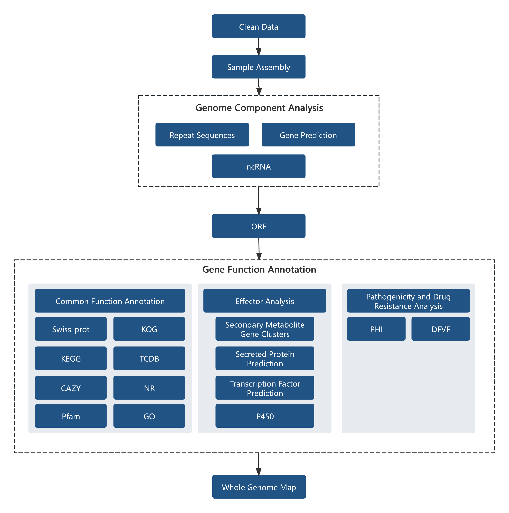

```{r setup, include=FALSE}
# set global chunk options
library(knitr)

# description of echo
opts_chunk$set(echo=FALSE)

# description of warning
opts_chunk$set(warning=FALSE)

# description of message
opts_chunk$set(message=FALSE)

# description of include
#opts_chunk$set(include=FALSE)

# description of cache
#opts_chunk$set(cache=TRUE)
```


```{r echo=FALSE}
library(knitr)
data <- read.delim('file/project_info.xls',sep='\t',header=T)
kable(data, table.attr = "class=\"nowrap\"","html") %>%
kable_styling(bootstrap_options=c("striped","hover","condensed"))
```


# Overview of the Workflow
## Experimental Procedure


<p class='mark'>Figure 1-1 Project workflow</p>

### Sample Quality Control

&emsp;&emsp;Please refer to Novogene’s sample QC report.

### Library Construction, Quality Control and Sequencing

&emsp;&emsp;SMRTbell libraries were prepared using the SMRTbell® Prep Kit 3.0. Qualified DNA samples were sheared to target sizes using Covaris g-TUBE, followed by DNA damage repair and end polishing. Hairpin adapters were ligated to DNA fragments using DNA ligase, with subsequent purification using AMPure PB beads. Size selection was performed using BluePippin, followed by additional AMPure PB bead purification. After final DNA damage repair and another AMPure PB bead clean-up, completed libraries were quantified by Qubit and fragment size distribution was analyzed using Agilent Femto Pulse. Polymerase and primers were then bound, and sequencing was performed on the PacBio Revio platform.

## Bioinformatics analysis workflow



<p class='mark'>Figure 1-2 Bioinformatics analysis workflow diagram</p>

The information analysis consists of several steps:

Information analysis consists of several steps:

&emsp;&emsp;1. Raw data processing: This step involves filtering out low-quality reads and retaining high-quality reads. The filtered data is referred to as Clean Data.

&emsp;&emsp;2. Sample assembly: Genomic assembly is performed to obtain fasta that reflect the sample's genome.

&emsp;&emsp;3. Genomic composition analysis: After assembly, the composition of the sample's genome is analyzed, including predictions of coding genes, non-coding RNAs, repetitive sequences, and other genomic components.

&emsp;&emsp;4. Functional annotation: Functional annotation is performed on the coding gene sequences using different databases, including commonly used databases such as KEGG, COG, and databases specific to pathogenic microorganisms.


<h6 style="text-align:right">Novogene Co., Ltd.</h6>
<hr/>
</p>


# Results Presentation and Explanation

## Data Overview 

***

&emsp;&emsp;Sequencing statistics from the PacBio platform:


<p class='mark'>Table 2-1. Sequencing data statistics</p>

```{r echo=FALSE}
library(DT)
data <- read.delim('file/01.Cleandata/clean_data.xls',sep='\t',header=T)
datatable(data,rownames=FALSE,extensions=c('KeyTable','Buttons','FixedColumns'),options=list(keys=T,scrollX=T,dom = 'Bfrtip',buttons = list('copy', 'print', list(extend = 'collection',buttons = c('csv', 'excel', 'pdf'),text = 'Download')),initComplete = JS("function(settings, json) {","$(this.api().table().header()).css({'background-color':'#4682B4','color': 'white'});","}")),class='nowrap')
```


- **Sample ID**: Sample name  
- **num_seqs**: Number of reads  
- **sum_len (bp)**: Total base pairs  
- **min_len (bp)**: Minimum read length  
- **N50_len (bp)**: The read length at which 50% of the bases are in reads longer than, or equal to, this value  
- **max_len (bp)**: Maximum read length

&emsp;&emsp;<font face="Arial">The length distribution of HiFi reads is as follows:</font>

```{r echo=FALSE}
library(stringr)
library(bsselectR)
state_plots <- paste0(list.files("file/01.Cleandata/","*.subreads_distri.png",full.names=TRUE))
names(state_plots) <- str_replace_all(state_plots,c("\\.subreads_distri.png"="","file/01.Cleandata//"=""))
bsselect(state_plots,type="img",height='40%',width='60%',live_search=TRUE,show_tick=TRUE,style='btn-info')
```

<p class='mark'>Figure 2-1 Length distribution of HiFi reads</p>

<p class='mark'>Note: Number of reads (y-axis) against HiFi reads sequence length (x-axis).</p>

&emsp;&emsp;Result file directory: Result/01.Cleandata/

<p>
<br/>

<h6 style="text-align:right">Novogene Co., Ltd.</h6>
<hr/>
</p>


## Genomic Overview

### Assembly AnalysisAssembly Analysis

&emsp;&emsp;Genome assembly was performed using HiFiasm (https://github.com/chhylp123/hifiasm,v0.14.2-r315) with PacBio sequencing data. HiFiasm does not require polishing tools such as Pilon or Racon, which simplifies the assembly pipeline and reduces overall running time. Assembly statistics are provided in the table below.


<p class='mark'>Table 2-2 Statistics of sample genome assembly results</p>

```{r echo=FALSE}
library(DT)
data <- read.delim('file/02.Assembly/all.assembly.stat.xls',sep='\t',header=T)
datatable(data,rownames=FALSE,extensions=c('KeyTable','Buttons','FixedColumns'),options=list(keys=T,scrollX=T,dom = 'Bfrtip',buttons = list('copy', 'print', list(extend = 'collection',buttons = c('csv', 'excel', 'pdf'),text = 'Download')),initComplete = JS("function(settings, json) {","$(this.api().table().header()).css({'background-color':'#4682B4','color': 'white'});","}")),class='nowrap')
```


- **Sample ID**: Sample name.
- **Polished Contigs**: The number of assembled contigs
- **Max Contig Length**: The maximum length of contigs in the assembly
- **N50 Contig Length**: The length of the contig that, when arranged from largest to smallest, reaches 50% of the total length
- **Total Lengths**: The total length of all assembled contigs
- **GC%**: The GC content of the assembled sequences

###  Assembly Evaluation

&emsp;&emsp;The reads were aligned to the assembled genome sequence, and the GC content and read coverage depth of the assembly sequence were calculated to summarize the GC bias and repetitive sequence information of the genome. The analysis results are shown in the following figure:

```{r echo=FALSE}
library(stringr)
library(bsselectR)
state_plots <- paste0(list.files("file/02.Assembly/","*GC_depth.png",full.names=TRUE))
names(state_plots) <- str_replace_all(state_plots,c("\\.GC_depth.png"="","file/02.Assembly//"=""))
bsselect(state_plots,type="img",height='40%',width='60%',live_search=TRUE,show_tick=TRUE,style='btn-info')
```

<p class='mark'>Figure 2-1 GC content distribution versus sequencing depth</p>

&emsp;&emsp;BUSCO (Benchmarking Universal Single-Copy Orthologs; http://busco.ezlab.org/) analysis is performed using a single-copy ortholog database, with the metaeuk and hmmer software packages employed to assess genome assembly completeness.

<p class='mark'>Table 2-3 Genome assembly BUSCO evaluation results</p>

```{r echo=FALSE}
library(DT)
data <- read.delim('file/02.Assembly/BUSCO.stat.xls',sep='\t',header=T)
datatable(data,rownames=FALSE,extensions=c('KeyTable','Buttons','FixedColumns'),options=list(keys=T,scrollX=T,dom = 'Bfrtip',buttons = list('copy', 'print', list(extend = 'collection',buttons = c('csv', 'excel', 'pdf'),text = 'Download')),initComplete = JS("function(settings, json) {","$(this.api().table().header()).css({'background-color':'#4682B4','color': 'white'});","}")),class='nowrap')
```

- **<font face="Arial">Sample ID</font>**: Sample Name
- **<font face="Arial">C</font>**: Complete BUSCOs
- **<font face="Arial">S</font>**: Complete and single-copy BUSCOs
- **<font face="Arial">D</font>**: Complete Duplicated BUSCOs
- **<font face="Arial">F</font>**: Fragmented BUSCOs
- **<font face="Arial">M</font>**: Missing BUSCOs
- **<font face="Arial">n</font>**: Total BUSCO groups searched

```{r echo=FALSE}
library(stringr)
library(bsselectR)
state_plots <- paste0(list.files("file/02.Assembly/","*.busco_figure.png",full.names=TRUE))
names(state_plots) <- str_replace_all(state_plots,c("\\.busco_figure.png"="","file/04.Genome_Function//"=""))
bsselect(state_plots,type="img",height='40%',width='60%',live_search=TRUE,show_tick=TRUE,style='btn-info')
```
<p class='mark'>Figure 2-2 BUSCO statistics chart</p>

<p>
<br/>

<h6 style="text-align:right">Novogene Co., Ltd.</h6>
<hr/>
</p>


## Genomic Composition Analysis

&emsp;&emsp;The microbial genome is composed of diverse functional regions. Beyond protein-coding sequences, non-coding regions are involved in transcriptional regulation, post-transcriptional regulation, translational regulation, and epigenetic control, with some functional elements linked to evolutionary diversity.

&emsp;&emsp;Protein-coding genes, repetitive sequences, and non-coding RNAs are predicted through multiple computational approaches to characterize the genomic composition.

### Coding Genes
&emsp;&emsp;The methods for predicting coding genes in fungal samples are as follows: (1) If transcriptome data is available, the following methods are used: de novo prediction using Transdecoder, Glimmer, Snap, PASA prediction based on transcriptome data, Cufflinks prediction based on transcriptome data, de novo prediction using Augustus (version 2.7), and homology-based prediction using Genewise (version 2.4.1) with closely related sequences (if provided). The results from multiple methods are then integrated using EVM and validated using PASA in the second round. (2) If transcriptome data is not available but closely related reference sequences are provided, homology-based prediction is done using Genewise. (3) If neither transcriptome data nor closely related reference sequences are provided, de novo prediction is done using Augustus. The statistical information of the gene prediction results is shown in the table below:

<p class='mark'>Table 2-4 Statistical table of predicted coding genes</p>

```{r echo=FALSE}
library(DT)
data <- read.delim('file/03.Genome_Component/gene.xls',sep='\t',header=T)
datatable(data,rownames=FALSE,extensions=c('KeyTable','Buttons','FixedColumns'),options=list(keys=T,scrollX=T,dom = 'Bfrtip',buttons = list('copy', 'print', list(extend = 'collection',buttons = c('csv', 'excel', 'pdf'),text = 'Download')),initComplete = JS("function(settings, json) {","$(this.api().table().header()).css({'background-color':'#4682B4','color': 'white'});","}")),class='nowrap')
```

- **Sample ID**: Sample name
- **Genome size**: Total length of the genome
- **Gene number**: Number of predicted coding genes
- **Gene total length**: Total length of all coding genes
- **Gene average length**: Average length of coding genes
- **Gene length / Genome**: Percentage of coding region length in the whole genome

&emsp;&emsp;The gene length distribution plot is shown below:

```{r echo=FALSE}
library(stringr)
library(bsselectR)
state_plots <- paste0(list.files("file/03.Genome_Component/","*.cds.png",full.names=TRUE))
names(state_plots) <- str_replace_all(state_plots,c("\\.cds.png"="","file/03.Genome_Component//"=""))
bsselect(state_plots,type="img",height='40%',width='60%',live_search=TRUE,show_tick=TRUE,style='btn-info')
```

<p class='mark'>Figure 2-3 Gene length distribution plot</p>
<p class='mark'>Note: The x-axis represents the gene length, and the y-axis represents the corresponding number of genes.</p>
&emsp;&emsp;Result file directory: Result/03.Genome_Component/*/Gene/


### Repetitive Sequences
&emsp;&emsp;Repeated sequences (also known as repetitive elements, repeating units or repeats) are short or long patterns that occur in multiple copies throughout the genome. These sequences are classified into two major categories based on their distribution patterns: interspersed repeats and tandem repeats.

&emsp;&emsp;Interspersed repeats are further categorized into Short Interspersed Nuclear Elements (SINEs) and Long Interspersed Nuclear Elements (LINEs). Among these, LINEs are typically associated with transpositional activity. Tandem Repeats (TR) refer to repeats of specific nucleotide sequences that occur adjacently and are repeated two or more times. Tandem repeats are further classified into Minisatellite DNA and Microsatellite DNA. Tandem repeat units exhibit species-specific compositional characteristics and can be utilized as genetic traits for studying evolutionary relationships.

&emsp;&emsp;Interspersed repeats are predicted using RepeatMasker (version open-4.0.5), while tandem repeats in DNA sequences are identified through Tandem Repeats Finder (TRF, version 4.07b) [11]. The prediction results are provided in the table below.

<p class='mark'>Table 2-6 Statistics of interspersed repeat elements</p>

```{r echo=FALSE}
library(DT)
data <- read.delim('file/03.Genome_Component/rep.xls',sep='\t',header=T)
datatable(data,rownames=FALSE,extensions=c('KeyTable','Buttons','FixedColumns'),options=list(keys=T,scrollX=T,dom = 'Bfrtip',buttons = list('copy', 'print', list(extend = 'collection',buttons = c('csv', 'excel', 'pdf'),text = 'Download')),initComplete = JS("function(settings, json) {","$(this.api().table().header()).css({'background-color':'#4682B4','color': 'white'});","}")),class='nowrap')
```

- **Sample ID**: Sample name
- **Type**: Type of interspersed repeats
- **Number (#)**: Number of repeats
- **Total Length (bp)**: Total length of repeats
- **In genome (%)**: Percentage of the genome occupied by repeats
- **Average length (bp)**: Average length of repeats
- **LTR**: Long terminal repeats
- **DNA**: DNA transposons
- **LINE**: Long interspersed nuclear elements
- **SINE**: Short interspersed nuclear elements
- **RC**: Rolling-circle 

<p class='mark'>Table 2-7 Statistics of tandem repeats results</p>

```{r echo=FALSE}
library(DT)
data <- read.delim('file/03.Genome_Component/TR.xls',sep='\t',header=T)
datatable(data,rownames=FALSE,extensions=c('KeyTable','Buttons','FixedColumns'),options=list(keys=T,scrollX=T,dom = 'Bfrtip',buttons = list('copy', 'print', list(extend = 'collection',buttons = c('csv', 'excel', 'pdf'),text = 'Download')),initComplete = JS("function(settings, json) {","$(this.api().table().header()).css({'background-color':'#4682B4','color': 'white'});","}")),class='nowrap')
```

- **Sample ID**: Sample name
- **Type**: Type of tandem repeats
- **Number (#)**: Number of repeats
- **Repeat Size (bp)**: Range of repeat sizes
- **Total Length (bp)**: Total length of repeats
- **In genome (%)**: Percentage of the genome occupied by repeats
- **TR**: Tandem repeats
- **Minisatellite DNA**: Minisatellite DNA
- **Microsatellite DNA**: Microsatellite DNA

&emsp;&emsp;Result file directory: Result/03.Genome_Component/*/Repeat/


### Non-coding RNA

&emsp;&emsp;Non-coding RNA (ncRNA) is a class of RNA molecules that perform various biological functions but do not carry information for protein translation. They directly participate in biological activities at the RNA level. Commonly studied ncRNAs in microorganisms include sRNA, rRNA, and tRNA.

&emsp;&emsp;tRNA：tRNAscan-SE software [12]（Version 1.3.1）is used to predict tRNA.

&emsp;&emsp;rRNA: ribosomal RNA, is highly conserved in closely related species. There are two methods for predicting rRNA. The first method is to find rRNA by aligning with a reference rRNA database of closely related sequences. The second method is to predict rRNA using rRNAmmer software [13]（Version 1.2）.

&emsp;&emsp;sRNA: small RNA, is first annotated by aligning with the Rfam database. Then, the final sRNA is determined using the cmsearch program (Version 1.1rc4)[14][15] with default parameters.

&emsp;&emsp;snRNA: small nuclear RNA, is a major component of the RNA spliceosome involved in post-transcriptional processing in eukaryotes.

&emsp;&emsp;miRNA: MicroRNA (miRNA) is a class of endogenous non-coding RNA with regulatory functions discovered in eukaryotes. The precursor is approximately 90bp in length, and the mature miRNA is about 20-25 nucleotides (nt) long. miRNA is widely present in eukaryotes and is a group of short sequence RNAs that do not encode proteins. It does not have an open reading frame (ORF) and regulates gene expression.

&emsp;&emsp;The prediction principles for sRNA, snRNA, and miRNA are similar. They are first annotated by aligning with the Rfam software against the Rfam database. Then, the final sRNA, snRNA, or miRNA is determined using the cmsearch program with default parameters.

<p class='mark'>Table 2-8 Statistical results of ncRNA after de-replication</p>

```{r echo=FALSE}
library(DT)
data <- read.delim('file/03.Genome_Component/ncRNA.xls',sep='\t',header=T)
datatable(data,rownames=FALSE,extensions=c('KeyTable','Buttons','FixedColumns'),options=list(keys=T,scrollX=T,dom = 'Bfrtip',buttons = list('copy', 'print', list(extend = 'collection',buttons = c('csv', 'excel', 'pdf'),text = 'Download')),initComplete = JS("function(settings, json) {","$(this.api().table().header()).css({'background-color':'#4682B4','color': 'white'});","}")),class='nowrap')
```

- **Sample ID**: Sample name
- **Type**: Types of ncRNA
- **Number (#)**: Number of ncRNAs
- **Average length (bp)**: Average length of ncRNAs
- **Total length (bp)**: Total length of ncRNAs

&emsp;&emsp;Result file directory: Result/03.Genome_Component/*/ncRNA/


<p>
<br/>

<h6 style="text-align:right">Novogene Co., Ltd.</h6>
<hr/>
</p>

## Functional Gene Analysis

### Effector

#### Secreted protein prediction
&emsp;&emsp;Secretory proteins are defined as proteins synthesized intracellularly and translocated across the membrane via signal peptides to exert extracellular functions, many of which are essential enzymes. The N-terminal signal peptide (15-30 amino acids) is required for secretion.

&emsp;&emsp;Prediction is performed using SignalP (Version 4.1)[27] and TMHMM (Version 2.0c) to identify signal peptides and transmembrane domains, respectively. Combined results determine secretory protein candidates.

<p class='mark'>Table 2-9 Secreted protein identification statistics</p>


```{r echo=FALSE}
library(DT)
data <- read.delim('file/04.Genome_Function/SP.xls',sep='\t',header=T)
datatable(data,rownames=FALSE,extensions=c('KeyTable','Buttons','FixedColumns'),options=list(keys=T,scrollX=T,dom = 'Bfrtip',buttons = list('copy', 'print', list(extend = 'collection',buttons = c('csv', 'excel', 'pdf'),text = 'Download')),initComplete = JS("function(settings, json) {","$(this.api().table().header()).css({'background-color':'#4682B4','color': 'white'});","}")),class='nowrap')
```

- **Sample ID**: Sample name
- **SignalP Protein**: Number of proteins with signal peptide structures
- **TMHMM Protein**: Number of proteins with transmembrane domains
- **Secretory Protein**: Number of predicted secretory proteins

&emsp;&emsp;Result file directory: Result/04.Genome_Function/*/Effector/Secretory_Protein/

#### Secondary Metabolite Gene Cluster Analysis
&emsp;&emsp;Secondary metabolites are non-essential compounds produced during specific growth phases. The antiSMASH program [29] (version 4.0.2) is used to predict the gene clusters in the genome.

&emsp;&emsp;PKS can be divided into three types: type I, also known as modular PKS, is a multifunctional enzyme complex composed of multiple domains. Type II, also known as aromatic PKS, mainly synthesizes aromatic compounds. Type III, also known as chalcone PKS. The antiSMASH-4.0.2 program is used to predict the genome, and the prediction results are summarized in the following table:

<p class='mark'>Table 2-10 Statistics of secondary metabolite gene clusters and gene numbers</p>


```{r echo=FALSE}
library(DT)
data <- read.delim('file/04.Genome_Function/sm.xls',sep='\t',header=T)
datatable(data,rownames=FALSE,extensions=c('KeyTable','Buttons','FixedColumns'),options=list(keys=T,scrollX=T,dom = 'Bfrtip',buttons = list('copy', 'print', list(extend = 'collection',buttons = c('csv', 'excel', 'pdf'),text = 'Download')),initComplete = JS("function(settings, json) {","$(this.api().table().header()).css({'background-color':'#4682B4','color': 'white'});","}")),class='nowrap')
```

- **Sample ID**: Sample name
- **cluster**: Gene cluster name
- **Clusters number**: Number of gene clusters
- **Gene number**: Number of genes in the gene cluster

```{r echo=FALSE}
library(stringr)
library(bsselectR)
state_plots <- paste0(list.files("file/04.Genome_Function/","*cluster_num.png",full.names=TRUE))
names(state_plots) <- str_replace_all(state_plots,c("\\.cluster_num.png"="","file/04.Genome_Function//"=""))
bsselect(state_plots,type="img",height='40%',width='60%',live_search=TRUE,show_tick=TRUE,style='btn-info')
```

<p class='mark'>Figure 2-4 Statistics of sample gene clusters and corresponding gene numbers</p>
&emsp;&emsp;Result file directory: Result/04.Genome_Function/*/Effector/Secondary_Metabolism/

####P450 Annotation
&emsp;&emsp;Cytochrome P450 (cytochrome P450 or CYP450, abbreviated as CYP450) is a superfamily of heme-thiolate proteins that are involved in the metabolism of endogenous substances as well as exogenous substances including drugs and environmental compounds. The P450 database is divided into 16 classes based on the gene's location in the IterPro database, and the statistical results are shown in the figure below:


```{r echo=FALSE}
library(stringr)
library(bsselectR)
state_plots <- paste0(list.files("file/04.Genome_Function/","*P450.class.catalog.png",full.names=TRUE))
names(state_plots) <- str_replace_all(state_plots,c("\\.P450.class.catalog.png"="","file/04.Genome_Function//"=""))
bsselect(state_plots,type="img",height='40%',width='60%',live_search=TRUE,show_tick=TRUE,style='btn-info')
```

<p class='mark'>Figure 2-5 Sample Gene Functional Annotation P450 Classification Chart</p>
<p class='mark'>Note: The x-axis represents the classification types in P450 annotation, and the y-axis represents the number of genes annotated.</p>
&emsp;&emsp;Result file directory: Result/04.Genome_Function/*/General_Gene_Annotation/P450/

####Transcription Factor Analysis

&emsp;&emsp;Transcription factors (TFs) refer to proteins that can bind to DNA in a sequence-specific manner and regulate transcription. Transcription factors control chromatin and transcription by recognizing specific DNA sequences, forming a complex system that guides genome expression.

&emsp;&emsp;Compare the amino acid sequence of the target species with the fungal transcription factor database(http://ftfd.snu.ac.kr/) to obtain annotation results.

&emsp;&emsp;Result file directory: Result/04.Genome_Function/*/General_Gene_Annotation/TF/

### Gene Function Annotation
&emsp;&emsp;Currently, the commonly used functional databases for annotation include NR, GO, KEGG, COG, TCDB, CAZY, Pfam, and Swiss-Prot.

&emsp;&emsp;The basic steps of functional annotation are as follows:

&emsp;&emsp;1) Use the Diamond tool to compare the predicted gene protein sequences with various functional databases (evalue ≤ 1e-5);

&emsp;&emsp;2) Filter the comparison results: For each sequence's comparison: results, select the comparison result with the highest score (defaultidentity>=40%，coverage>=40%) for annotation.

#### NR Annotation
&emsp;&emsp;The Non-Redundant Protein Database (NR), established and maintained by the National Center for Biotechnology Information (NCBI), represents a comprehensive repository of non-redundant protein sequences. Its annotations encompass species-specific information, facilitating taxonomical classification. Leveraging NR database annotations affords access to functional insights into the genes of the respective species.The annotation results are classified as follows:


```{r echo=FALSE}
library(stringr)
library(bsselectR)
state_plots <- paste0(list.files("file/04.Genome_Function/","*nr.anno.png",full.names=TRUE))
names(state_plots) <- str_replace_all(state_plots,c("\\.nr.anno.png"="","file/04.Genome_Function//"=""))
bsselect(state_plots,type="img",height='40%',width='60%',live_search=TRUE,show_tick=TRUE,style='btn-info')
```

<p class='mark'>Figure 2-6 Sample NR database species annotation statistics chart</p>
<p class='mark'>Note: The x-axis represents the species ID, and the y-axis represents the number of genes annotated.</p>
&emsp;&emsp;Result file directory: Result/04.Genome_Function/*/General_Gene_Annotation/NR/

#### GO Annotation
&emsp;&emsp;GO (Gene Ontology) is the established standard for gene function annotation. The GO provides controlled vocabularies to classify different gene functions: Biological Process (BP), Molecular Function (MF) and Cellular Component (CC). GO term is the basic unit of GO system. Each term has a unique identifier. The relationship between the GO term of each ontology can form a Directed Acyclic Topology. More details could be found from the website, the annotation results are classified as follows:


```{r echo=FALSE}
library(stringr)
library(bsselectR)
state_plots <- paste0(list.files("file/04.Genome_Function/","*.go.png",full.names=TRUE))
names(state_plots) <- str_replace_all(state_plots,c("\\.go.png"="","file/04.Genome_Function//"=""))
bsselect(state_plots,type="img",height='40%',width='60%',live_search=TRUE,show_tick=TRUE,style='btn-info')
```

<p class='mark'>Figure 2-7 GO annotation classification</p>
<p class='mark'>Note: The x-axis represents the sub-terms of GO terms for the three main categories of GO, and the y-axis represents the number of genes annotated to this term (including the sub-terms of the term). The three different classifications represent the three fundamental classifications of GO terms (from left to right: biological process, cellular component, molecular function).</p>

&emsp;&emsp;Result file directory: Result/04.Genome_Function/*/General_Gene_Annotation/GO/

#### KEGG Annotation
&emsp;&emsp;The full name of KEGG is the Kyoto Encyclopedia of Genes and Genomes. It is a database that performs systematic analysis of the metabolic pathways of gene products and compounds within cells, as well as the functions of these gene products. KEGG integrates data from various aspects such as genomics, chemical molecules, and biochemical systems, including metabolic pathways (KEGG PATHWAY), drugs (KEGG DRUG), diseases (KEGG DISEASE), functional models (KEGG MODULE), gene sequences (KEGG GENES), and genomes (KEGG GENOME), among others. The KO (KEGG ORTHOLOG) system links various KEGG annotation systems together, and KEGG has established a comprehensive KO annotation system, which can complete functional annotation of the genome of new species. After annotating genes with KO, they can be classified according to the KEGG metabolic pathways in which they participate.

&emsp;&emsp;The statistical chart of the number of annotated genes in the KEGG database is shown below:


```{r echo=FALSE}
library(stringr)
library(bsselectR)
state_plots <- paste0(list.files("file/04.Genome_Function/","*kegg.functional_classification.png",full.names=TRUE))
names(state_plots) <- str_replace_all(state_plots,c("\\.kegg.functional_classification.png"="","file/04.Genome_Function//"=""))
bsselect(state_plots,type="img",height='40%',width='60%',live_search=TRUE,show_tick=TRUE,style='btn-info')
```

<p class='mark'>Figure 2-8 KEGG metabolic pathway classification</p>
&emsp;&emsp;Note: The numbers on the bar graph represent the number of annotated genes. The y-axis represents the codes of level 1 functional categories, with their explanations detailed in the corresponding legend. 

&emsp;&emsp;Result file directory: Result/04.Genome_Function/*/General_Gene_Annotation/KEGG/

#### KOG database annotation
&emsp;&emsp;Developed by the NCBI, the KOG database categorizes eukaryotic orthologous protein-coding genes into functional groups linked to core biological processes, including information storage/processing, cellular regulation, and metabolism. It supports gene functional annotation, evolutionary analyses, and discovery of conserved genomic elements across eukaryotes. Tailored for eukaryotic gene systems, KOG integrates data from key model organisms (e.g., humans, yeast, Drosophila) to enhance functional prediction accuracy. The statistical results are shown in the following figure：


```{r echo=FALSE}
library(stringr)
library(bsselectR)
state_plots <- paste0(list.files("file/04.Genome_Function/","*kog.class.png",full.names=TRUE))
names(state_plots) <- str_replace_all(state_plots,c("\\.kog.class.png"="","file/04.Genome_Function//"=""))
bsselect(state_plots,type="img",height='40%',width='60%',live_search=TRUE,show_tick=TRUE,style='btn-info')
```

<p class='mark'>Figure 2-9 Annotation of KOG database</p>
<p class='mark'>Note: The x-axis denotes the names of the twenty-six groups of KOG/COG, while the y-axis represents the proportion of genes annotated to each group compared to the total number of annotated genes.
&emsp;&emsp;Result file directory: Result/04.Genome_Function/*/General_Gene_Annotation/KOG/

#### CAZy Annotation
&emsp;&emsp;CAZy [26], short for Carbohydrate-Active enZYmes Database, is a specialized database related to carbohydrate-active enzymes. It includes enzyme families that catalyze carbohydrate degradation, modification, and biosynthesis. It consists of five main classifications: glycoside hydrolases (GHs), glycosyl transferases (GTs), polysaccharide lyases (PLs), carbohydrate esterases (CEs), and auxiliary activities (AAs). For more details, please refer to http://www.cazy.org/.

&emsp;&emsp;The classification annotation results and the number statistics graph of the CAZy database are shown below:

<p class='mark'>Table 2-11 CAZy annotation results</p>


```{r echo=FALSE}
library(DT)
data <- read.delim('file/04.Genome_Function/CAZy.xls',sep='\t',header=T)
datatable(data,rownames=FALSE,extensions=c('KeyTable','Buttons','FixedColumns'),options=list(keys=T,scrollX=T,dom = 'Bfrtip',buttons = list('copy', 'print', list(extend = 'collection',buttons = c('csv', 'excel', 'pdf'),text = 'Download')),initComplete = JS("function(settings, json) {","$(this.api().table().header()).css({'background-color':'#4682B4','color': 'white'});","}")),class='nowrap')
```

- **Sample ID**: Sample name
- **CBM**: Number of genes related to carbohydrate-binding modules (CBMs)
- **CE**: Number of genes related to carbohydrate esterases (CEs)
- **GH**: Number of genes related to glycoside hydrolases (GHs)
- **GT**: Number of genes related to glycosyl transferases (GTs)
- **PL**: Number of genes related to polysaccharide lyases (PLs)
- **AA**: Number of genes related to auxiliary activities (AAs)

```{r echo=FALSE}
library(stringr)
library(bsselectR)
state_plots <- paste0(list.files("file/04.Genome_Function/","*single_CAZy_class.png",full.names=TRUE))
names(state_plots) <- str_replace_all(state_plots,c("\\.single_CAZy_class.png"="","file/04.Genome_Function//"=""))
bsselect(state_plots,type="img",height='40%',width='60%',live_search=TRUE,show_tick=TRUE,style='btn-info')
```
<p class='mark'>Figure 2-10 CAZy functional classification and gene count statistics</p>
<p class='mark'>Note: The x-axis represents CAZy database classification categories, and the y-axis indicates the number of annotated genes.</p>

&emsp;&emsp;Carbohydrate-binding domains are non-catalytic domains that can fold into specific three-dimensional structures and have the function of binding carbohydrates. Recent studies have shown that carbohydrate-binding domains can enhance the activity of carbohydrate-active enzymes by binding to the substrates of these enzymes.

&emsp;&emsp;Result file directory: Result/04.Genome_Function/*/General_Gene_Annotation/CAZy/


#### TCDB Annotation
&emsp;&emsp;TCDB, short for Transporter Classification Database [24], is a membrane transporter protein classification database that includes ion channels (TC system). The TCDB database classifies transport systems into 5 levels, and the statistical results for the first level are shown in the following figure:


```{r echo=FALSE}
library(stringr)
library(bsselectR)
state_plots <- paste0(list.files("file/04.Genome_Function/","*tcdb.class.catalog.png",full.names=TRUE))
names(state_plots) <- str_replace_all(state_plots,c("\\.tcdbclasscatalog.png"="","file/04.Genome_Function//"=""))
bsselect(state_plots,type="img",height='40%',width='60%',live_search=TRUE,show_tick=TRUE,style='btn-info')
```

<p class='mark'> Figure 2-11 Sample gene function annotation TCDB functional classification chart</p>
<p class='mark'> Note: X-axis (TCDB first-level classification types); Y-axis (number of annotated genes) </p>
&emsp;&emsp;Result file directory: Result/04.Genome_Function/*/General_Gene_Annotation/TCDB/


####Pfam Annotation

&emsp;&emsp;Pfam database is composed of two parts: Pfam-A and Pfam-B. Pfam-A is manually curated and of higher quality. For more information, you can visit http://pfam.xfam.org/.

&emsp;&emsp;Result file directory: Result/04.Genome_Function/*/General_Gene_Annotation/Pfam/

####Swiss-Prot Annotation

&emsp;&emsp;Swiss-Prot[25] is a curated protein sequence database that provides high-level annotation results for proteins, including descriptions of protein functions, domain structures, post-translational modifications, variations, and more. For more information, you can visit http://www.ebi.ac.uk/uniprot/.

&emsp;&emsp;Result file directory: Result/04.Genome_Function/*/General_Gene_Annotation/Swiss-Prot/

### Toxicity or Pathogenicity Analysis
#### Pathogen Host Interactions (PHI) Annotation

&emsp;&emsp; PHI, short for Pathogen Host Interactions Database [30], is a database of interactions between pathogens and hosts. It mainly includes fungal, oomycete, and bacterial pathogens, and their hosts include animals, plants, fungi, and insects. This database plays an important role in the identification of target genes for drug intervention. It also includes antifungal compounds and their corresponding target genes. Each gene in the database contains nucleotide and amino acid sequences, as well as detailed descriptions of predicted protein functions during the infection process.

&emsp;&emsp;The statistical distribution of the number of genes for each phenotype mutation type in the pathogen PHI is shown in the following figure:


```{r echo=FALSE}
library(stringr)
library(bsselectR)
state_plots <- paste0(list.files("file/04.Genome_Function/","*phi.class.png",full.names=TRUE))
names(state_plots) <- str_replace_all(state_plots,c("\\.phi.class.png"="","file/04.Genome_Function//"=""))
bsselect(state_plots,type="img",height='40%',width='60%',live_search=TRUE,show_tick=TRUE,style='btn-info')
```

<p class='mark'>Figure 2-12 Sample gene function annotation pathogen PHI phenotype mutation type distribution chart</p>
<p class='mark'>Note: The x-axis represents phenotype mutation types, and the y-axis represents the number of annotated genes.</p>

&emsp;&emsp;Result file directory: Result/04.Genome_Function/*/Pathogenicity/PHI/

####Fungal Virulence Factors (DFVF) Annotation.
&emsp;&emsp;The full name of DFVF database is the Database of Fungal Virulence Factors. It is a comprehensive database of known fungal virulence factors, collecting 2058 pathogenic genes produced by 228 fungal strains from 85 genera. Each gene is described in detail regarding the diseases it causes and the host it affects. Furthermore, it is associated with Pfam functional domain annotation and Gene Ontology (GO) annotation information.

&emsp;&emsp;Use Diamond software to align the amino acid sequences of the target species with the DFVF database, and integrate the target species' genes with their corresponding functional annotation information to obtain annotation results.

&emsp;&emsp;Result file directory: Result/04.Genome_Function/*/Pathogenicity/DVDF/


<p>
<br/>

<h6 style="text-align:right">Novogene Co., Ltd. </h6>
<hr/>
</p>


## Genomic visualization analysis

### Whole-Genome map

***
&emsp;&emsp;For the assembled genomic sequence of the sequencing sample, combined with the predicted results of the coding genes, the Circos software [38] is used to display the genomic information of the sample. If the analysis of non-coding RNA is also conducted, the relevant analysis results will be displayed on the graph. The whole genome map is shown below:

```{r echo=FALSE}
library(stringr)
library(bsselectR)
state_plots <- paste0(list.files("file/05.Genome_Drawing/","*.Overview.png",full.names=TRUE))
names(state_plots) <- str_replace_all(state_plots,c("\\.Overview.png"="","file/05.Genome_Drawing//"=""))
bsselect(state_plots,type="img",height='40%',width='60%',live_search=TRUE,show_tick=TRUE,style='btn-info')
```

<p class='mark'>Figure 2-12 Whole genome map</p>
The outermost ring displays genomic sequence coordinates. From the exterior inward, the subsequent rings represent: (1) gene functional annotation results; (2) ncRNA distribution; (3) genomic GC content, calculated with sliding windows (chromosome length/1,000 bp) and step size (chromosome length/1,000 bp)—inward blue segments denote regions with GC content below the genomic average, while outward red arcs indicate regions above the average, where peak height reflects the magnitude of deviation from the mean; and (4) genomic GC skew (window/step size = chromosome length/1,000 bp), computed as (G-C)/(G+C). Inward green segments signify regions where G content is lower than C, and outward orange arcs represent the inverse relationship.

&emsp;&emsp;Result file directory: Result/05.Genome_Drawing/Genome_Overview。

<p>
<br/>

<h6 style="text-align:right">Novogene Co., Ltd.</h6>
<hr/>
</p>

# Method Description
&emsp;&emsp;The following is the default process method description. Please update it according to the actual situation, teacher.

[Method Description in English](src/method_F_F_PB.pdf)

[Information Analysis Method Description](src/analysis_method_ONT_F_F_EN.pdf)

[Result file directory Explanation](src/Result_file_directory_PB_EN.pdf)

[FAQ](src/FAQ_EN.pdf)

[Software and Database Version Explanation](src/Version_information_EN.html)

# References


1. Li R, Zhu H, Ruan J, et al. De novo assembly of human genomes with massively parallel short read sequencing[J]. Genome research, 2010, 20(2): 265-272.  
2. Li R, Li Y, Kristiansen K, et al. SOAP: short oligonucleotide alignment program[J]. Bioinformatics, 2008, 24(5): 713-714.  
3. Bankevich A, Nurk S, Antipov D, et al. SPAdes: a new genome assembly algorithm and its applications to single-cell sequencing[J]. Journal of Computational Biology, 2012, 19(5): 455-477.  
4. Simpson JT, Wong K, Jackman SD, et al. ABySS: a parallel assembler for short read sequence data[J]. Genome Research, 2009, 19(6):1117.  
5. Lin S H, Liao Y C. CISA: contig integrator for sequence assembly of bacterial genomes[J]. PloS one, 2013, 8(3): e60843.  
6. Wick RR, Judd LM, Gorrie CL, Holt KE. Unicycler: Resolving bacterial genome assemblies from short and long sequencing reads[J]. PLoS Computational Biology, 2017 Jun 8:13(6).  
7. Reiner J, Pisani L, Qiao W, et al. Cytogenomic identification and long-read single molecule real-time (SMRT) sequencing of a Bardet–Biedl Syndrome 9 (BBS9) deletion[J]. Npj Genomic Medicine, 2018, 3(1).  
8. Besemer J, Lomsadze A, Borodovsky M. GeneMarkS: a self-training method for prediction of gene starts in microbial genomes. Implications for finding sequence motifs in regulatory regions[J]. Nucleic Acids Research, 2001, 29(12): 2607-2618.  
9. Stanke M, Diekhans M, Baertsch R, Haussler D. Using native and syntenically mapped cDNA alignments to improve de novo gene finding[J]. Bioinformatics, 2008, 24(5):637-644.  
10. Saha S, Bridges S, Magbanua Z V, et al. Empirical comparison of ab initio repeat finding programs[J]. Nucleic acids research, 2008, 36(7): 2284-2294.  
11. Benson G. Tandem repeats finder: a program to analyze DNA sequences[J]. Nucleic acids research, 1999, 27(2): 573.  
12. Lowe T M, Eddy S R. tRNAscan-SE: a program for improved detection of transfer RNA genes in genomic sequence[J]. Nucleic acids research, 1997, 25(5): 0955-964.  
13. Lagesen K, Hallin P, Rødland E A, et al. RNAmmer: consistent and rapid annotation of ribosomal RNA genes[J]. Nucleic acids research, 2007, 35(9): 3100-3108.  
14. Gardner P P, Daub J, Tate J G, et al. Rfam: updates to the RNA families database[J]. Nucleic acids research, 2009, 37(suppl 1): D136-D140.  
15. Nawrocki EP, Kolbe DL, Eddy SR. Infernal 1.0: inference of RNA alignments[J]. Bioinformatics, 2009, 25(10):1335-1337.  
16. Hsiao W, Wan I, Jones S J, et al. IslandPath: aiding detection of genomic islands in prokaryotes[J]. Bioinformatics, 2003, 19(3): 418-420.  
17. You Z, YJ Liang, Karlene L, et al. PHAST: A Fast Phage Search Tool[J]. Nucleic Acids Res, 2011.  
18. Grissa I, Vergnaud G, Pourcel C. CRISPRFinder: a web tool to identify clustered regularly interspaced short palindromic repeats[J]. Nucleic acids research, 2007, 35(suppl 2): W52-W57.  
19. Ashburner M, Ball C A, Blake J A, et al. Gene Ontology: tool for the unification of biology[J]. Nature genetics, 2000, 25(1): 25-29.  
20. Kanehisa M, Goto S, Kawashima S, et al. The KEGG resource for deciphering the genome[J]. Nucleic acids research, 2004, 32(suppl 1): D277-D280.  
21. Kanehisa M, Goto S, Hattori M, et al. From genomics to chemical genomics: new developments in KEGG[J]. Nucleic acids research, 2006, 34(suppl 1): D354-D357.  
22. Galperin MY, Makarova KS, Wolf YI, et al. Expanded microbial genome coverage and improved protein family annotation in the COG database[J]. Nucleic Acids Research, 2015, 43(Database issue):261-9.  
23. Li W, Jaroszewski L, Godzik A. Tolerating some redundancy significantly speeds up clustering of large protein databases[J]. Bioinformatics, 2002, 18(1): 77-82.  
24. Milton SJ, Vamsee SR, Dorjee GT, et al. The Transporter Classification Database[J]. Nucleic Acids Research, 2014.  
25. Amos B, Rolf A. The SWISS-PROT protein sequence database and its supplement TrEMBL in 2000[J]. Nucleic Acids Res., 2000, 28(1): 45-48.  
26. Cantarel B L, Coutinho P M, Rancurel C, et al. The Carbohydrate-Active EnZymes database (CAZy): an expert resource for glycogenomics[J]. Nucleic acids research, 2009, 37(suppl 1): D233-D238.  
27. Petersen T N, Brunak S, von Heijne G, et al. SignalP 4.0: discriminating signal peptides from transmembrane regions[J]. Nature methods, 2011, 8(10): 785-786.  
28. Eichinger V, Nussbaumer T, Platzer A, et al. Effective DB-updates and novel features for a better annotation of bacterial secreted proteins and Type III, IV, VI secretion systems[J]. Nucleic Acids Res., 2016.  
29. Medema M H, Blin K, Cimermancic P, et al. antiSMASH: rapid identification, annotation and analysis of secondary metabolite biosynthesis gene clusters in bacterial and fungal genome sequences[J]. Nucleic acids research, 2011, 39(suppl 2): W339-W346.  
30. Martin U, Rashmi P, Arathi R, et al. The Pathogen-Host Interactions database (PHI-base): additions and future developments[J]. Nucleic Acids Research, 2015, doi: 10.1093/nar/gku1165.  
31. Chen L, Xiong Z, Sun L, et al. VFDB 2012 update: toward the genetic diversity and molecular evolution of bacterial virulence factors[J]. Nucleic acids research, 2012, 40(D1): D641-D645.  
32. Liu B, Pop M. ARDB-antibiotic resistance genes database[J]. Nucleic acids research, 2009, 37(suppl 1): D443-D447.  
33. Jia B, Raphenya A R, Alcock B, et al. CARD 2017: expansion and model-centric curation of the comprehensive antibiotic resistance database[J]. Nucleic Acids Research, 2017, 45(Database issue):D566-D573.  
34. Kurtz S, Phillippy A, Delcher A L, et al. Versatile and open software for comparing large genomes[J]. Genome biology, 2004, 5(2): R12.  
35. Harris R S. Improved pairwise alignment of genomic DNA[M]. ProQuest, 2007.  
36. Chiaromonte F, Yap V B, Miller W. Scoring pairwise genomic sequence alignments[C]//Pacific Symposium on Biocomputing, 2001, 7: 115.  
37. Altschul S F, Gish W, Miller W, et al. Basic local alignment search tool[J]. Journal of molecular biology, 1990, 215(3): 403-410.  
38. Krzywinski M, et al. Circos: an Information Aesthetic for Comparative Genomics[J]. Genome Res., 2009, 19:1639-1645.
