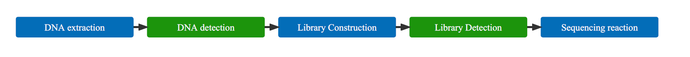
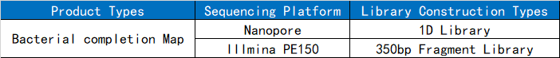
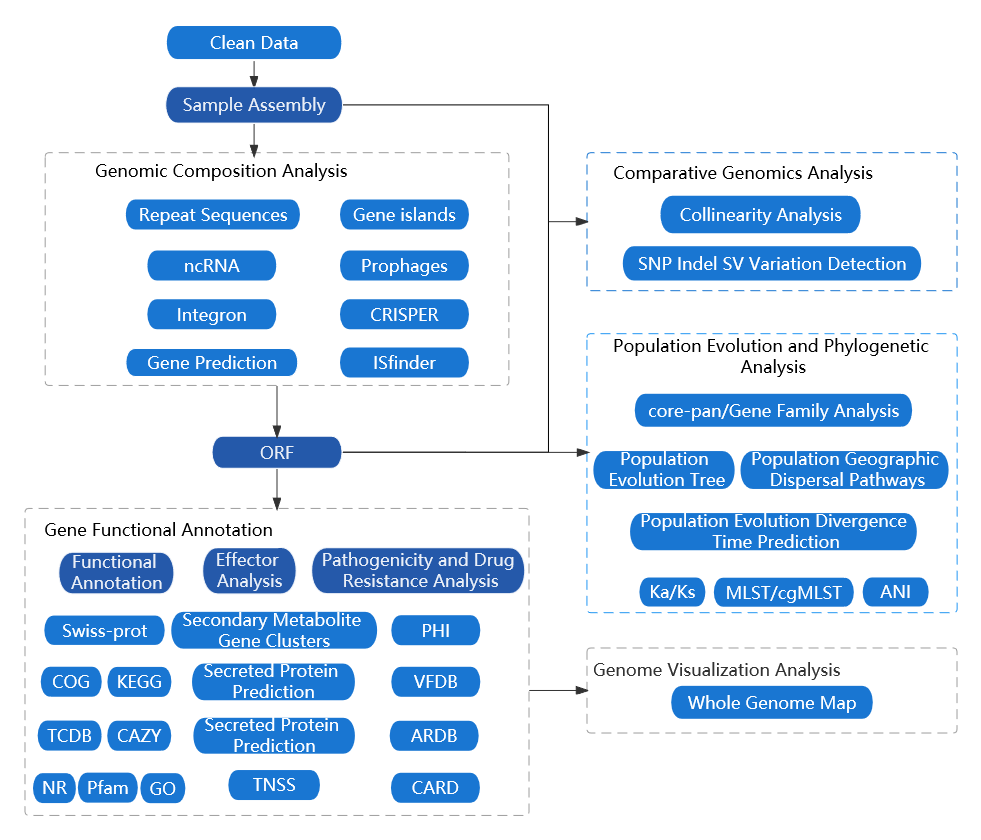

```{r setup, include=FALSE}
# set global chunk options
library(knitr)

# description of echo
opts_chunk$set(echo=FALSE)

# description of warning
opts_chunk$set(warning=FALSE)

# description of message
opts_chunk$set(message=FALSE)

# description of include
#opts_chunk$set(include=FALSE)

# description of cache
#opts_chunk$set(cache=TRUE)
```


```{r echo=FALSE}
library(knitr)
data <- read.delim('file/project_info.xls',sep='\t',header=T)
kable(data, table.attr = "class=\"nowrap\"","html") %>%
kable_styling(bootstrap_options=c("striped","hover","condensed"))
```


# overview of the workflow
##Experimental procedure



### DNA extraction


The STE method was used to extract genomic DNA from the sample, followed by agarose gel electrophoresis to test the purity and integrity of the DNA. Quantification was performed using Qubit.

### Library construction

&emsp;&emsp;（1）Library construction on the Nanopore platform.

&emsp;&emsp;First, the BluePippin automated nucleic acid fragment recovery system is used to recover large DNA fragments. Then, end-repair is performed, and the EXP-NBD104 reagent kit from Oxford Nanopore Technologies is used for PCR-free barcode addition. Subsequently, the AATI automated capillary electrophoresis system is used to detect the fragment sizes and perform equimolar pooling of the samples. Finally, the SQK-LSK109 ligation kit from Oxford Nanopore Technologies is used for adapter ligation to construct a 1D library. Sequencing is performed on the Nanopore platform.


&emsp;&emsp;（2）<font face="Arial">Library construction and library quality control on the Illumina platform.</font>

&emsp;&emsp;DNA samples that have passed gel electrophoresis are randomly sheared into fragments of approximately 350bp in length using the Covaris ultrasonic disruptor. The processed DNA fragments are then prepared into a complete library using the NEBNext® Ultra™ DNA Library Prep Kit for Illumina (NEB, USA) reagent kit, which includes steps such as end repair, A-tailing, adapter ligation, purification, and PCR amplification. After library construction is completed, initial quantification is performed using the Qubit 2.0, and the library is diluted to a concentration of 2ng/ul. Subsequently, the insert fragments of the library are detected using the Agilent 2100, and once the insert size meets expectations, the library's effective concentration is quantified using Q-PCR to ensure library quality.

### Library construction types



### Sequencing


&emsp;&emsp;After passing library quality control, different libraries are sequenced using Nanopore PromethION and Illumina NovaSeq PE150 sequencing platforms, based on their effective concentrations and the desired amount of data to be generated.


## Bioinformatics analysis workflow



<p class='mark'>Figure 1-1: Bioinformatics analysis workflow diagram</p>

Information analysis consists of several steps:

&emsp;&emsp;1 Raw data processing: This step involves filtering out low-quality reads and retaining high-quality reads. The filtered data is referred to as Clean Data.

&emsp;&emsp;2 Sample assembly: Genomic assembly is performed to obtain sequence files that reflect the sample's genome.

&emsp;&emsp;3 Genomic composition analysis: After assembly, the composition of the sample's genome is analyzed, including predictions of coding genes, non-coding RNAs, repetitive sequences, prophages, genomic islands, CRISPR, and other genomic components.

&emsp;&emsp;4 Functional annotation: Functional annotation is performed on the coding gene sequences using different databases, including commonly used databases such as KEGG, COG, and databases specific to pathogenic microorganisms.

&emsp;&emsp;5 Genomic comparative analysis: In this step, the differences between the sample and reference genomes are compared at the genome and gene levels. This includes analyses such as collinearity analysis, gene family construction, analysis of shared/unique genes, and construction of species phylogenetic trees.

&emsp;&emsp;6 Genomic visualization analysis: This step combines the results of genomic composition analysis and functional annotation to display the basic research findings of the genome.

&emsp;&emsp;Note: This analysis workflow includes all the analysis contents of this product. The blue dashed line represents advanced analysis content. The specific analysis content of this project is based on this report.


<h6 style="text-align:right">北京诺禾致源科技股份有限公司</h6>
<hr/>
</p>


# Results Presentation and Explanation

## Data overview

***

&emsp;&emsp;The raw format of Nanopore sequencing data is in fast5 format. The Guppy software is used for basecalling to convert fast5 files into fastq format. The raw data for each sample is then split based on barcodes. The raw data of each sample is analyzed using NanoPlot (https://github.com/wdecoster/NanoPlot ，version：1.29.1)software，and the detailed statistical information is shown in the table below:


<p class='mark'>Table 2-1 Sequencing Data Statistics</p>

```{r echo=FALSE}
library(DT)
data <- read.delim('file/01.Cleandata/all.Cleandata.stat.xls',sep='\t',header=T)
datatable(data,rownames=FALSE,extensions=c('KeyTable','Buttons','FixedColumns'),options=list(keys=T,scrollX=T,dom = 'Bfrtip',buttons = list('copy', 'print', list(extend = 'collection',buttons = c('csv', 'excel', 'pdf'),text = 'Download')),initComplete = JS("function(settings, json) {","$(this.api().table().header()).css({'background-color':'#4682B4','color': 'white'});","}")),class='nowrap')
```

- **Sample ID**：Sample name
- **Number of Reads**：reads number
- **Total Bases(bp)**：Data
- **Mean Read Length(bp)**：Mean Read Length
- **N50 Read Length(bp)**：Sort the obtained Polymerase reads from longest to shortest, and gradually add up the lengths of the reads until the length of Polymerase read is not less than 50% of the total length.
- **Mean Read quality**：Mean Read quality.

&emsp;&emsp;Result File Directory：Result/00.Rawdata。

&emsp;&emsp;NanoPlot software was used to perform statistics on the data with quality threshold Q>7，The statistical information is shown in the table below:

```{r echo=FALSE}
library(DT)
data <- read.delim('file/01.Cleandata/pass.clean_data.xls',sep='\t',header=T)
datatable(data,rownames=FALSE,extensions=c('KeyTable','Buttons','FixedColumns'),options=list(keys=T,scrollX=T,dom = 'Bfrtip',buttons = list('copy', 'print', list(extend = 'collection',buttons = c('csv', 'excel', 'pdf'),text = 'Download')),initComplete = JS("function(settings, json) {","$(this.api().table().header()).css({'background-color':'#4682B4','color': 'white'});","}")),class='nowrap')
```

<p class='mark'>Table 2-2: Statistics of Sequencing Quality Control Data</p>

- **Sample ID**：Sample name
- **Number of Reads**：reads number
- **Total Bases(bp)**：Data
- **Mean Read Length(bp)**：Mean Read Length
- **N50 Read Length(bp)**：Sort the obtained Polymerase reads from longest to shortest, and gradually add up the lengths of the reads until the length of Polymerase read is not less than 50% of the total length.
- **Mean Read quality**：Mean Read quality.

&emsp;&emsp;The length distribution of Polymerase Read is shown in the following graph:

```{r echo=FALSE}
library(stringr)
library(bsselectR)
state_plots <- paste0(list.files("file/01.Cleandata/","*HistogramReadlength.png",full.names=TRUE))
names(state_plots) <- str_replace_all(state_plots,c("\\HistogramReadlength.png"="","file/01.Cleandata//"=""))
bsselect(state_plots,type="img",height='40%',width='60%',live_search=TRUE,show_tick=TRUE,style='btn-info')
```

<p class='mark'>Figure 2-1 shows the length distribution graph of reads: the x-axis represents the length, and the y-axis represents the number of reads (with the position of N50 indicated on the graph).）</p>
&emsp;&emsp;Result File Directory：Result/01.Clean_data。

<p>
<br/>

<h6 style="text-align:right">北京诺禾致源科技股份有限公司</h6>
<hr/>
</p>


## Genomic Overview

### Assembly analysis

***

&emsp;&emsp;Starting from the quality-controlled and validated data of each sample, the Unicycler software(https://github.com/rrwick/Unicycler ,version：0.4.8)[6] was utilized for genome assembly using both second-generation and third-generation sequencing data. This process involved the separation of chromosomal and plasmid sequences, and assembly of the chromosomal sequences into a circular genome (or a linear genome if applicable) resulting in a final 0-gap complete genome sequence. The assembly results are shown in the following table:


<p class='mark'>Table 2-3 Statistics of Sample Genome Assembly Results</p>

```{r echo=FALSE}
library(DT)
data <- read.delim('file/02.Assembly/all.assembly.stat.xls',sep='\t',header=T)
datatable(data,rownames=FALSE,extensions=c('KeyTable','Buttons','FixedColumns'),options=list(keys=T,scrollX=T,dom = 'Bfrtip',buttons = list('copy', 'print', list(extend = 'collection',buttons = c('csv', 'excel', 'pdf'),text = 'Download')),initComplete = JS("function(settings, json) {","$(this.api().table().header()).css({'background-color':'#4682B4','color': 'white'});","}")),class='nowrap')
```

- **<font face="Arial">Sample ID</font>**：Sample name：
- **<font face="Arial">Type</font>**：Assembly Result Sequence Types
- **<font face="Arial">Contig ID</font>**：Assembled Contig ID:
- **<font face="Arial">Size(bp)</font>**：Size of Assembled Sequence:
- **<font face="Arial">GC%</font>**：GC Content of Assembled Contig:
- **<font face="Arial">Circular</font>**:Whether the sequence is circularized.

###Plasmid Sequence Alignment
***
&emsp;&emsp;Align the assembled plasmid sequence with the plasmid database and analyze the results of the alignment. The statistics of the top 5 alignment results based on the total score value are as follows:
<p class='mark'>Statistical analysis of the top 5 results of plasmid sequence alignment for Sample in Table 2-3.</p>
```{r echo=FALSE}
library(DT)
data <- read.delim('file/02.Assembly/all.plassmid.blast.stat.xls',sep='\t',header=T)
datatable(data,rownames=FALSE,extensions=c('KeyTable','Buttons','FixedColumns'),options=list(keys=T,scrollX=T,dom = 'Bfrtip',buttons = list('copy', 'print', list(extend = 'collection',buttons = c('csv', 'excel', 'pdf'),text = 'Download')),initComplete = JS("function(settings, json) {","$(this.api().table().header()).css({'background-color':'#4682B4','color': 'white'});","}")),class='nowrap')
```

- **<font face="Arial">Sample ID</font>**：Sample name：
- **<font face="Arial">query_id</font>**：Sample plasmid ID；
- **<font face="Arial">query_len</font>**：Plasmid length:
- **<font face="Arial">subject_id</font>**：ID identification of the aligned target sequence;
- **<font face="Arial">subject_len</font>**：Length of the subject sequence;
- **<font face="Arial">max_score</font>**：The highest alignment score between the plasmid sequence and the aligned database plasmid sequence;
- **<font face="Arial">total_score</font>**：Total alignment score:
- **<font face="Arial">query_cover</font>**：Alignment coverage (percentage of aligned fragments to the plasmid sequence);
- **<font face="Arial">E_value</font>**：Expected value of the alignment result:
- **<font face="Arial">identity</font>**：Percentage of sequence alignment consistency;
- **<font face="Arial">descroption</font>**：Description information of the plasmid aligned to the database.

&emsp;&emsp;Note: When the query cover value is less than 50%, the credibility of the sample plasmid alignment to the corresponding plasmid in NCBI is low.

&emsp;&emsp;Result File Directory：Result/02.Assembly/。

<p>
<br/>

<h6 style="text-align:right">北京诺禾致源科技股份有限公司</h6>
<hr/>
</p>


##Genomic composition analysis
&emsp;&emsp;The functional regions contained in microbial genomes are highly diverse. In addition to the coding gene regions, there are also non-coding regions that play roles in transcriptional regulation, post-transcriptional regulation, translational regulation, epigenetic regulation, and other functions. Some functional regions are also associated with species diversity in evolution.

&emsp;&emsp;By using various methods, the composition of the target genome can be obtained by predicting coding genes, repetitive sequences, non-coding RNAs, and other elements.

###Coding genes
&emsp;&emsp;Use GeneMarkS（Version 4.17）(http://topaz.gatech.edu/GeneMark/) software to predict coding genes in the newly sequenced genome. The statistical information of the gene prediction results is shown in the table below:

<p class='mark'>Table 2-4: Statistical Table of Predicted Coding Genes</p>

```{r echo=FALSE}
library(DT)
data <- read.delim('file/03.Genome_Component/gene.xls',sep='\t',header=T)
datatable(data,rownames=FALSE,extensions=c('KeyTable','Buttons','FixedColumns'),options=list(keys=T,scrollX=T,dom = 'Bfrtip',buttons = list('copy', 'print', list(extend = 'collection',buttons = c('csv', 'excel', 'pdf'),text = 'Download')),initComplete = JS("function(settings, json) {","$(this.api().table().header()).css({'background-color':'#4682B4','color': 'white'});","}")),class='nowrap')
```

- **Sample ID**：Sample name
- **Genome size**：Total length of the genome
- **Gene number**：Number of predicted coding genes
- **Gene total length**：Total length of all coding genes
- **Gene average length**：Average length of coding genes
- **Gene length / Genome**：Percentage of coding region length in the whole genome

&emsp;&emsp;The gene length distribution plot is shown below:

```{r echo=FALSE}
library(stringr)
library(bsselectR)
state_plots <- paste0(list.files("file/03.Genome_Component/","*.cds.png",full.names=TRUE))
names(state_plots) <- str_replace_all(state_plots,c("\\.cds.png"="","file/03.Genome_Component//"=""))
bsselect(state_plots,type="img",height='40%',width='60%',live_search=TRUE,show_tick=TRUE,style='btn-info')
```

<p class='mark'>Figure 2-2: Gene Length Distribution Plot</p>
<p class='mark'>Explanation: The x-axis represents the gene length, and the y-axis represents the corresponding number of genes.</p>
&emsp;&emsp;Result file directory:Result/03.Genome_Component/*/Gene/

###Repetitive sequence
&emsp;&emsp;Repetitive sequences are identical or complementary segments that appear in different positions in the genome and are a component of gene regulatory networks. Based on the distribution of repetitive sequences in the genome, they can be classified as dispersed repetitive sequences and tandem repeat sequences.

&emsp;&emsp;Dispersed repetitive sequences can be further divided into short interspersed nuclear elements (SINEs) and long interspersed nuclear elements (LINEs), with the latter often having transpositional activity. Tandem repeat sequences (TR) are repetitive sequences that consist of adjacent, repeated occurrences of specific nucleotide sequence patterns, occurring two or more times. TR can be further classified as minisatellite DNA and microsatellite DNA. Tandem repeat units have species-specific compositions and can be used as genetic markers to study evolutionary relationships.

&emsp;&emsp;To predict dispersed repetitive sequences, software tools such as RepeatMasker (Version open-4.0.5) are used, while DNA sequences are searched for tandem repeat sequences using TRF (Tandem Repeats Finder, Version 4.07b) [11]. The prediction results are shown in the table below.


<p class='mark'>Table 2-5: Statistics of Dispersed Repetitive Sequences Results</p>

```{r echo=FALSE}
library(DT)
data <- read.delim('file/03.Genome_Component/rep.xls',sep='\t',header=T)
datatable(data,rownames=FALSE,extensions=c('KeyTable','Buttons','FixedColumns'),options=list(keys=T,scrollX=T,dom = 'Bfrtip',buttons = list('copy', 'print', list(extend = 'collection',buttons = c('csv', 'excel', 'pdf'),text = 'Download')),initComplete = JS("function(settings, json) {","$(this.api().table().header()).css({'background-color':'#4682B4','color': 'white'});","}")),class='nowrap')
```

- **Sample ID**：Sample name
- **Type**：Types of Dispersed Repetitive Sequences
- **Number(#)**：Number of Repetitive Sequences
- **Total Length(bp)**：Total Length of Repetitive Sequences
- **In genome(%)**：Percentage of Repetitive Sequences in the Genome
- **Average length(bp)**：Average Length of Repetitive Sequences
- **LTR**：Long Terminal Repeat Sequences
- **DNA**：DNA Transposons
- **LINE**：Long Dispersed Repeat Sequences
- **SINE**：Short Dispersed Repeat Sequences
- **RC**：Rolling circle

<p class='mark'>Table 2-6: Statistical analysis of Tandem Repeat Sequences Results</p>

```{r echo=FALSE}
library(DT)
data <- read.delim('file/03.Genome_Component/TR.xls',sep='\t',header=T)
datatable(data,rownames=FALSE,extensions=c('KeyTable','Buttons','FixedColumns'),options=list(keys=T,scrollX=T,dom = 'Bfrtip',buttons = list('copy', 'print', list(extend = 'collection',buttons = c('csv', 'excel', 'pdf'),text = 'Download')),initComplete = JS("function(settings, json) {","$(this.api().table().header()).css({'background-color':'#4682B4','color': 'white'});","}")),class='nowrap')
```

- **Sample ID**：Sample name
- **Type**：Types of Tandem Repeat Sequences
- **Number(#)**：Number of Repeat Sequences
- **Repeat Size(bp)**：Length Range of Repeat Sequences
- **Total Length(bp)**：Total Length of Repeat Sequences
- **In genome(%)**：Percentage of Repeat Sequences in the Genome
- **TR**：Tandem Repeat Sequences
- **Minisatellite DNA**：Minisatellite DNA
- **Microsatellite DNA**：Microsatellite DNA


 &emsp;&emsp;Result file directory:Result/03.Genome_Component/*/Repeat/


###Non-coding RNA
&emsp;&emsp;Non-coding RNA (ncRNA) is a class of RNA molecules that perform various biological functions and do not carry information for protein translation. They directly play a role in life activities at the RNA level. For microorganisms, commonly studied ncRNAs include sRNA, rRNA, and tRNA.

&emsp;&emsp;tRNA: tRNA prediction is done using the tRNAscan-SE software (Version 1.3.1). rRNA: rRNA, also known as ribosomal RNA, is highly conserved among closely related species. There are two methods to predict rRNA. The first method involves comparing it with a reference rRNA library of closely related sequences. The second method uses the rRNAmmer software (Version 1.2) for rRNA prediction.

&emsp;&emsp;sRNA: Small RNA is first annotated through comparison with the Rfam database[14][15]. Then, the final sRNA is determined using the cmsearch program (Version 1.1rc4) with default parameters.


<p class='mark'>Table 2-7 Statistical results of ncRNA after de-replication</p>

```{r echo=FALSE}
library(DT)
data <- read.delim('file/03.Genome_Component/ncRNA.xls',sep='\t',header=T)
datatable(data,rownames=FALSE,extensions=c('KeyTable','Buttons','FixedColumns'),options=list(keys=T,scrollX=T,dom = 'Bfrtip',buttons = list('copy', 'print', list(extend = 'collection',buttons = c('csv', 'excel', 'pdf'),text = 'Download')),initComplete = JS("function(settings, json) {","$(this.api().table().header()).css({'background-color':'#4682B4','color': 'white'});","}")),class='nowrap')
```

- **Sample ID**：Sample name
- **Type**：Types of ncRNA
- **Number(#)**：Number of ncRNAs
- **Average length(bp)**：Average length of ncRNAs
- **Total length(bp)**：Total length of ncRNAs


&emsp;&emsp;Result file directory：Result/03.Genome_Component/*/ncRNA/

###Gene islands（GIs）
&emsp;&emsp;Genomic Islands (GIs) are genomic segments that are integrated into the genome of microorganisms, such as bacteria, phages, or plasmids, through gene transfer at the genetic level. A genomic island can be associated with various biological functions, including pathogenic mechanisms and adaptability of the organism. Comparative genomic analysis can be used to study the specificity and functional origins of microbial special functions.

&emsp;&emsp;Based on sequence composition, the IslandPath-DIOMB software [16] (Version 0.2) was used to predict genomic islands by detecting nucleotide bias (phylogenetically bias) and mobility genes (such as transposases or integrases) in the sequence to determine the presence of genomic islands and potential horizontal gene transfer. The results are summarized in the table below:

<p class='mark'>Table 2-8: Statistics of Genomic Island Prediction Results</p>


```{r echo=FALSE}
library(DT)
data <- read.delim('file/03.Genome_Component/GIs.xls',sep='\t',header=T)
datatable(data,rownames=FALSE,extensions=c('KeyTable','Buttons','FixedColumns'),options=list(keys=T,scrollX=T,dom = 'Bfrtip',buttons = list('copy', 'print', list(extend = 'collection',buttons = c('csv', 'excel', 'pdf'),text = 'Download')),initComplete = JS("function(settings, json) {","$(this.api().table().header()).css({'background-color':'#4682B4','color': 'white'});","}")),class='nowrap')
```

- **Sample ID**：Sample name
- **GIs number**：Number of GIs
- **GIs total length(bp)**：Total Length of GIs
- **GIs Average length(bp)**：Average Length of GIs

&emsp;&emsp;The gene distribution statistics chart for the plotted genomic islands are as follows：


```{r echo=FALSE}
library(stringr)
library(bsselectR)
state_plots <- paste0(list.files("file/03.Genome_Component/","*.GI.png",full.names=TRUE))
names(state_plots) <- str_replace_all(state_plots,c("\\.GI.png"="","file/03.Genome_Component//"=""))
bsselect(state_plots,type="img",height='40%',width='60%',live_search=TRUE,show_tick=TRUE,style='btn-info')
```

<p class='mark'>Figure 2-3: Gene distribution statistics chart in the sample genomic islands</p>
<p class='mark'>Explanation: The x-axis represents the length scale (showing genomic islands with lengths smaller than 15kb).</p>


&emsp;&emsp;Result file directory：Result/03.Genome_Component/*/Genomic_Island/

###Prophages
&emsp;&emsp;The nucleic acids of temperate phages integrated into the host genome are called prophages. They can replicate or segregate synchronously with the host bacterial DNA. The presence of prophage sequences may enable bacteria to acquire antibiotic resistance, enhance adaptability to the environment, increase adhesion, or transform bacteria into pathogens.


&emsp;&emsp;PhiSpy software [17] (Version 2.3) was used to predict prophages in the sample genome. The prediction results are shown in Table 2-9:

<p class='mark'>Table 2-9: Prophage prediction result statistics</p>


```{r echo=FALSE}
library(DT)
data <- read.delim('file/03.Genome_Component/Prophage.xls',sep='\t',header=T)
datatable(data,rownames=FALSE,extensions=c('KeyTable','Buttons','FixedColumns'),options=list(keys=T,scrollX=T,dom = 'Bfrtip',buttons = list('copy', 'print', list(extend = 'collection',buttons = c('csv', 'excel', 'pdf'),text = 'Download')),initComplete = JS("function(settings, json) {","$(this.api().table().header()).css({'background-color':'#4682B4','color': 'white'});","}")),class='nowrap')
```

- **Sample ID**：Sample name
- **Prophage_Num**：Number of prophages
- **Total_length**：Total length of prophages
- **Average_length**：Average length of prophages


&emsp;&emsp;Result file directory：Result/03.Genome_Component/*/Prophage/

###CRISPR
&emsp;&emsp;CRISPR (Clustered Regularly Interspaced Short Palindromic Repeat Sequences) are short repetitive sequences that are homologous to phages or plasmids. They provide resistance to phages through the action of homologous DNA and are part of the prokaryotic immune system.

&emsp;&emsp;The CRISPR locus contains CRISPR-associated genes (Cas genes) that function in conjunction with CRISPR to provide immunity, such as CRISPR/Cas9. The study of CRISPR can analyze functional differences between different strains, particularly in terms of environmental adaptability and pathogenicity.

&emsp;&emsp;CRISPR prediction was performed on the sample genome using CRISPRdigger [18] (Version 1.0). The prediction results are summarized in the following table:

<p class='mark'>Table 2-10: CRISPR prediction result statistics </p>


```{r echo=FALSE}
library(DT)
data <- read.delim('file/03.Genome_Component/CRISPR.xls',sep='\t',header=T)
datatable(data,rownames=FALSE,extensions=c('KeyTable','Buttons','FixedColumns'),options=list(keys=T,scrollX=T,dom = 'Bfrtip',buttons = list('copy', 'print', list(extend = 'collection',buttons = c('csv', 'excel', 'pdf'),text = 'Download')),initComplete = JS("function(settings, json) {","$(this.api().table().header()).css({'background-color':'#4682B4','color': 'white'});","}")),class='nowrap')
```

- **Sample ID**：Sample name
- **CRISPR_Num number**：Predicted total number of CRISPRs 
- **Total_length**：Total length of CRISPRs
- **Average_length**：Average length of CRISPRs 


&emsp;&emsp;Result file directory：Result/03.Genome_Component/*/CRISPR/

###ISfinder analysis

&emsp;&emsp;IS, Insertion Sequences, are relatively short and compact DNA fragments (between 0.7 to 2.5 kb) that only encode functions related to mobility. They are a major class of Mobile Genetic Elements (MGEs). The ISfinder database（https://www-is.biotoul.fr/） is used to predict bacterial insertion sequences.

&emsp;&emsp;The assembly sequences are compared to the ISfinder database using Blast software to obtain the prediction results for insertion sequences.


&emsp;&emsp;Result file directory：Result/03.Genome_Component/*/ISfinder/

###Integron analysis

&emsp;&emsp;Integron: Integrative element: Integrons are mobile DNA molecules with a unique structure that can capture and integrate exogenous genes, transforming them into functional gene expression units. They facilitate the horizontal transfer of multidrug resistance genes in bacteria through transposons or conjugative plasmids. Integrons are present in many bacteria, located on chromosomes, plasmids, or transposons. They are an inherent genetic unit in bacteria that enhances bacterial survival by capturing exogenous genes. The INTEGRALL database（http://integrall.bio.ua.pt/?）is used to predict integrons in the genome.


&emsp;&emsp;Blast software is used to compare the assembly sequences with the INTEGRALL database to obtain the integron prediction results.

&emsp;&emsp;Result file directory：Result/03.Genome_Component/*/Integron/

<p>
<br/>

<h6 style="text-align:right">北京诺禾致源科技股份有限公司</h6>
<hr/>
</p>

##Gene function analysis

###Effector

####Secreted protein prediction
&emsp;&emsp;Secreted proteins are proteins that are synthesized inside cells and are transported outside the cells to perform their functions under the guidance of signal peptides. Many important enzymes required for life activities are present in secreted proteins. The N-terminus of secreted proteins is a signal peptide consisting of 15 to 30 amino acids, which plays a leading role in the secretion of secreted proteins.

&emsp;&emsp;Prediction is performed using the SignalP [27] (Version 4.1) and TMHMM (Version 2.0c) tools to detect the presence of signal peptides and transmembrane structures, and to comprehensively predict whether the protein sequence is a secreted protein.

<p class='mark'>Table 2-11 Statistical table of secreted proteins results</p>


```{r echo=FALSE}
library(DT)
data <- read.delim('file/04.Genome_Function/SP.xls',sep='\t',header=T)
datatable(data,rownames=FALSE,extensions=c('KeyTable','Buttons','FixedColumns'),options=list(keys=T,scrollX=T,dom = 'Bfrtip',buttons = list('copy', 'print', list(extend = 'collection',buttons = c('csv', 'excel', 'pdf'),text = 'Download')),initComplete = JS("function(settings, json) {","$(this.api().table().header()).css({'background-color':'#4682B4','color': 'white'});","}")),class='nowrap')
```

- **Sample ID**:sample name
- **SignalP Protein**：Number of proteins with signal peptide structures
- **TMHMM Protein**：Number of proteins with transmembrane structures
- **Secreted Protein**：Number of proteins predicted as secreted proteins


&emsp;&emsp;Result file directory：Result/04.Genome_Function/*/Effector/Secretory_Protein/

####Prediction of secretion system proteins and T3SS effector proteins 

&emsp;&emsp;Pathogenic bacteria secrete this type of protein to the extracellular or host cells through the secretion system TNSS (type N secretion systems, currently known to have 7 types, types I to VII), and control immune response reactions and cell death to cause pathological reactions. The T3SS of gram-negative bacteria is usually used to study the molecular level of pathogens, infection mechanisms, virulence, etc., and is a secretion system that has been studied more.

&emsp;&emsp;For the TNSS system, secretion system-related proteins are extracted from the protein sequence functional database annotation results for annotation. For gram-negative bacteria, the EffectiveT3 software [28] (Version 1.0.1) is used to predict T3SS effector proteins.

&emsp;&emsp;The prediction results are summarized as follows:

<p class='mark'>Table 2-12 TNSS results statistics</p>

```{r echo=FALSE}
library(DT)
data <- read.delim('file/04.Genome_Function/TNSS.xls',sep='\t',header=T)
datatable(data,rownames=FALSE,extensions=c('KeyTable','Buttons','FixedColumns'),options=list(keys=T,scrollX=T,dom = 'Bfrtip',buttons = list('copy', 'print', list(extend = 'collection',buttons = c('csv', 'excel', 'pdf'),text = 'Download')),initComplete = JS("function(settings, json) {","$(this.api().table().header()).css({'background-color':'#4682B4','color': 'white'});","}")),class='nowrap')
```

- **Sample ID**:sample name
- **Total_Gene_Num**:Total number of encoding genes
- **TNSS**:Number of proteins predicted as type I to VII secretion system effector proteins

Result file directory：Result/04.Genome_Function/*/Effector/TNSS/

<p class='mark'>Table 2-13 T3SS effector protein prediction results statistics</p>
```{r echo=FALSE}
library(DT)
data <- read.delim('file/04.Genome_Function/T3SS.xls',sep='\t',header=T)
datatable(data,rownames=FALSE,extensions=c('KeyTable','Buttons','FixedColumns'),options=list(keys=T,scrollX=T,dom = 'Bfrtip',buttons = list('copy', 'print', list(extend = 'collection',buttons = c('csv', 'excel', 'pdf'),text = 'Download')),initComplete = JS("function(settings, json) {","$(this.api().table().header()).css({'background-color':'#4682B4','color': 'white'});","}")),class='nowrap')
```

- **Sample ID**:sample name
- **Total Protein**:Total number of encoding genes
- **T3S effective true**:Number of proteins predicted as T3SS effector proteins
- **T3S effective false**:Number of proteins predicted as non-T3SS effector proteins

Result file directory：Result/04.Genome_Function/*/Effector/T3SS/

####Secondary metabolite gene cluster analysis
&emsp;&emsp;Secondary metabolites are substances synthesized by microorganisms from primary metabolites during a certain growth period. They do not have a specific function in the life activities of microorganisms and are not substances necessary for growth and reproduction. The antiSMASH program [29] (version 4.0.2) is used to predict the gene clusters in the genome.

&emsp;&emsp;PKS can be divided into three types: type I, also known as modular PKS, is a multifunctional enzyme complex composed of multiple domains. Type II, also known as aromatic PKS, mainly synthesizes aromatic compounds. Type III, also known as chalcone PKS. The antiSMASH-4.0.2 program is used to predict the genome, and the prediction results are summarized in the following table:

<p class='mark'>Table 2-14 Statistics of secondary metabolite gene clusters and gene numbers</p>


```{r echo=FALSE}
library(DT)
data <- read.delim('file/04.Genome_Function/sm.xls',sep='\t',header=T)
datatable(data,rownames=FALSE,extensions=c('KeyTable','Buttons','FixedColumns'),options=list(keys=T,scrollX=T,dom = 'Bfrtip',buttons = list('copy', 'print', list(extend = 'collection',buttons = c('csv', 'excel', 'pdf'),text = 'Download')),initComplete = JS("function(settings, json) {","$(this.api().table().header()).css({'background-color':'#4682B4','color': 'white'});","}")),class='nowrap')
```

- **Sample ID**：Sample name
- **cluster**：Gene cluster name
- **Clusters number**：Number of gene clusters
- **Gene number**：Number of genes in the gene cluster

```{r echo=FALSE}
library(stringr)
library(bsselectR)
state_plots <- paste0(list.files("file/04.Genome_Function/","*.cluster_num.png",full.names=TRUE))
names(state_plots) <- str_replace_all(state_plots,c("\\.cluster_num.png"="","file/04.Genome_Function//"=""))
bsselect(state_plots,type="img",height='40%',width='60%',live_search=TRUE,show_tick=TRUE,style='btn-info')
```

<p class='mark'>Figure 2-4 Statistics of sample gene clusters and corresponding gene numbers</p>
&emsp;&emsp;Result file directory：Result/04.Genome_Function/*/Effector/Secondary_Metabolism/


###Gene function annotation
&emsp;&emsp;Currently, the commonly used functional databases for annotation include NR, GO, KEGG, COG, TCDB, CAZY, Pfam, and Swiss-Prot.

&emsp;&emsp;The basic steps of functional annotation are as follows:

&emsp;&emsp;1）Use the Diamond tool to compare the predicted gene protein sequences with various functional databases (evalue ≤ 1e-5);

&emsp;&emsp;2）Filter the comparison results: For each sequence's comparison results, select the comparison result with the highest score（defaultidentity>=40%，coverage>=40%）for annotation.


####NR database annotation
&emsp;&emsp;NR, also known as the Non-Redundant Protein Database [23], is a non-redundant protein database created and maintained by NCBI. Its characteristics are that it is relatively comprehensive and contains species information in the annotation results, which can be used for species classification. Based on the annotated species, the annotated species and number of genes are statistically summarized, as shown in the following figure:


```{r echo=FALSE}
library(stringr)
library(bsselectR)
state_plots <- paste0(list.files("file/04.Genome_Function/","*.nr.anno.png",full.names=TRUE))
names(state_plots) <- str_replace_all(state_plots,c("\\.nr.anno.png"="","file/04.Genome_Function//"=""))
bsselect(state_plots,type="img",height='40%',width='60%',live_search=TRUE,show_tick=TRUE,style='btn-info')
```

<p class='mark'>Figure 2-5 Sample NR Database Species Annotation Statistics Chart</p>
<p class='mark'>Explanation: The x-axis represents the species ID, and the y-axis represents the number of genes annotated. </p>
&emsp;&emsp;Result file directory：Result/04.Genome_Function/*/General_Gene_Annotation/NR/

####GO database annotation
&emsp;&emsp;GO, short for Gene Ontology [19], is an internationally standardized classification system for describing gene functions. GO is divided into three categories: 1) Cellular Component: used to describe subcellular structures, locations, and macromolecular complexes, such as nucleoli, telomeres, and recognition initiation complexes; 2) Molecular Function: used to describe the functions of genes and gene products, such as carbohydrate binding or ATP hydrolysis enzyme activity; 3) Biological Process: used to describe the biological processes in which gene-encoded products are involved, such as mitosis or purine metabolism. The statistical results of the three major categories of the GO database are shown in the following figure:


```{r echo=FALSE}
library(stringr)
library(bsselectR)
state_plots <- paste0(list.files("file/04.Genome_Function/","*.go.png",full.names=TRUE))
names(state_plots) <- str_replace_all(state_plots,c("\\.go.png"="","file/04.Genome_Function//"=""))
bsselect(state_plots,type="img",height='40%',width='60%',live_search=TRUE,show_tick=TRUE,style='btn-info')
```

<p class='mark'>Figure 2-6 Sample Gene Function Annotation GO Functional Classification Chart</p>
<p class='mark'>Explanation: The x-axis represents the GO terms of the subcategories of the three major categories of GO, and the y-axis represents the number of genes annotated to that term (including the sub-terms of that term). The three different colors represent the three basic classifications of GO terms (from left to right: Biological Process, Cellular Component, Molecular Function).</p>
&emsp;&emsp;Result file directory：Result/04.Genome_Function/*/General_Gene_Annotation/GO/

####KEGG database annotation
&emsp;&emsp;KEGG, short for Kyoto Encyclopedia of Genes and Genomes [20][21], is a database that systematically analyzes the metabolic pathways of gene products and compounds in cells, as well as the functions of these gene products. It integrates data from various aspects such as genomes, chemical molecules, and biochemical systems, including metabolic pathways (KEGG PATHWAY), drugs (KEGG DRUG), diseases (KEGG DISEASE), functional modules (KEGG MODULE), gene sequences (KEGG GENES), and genomes (KEGG GENOME), etc. The KO (KEGG ORTHOLOG) system connects various KEGG annotation systems, and KEGG has established a complete system of KO annotation, which can complete the functional annotation of the genomes or transcriptomes of newly sequenced species. For more details, please refer to http://www.genome.jp/kegg/.

&emsp;&emsp;The statistical chart of the number of annotated genes in the KEGG database is shown below:


```{r echo=FALSE}
library(stringr)
library(bsselectR)
state_plots <- paste0(list.files("file/04.Genome_Function/","*kegg.functional_classification.png",full.names=TRUE))
names(state_plots) <- str_replace_all(state_plots,c("\\.kegg.functional_classification.png"="","file/04.Genome_Function//"=""))
bsselect(state_plots,type="img",height='40%',width='60%',live_search=TRUE,show_tick=TRUE,style='btn-info')
```

<p class='mark'>Figure 2-7 Sample Gene Function Annotation KEGG Metabolic Pathway Classification Chart</p>

&emsp;&emsp;Explanation: The numbers on the bar chart represent the number of genes annotated. The other coordinate axis represents the codes of the level 1 functional categories in the database, and the explanations of the codes can be found in the corresponding legend.

&emsp;&emsp;Result file directory：Result/04.Genome_Function/*/General_Gene_Annotation/KEGG/

#### COG database annotation
&emsp;&emsp;COG, short for Cluster of Orthologous Groups of proteins [22], is a protein database created and maintained by NCBI. It is constructed based on the evolutionary relationship of encoded proteins in the complete genomes of bacteria, algae, and eukaryotes. By comparing protein sequences, a specific protein sequence can be annotated to a specific COG. Each COG cluster consists of orthologous sequences, allowing the inference of the sequence's function. The COG database can be divided into 26 functional categories, as detailed at http://www.ncbi.nlm.nih.gov/COG/.

&emsp;&emsp;The COG database is divided into 26 functional categories, and the statistical results are shown in the following figure:


```{r echo=FALSE}
library(stringr)
library(bsselectR)
state_plots <- paste0(list.files("file/04.Genome_Function/","*.cog.class.png",full.names=TRUE))
names(state_plots) <- str_replace_all(state_plots,c("\\.cog.class.png"="","file/04.Genome_Function//"=""))
bsselect(state_plots,type="img",height='40%',width='60%',live_search=TRUE,show_tick=TRUE,style='btn-info')
```

<p class='mark'>Figure 2-8 Sample Gene Function Annotation COG Functional Classification Chart</p>
<p class='mark'>Explanation: The x-axis represents the COG functional types, and the y-axis represents the number of annotated genes.</p>
&emsp;&emsp;Result file directory：Result/04.Genome_Function/*/General_Gene_Annotation/COG/

####CAZy database annotation
&emsp;&emsp;CAZy [26], short for Carbohydrate-Active enZYmes Database, is a specialized database related to carbohydrate-active enzymes. It includes enzyme families that catalyze carbohydrate degradation, modification, and biosynthesis. It consists of five main classifications: glycoside hydrolases (GHs), glycosyl transferases (GTs), polysaccharide lyases (PLs), carbohydrate esterases (CEs), and auxiliary activities (AAs). For more details, please refer to http://www.cazy.org/.

&emsp;&emsp;The classification annotation results and the number statistics graph of the CAZy database are shown below:

<p class='mark'>Table 2-15 Carbohydrate Enzyme Classification Annotation Results</p>


```{r echo=FALSE}
library(DT)
data <- read.delim('file/04.Genome_Function/CAZy.xls',sep='\t',header=T)
datatable(data,rownames=FALSE,extensions=c('KeyTable','Buttons','FixedColumns'),options=list(keys=T,scrollX=T,dom = 'Bfrtip',buttons = list('copy', 'print', list(extend = 'collection',buttons = c('csv', 'excel', 'pdf'),text = 'Download')),initComplete = JS("function(settings, json) {","$(this.api().table().header()).css({'background-color':'#4682B4','color': 'white'});","}")),class='nowrap')
```

- **Sample ID**：Sample name
- **CBM**：Number of genes related to carbohydrate-binding modules (CBMs)
- **CE**：Number of genes related to carbohydrate esterases (CEs)
- **GH**：Number of genes related to glycoside hydrolases (GHs)
- **GT**：Number of genes related to glycosyl transferases (GTs)
- **PL**：Number of genes related to polysaccharide lyases (PLs)
- **AA**：Number of genes related to auxiliary activities (AAs)


```{r echo=FALSE}
library(stringr)
library(bsselectR)
state_plots <- paste0(list.files("file/04.Genome_Function/","*.single_CAZy_class.png",full.names=TRUE))
names(state_plots) <- str_replace_all(state_plots,c("\\.single_CAZy_class.png"="","file/04.Genome_Function//"=""))
bsselect(state_plots,type="img",height='40%',width='60%',live_search=TRUE,show_tick=TRUE,style='btn-info')
```
<p class='mark'>Figure 2-9 Sample CAZy Functional Classification and Corresponding Gene Quantity Statistics Chart</p>
<p class='mark'>Explanation: The x-axis represents the CAZy database classification types, and the y-axis represents the number of annotated genes.</p>

&emsp;&emsp;Carbohydrate-binding domains are non-catalytic domains that can fold into specific three-dimensional structures and have the function of binding carbohydrates. Recent studies have shown that carbohydrate-binding domains can enhance the activity of carbohydrate-active enzymes by binding to the substrates of these enzymes.

&emsp;&emsp;Result file directory：Result/04.Genome_Function/*/General_Gene_Annotation/CAZy/


####TCDB database annotation
&emsp;&emsp;TCDB, short for Transporter Classification Database [24], is a membrane transporter protein classification database that includes ion channels (TC system). The TCDB database classifies transport systems into 5 levels, and the statistical results for the first level are shown in the following figure:


```{r echo=FALSE}
library(stringr)
library(bsselectR)
state_plots <- paste0(list.files("file/04.Genome_Function/","*tcdb.class.catalog.png",full.names=TRUE))
names(state_plots) <- str_replace_all(state_plots,c("\\.tcdb.class.catalog.png"="","file/04.Genome_Function//"=""))
bsselect(state_plots,type="img",height='40%',width='60%',live_search=TRUE,show_tick=TRUE,style='btn-info')
```

<p class='mark'>Figure 2-10 Sample Gene Function Annotation TCDB Functional Classification Chart: X-axis (TCDB first-level classification types); Y-axis (number of annotated genes)</p>
&emsp;&emsp;Result file directory：Result/04.Genome_Function/*/General_Gene_Annotation/TCDB/


####Pfam database annotation
&emsp;&emsp;Proteins are generally composed of one or more functional regions, which are often referred to as domains. Different combinations of domains result in different protein structures. Therefore, the identification of protein domains is particularly important for analyzing protein function.

&emsp;&emsp;The Pfam database consists of two components: Pfam-A and Pfam-B, with Pfam-A being manually curated and of higher quality. For more details, please refer to http://pfam.xfam.org/.

&emsp;&emsp;Result file directory：Result/04.Genome_Function/*/General_Gene_Annotation/Pfam/

####Swiss-Prot database annotation
&emsp;&emsp;Swiss-Prot [25] is a curated protein sequence database that provides high-level annotation results, such as protein function, domain structure, post-translational modifications, and variations. For more details, please refer to http://www.ebi.ac.uk/uniprot/.

&emsp;&emsp;Result file directory：Result/04.Genome_Function/*/General_Gene_Annotation/Swiss-Prot/

###Toxicity or Pathogenicity Analysis
####Pathogen Host Interactions (PHI) Database Annotation

&emsp;&emsp;PHI, short for Pathogen Host Interactions Database [30], is a database of interactions between pathogens and hosts. It mainly includes fungal, oomycete, and bacterial pathogens, and their hosts include animals, plants, fungi, and insects. This database plays an important role in the identification of target genes for drug intervention. It also includes antifungal compounds and their corresponding target genes. Each gene in the database contains nucleotide and amino acid sequences, as well as detailed descriptions of predicted protein functions during the infection process.

&emsp;&emsp;The statistical distribution of the number of genes for each phenotype mutation type in the pathogen PHI is shown in the following figure:


```{r echo=FALSE}
library(stringr)
library(bsselectR)
state_plots <- paste0(list.files("file/04.Genome_Function/","*phi.class.png",full.names=TRUE))
names(state_plots) <- str_replace_all(state_plots,c("\\.phi.class.png"="","file/04.Genome_Function//"=""))
bsselect(state_plots,type="img",height='40%',width='60%',live_search=TRUE,show_tick=TRUE,style='btn-info')
```

<p class='mark'>Figure 2-11 Sample Gene Function Annotation Pathogen PHI Phenotype Mutation Type Distribution Chart</p>
<p class='mark'>Explanation: The x-axis represents phenotype mutation types, and the y-axis represents the number of annotated genes.</p>

&emsp;&emsp;Result file directory：Result/04.Genome_Function/*/Pathogenicity/PHI/

####Virulence Factors of Pathogenic Bacteria (VFDB) Annotation
&emsp;&emsp;The VFDB database [31], short for Virulence Factors of Pathogenic Bacteria, is a database specifically studying the virulence factors of pathogenic bacteria, chlamydiae, and rickettsiae. In addition to the species information and basic characteristics of virulence genes, it also provides detailed descriptions of virulence gene functions and pathogenic mechanisms. As of November 2017, the database has collected 74 genera of pathogenic bacteria with 1796 virulence factors, 926 related strains, and 30,178 VF-related genes (non-redundant).

&emsp;&emsp;Using the Diamond software, the amino acid sequences of the target species are aligned with the VFDB database to combine the genes of the target species with their corresponding virulence factor functional annotation information to obtain the annotation results.

&emsp;&emsp;Result file directory：Result/04.Genome_Function/*/Pathogenicity/VFDB/

####Antibiotic Resistance Genes Database (ARDB, CARD) Annotation
&emsp;&emsp;The ARDB database [32], short for Antibiotic Resistance Genes Database, enables the identification of antibiotic resistance-related gene names and information about the types of antibiotics they can resist.

&emsp;&emsp;Using the Diamond software, the amino acid sequences of the target species are aligned with the ARDB database to combine the genes of the target species with their corresponding antibiotic resistance functional annotation information to obtain the annotation results.

&emsp;&emsp;Result file directory：Result/04.Genome_Function/*/Pathogenicity/ARDB/

&emsp;&emsp;The CARD database [33], short for Comprehensive Antibiotic Research Database, is a recently developed antibiotic resistance gene database that has advantages such as comprehensive information, user-friendliness, and timely updates. The core component of this database is Antibiotic Resistance Ontology (ARO), which integrates sequence, antibiotic resistance, mechanism of action, and associations between AROs. Through the annotation of this database, one can find information about antibiotic resistance-related gene names and the types of antibiotics they can resist.

&emsp;&emsp;Using the RGI (v5.1.0) software, the amino acid sequences of the target species are aligned with the CARD database (v3.2.5) to combine the genes of the target species with their corresponding antibiotic resistance functional annotation information to obtain the annotation results.

&emsp;&emsp;Result file directory：Result/04.Genome_Function/*/Pathogenicity/CARD/

<p>
<br/>

<h6 style="text-align:right">北京诺禾致源科技股份有限公司</h6>
<hr/>
</p>


##  Genome Visualization Analysis

###  Whole Genome Map

***
&emsp;&emsp;The assembled genome sequence of the sequenced sample, combined with the predicted results of coding genes, is visualized using the Circos software [38] to display the sample genome. If analysis of non-coding RNA and gene function annotation is performed simultaneously, the relevant analysis results will also be displayed on the map. The whole genome map is shown as follows:

```{r echo=FALSE}
library(stringr)
library(bsselectR)
state_plots <- paste0(list.files("file/05.Genome_Drawing/Chr/","*.Overview.png",full.names=TRUE))
names(state_plots) <- str_replace_all(state_plots,c("\\.Overview.png"="","file/05.Genome_Drawing/Chr//"=""))
bsselect(state_plots,type="img",height='40%',width='60%',live_search=TRUE,show_tick=TRUE,style='btn-info')
```

<p class='mark'>Figure 2-12 Whole Genome Map</p>
<p class='mark'>Explanation: The outermost circle represents the genomic sequence position coordinates. From outer to inner, they are the results of gene function annotation (including COG (KOG) annotation results information based on the actual project situation), ncRNA, and genome GC content. The blue region inwards represents regions with GC content lower than the average GC content of the whole genome, while the red region outwards represents the opposite. The higher the peak, the greater the difference from the average GC content. The genome GC skew value: window size (chromosome length / 1000) bp, step size (chromosome length / 1000) bp. The specific algorithm is (G-C)/(G+C). The green region inwards represents regions with a lower G content than C, while the orange region outwards represents the opposite. </p>

&emsp;&emsp;Plasmid Map is shown as follows:

```{r echo=FALSE}
library(stringr)
library(bsselectR)
state_plots <- paste0(list.files("file/05.Genome_Drawing/Plas/","*.Overview.png",full.names=TRUE))
names(state_plots) <- str_replace_all(state_plots,c("\\.Overview.png"="","file/05.Genome_Drawing/Plas//"=""))
bsselect(state_plots,type="img",height='40%',width='60%',live_search=TRUE,show_tick=TRUE,style='btn-info')
```

<p class='mark'>Figure 2-13 Plasmid Circular Map</p>
<p class='mark'>Explanation: From outer to inner, the image consists of COG functional annotation classified genes (arrows represent the coding genes in the clockwise direction), genomic sequence position coordinates, genome GC content. The GC content is calculated with a window size of 500 bp and a step size of 20 bp. The blue region inwards represents regions with GC content lower than the average GC content of the whole genome, while the red region outwards represents the opposite. The higher the peak, the greater the difference from the average GC content. The genome GC skew value is calculated with a window size of 500 bp and a step size of 20 bp. The specific algorithm is (G-C)/(G+C). The green region inwards represents regions with a lower G content than C, while the orange region outwards represents the opposite.</p>

&emsp;&emsp;Result file directory：Result/05.Genome_Drawing/Genome_Overview。

<p>
<br/>

<h6 style="text-align:right">北京诺禾致源科技股份有限公司</h6>
<hr/>
</p>

# Method Description
&emsp;&emsp;The following is a default process method description. Please update it according to the actual situation

[Method Description](src/method_B_C_ONT.pdf)

[Information Analysis](src/analysis_method_ONT_B_C_EN.pdf)

[Result File Directory Explanation](src/Result_file_directory_ONT_EN.pdf)

[FAQ](src/FAQ_ONT_EN.pdf)

[Prediction Software and Database Version Explanation](src/Version_information_EN.html)

# References


- **[1] Li R, Zhu H, Ruan J, et al. De novo assembly of human genomes with massively parallel short read sequencing[J]. Genome research, 2010, 20(2): 265-272.**
- **[2] Li R, Li Y, Kristiansen K, et al. SOAP: short oligonucleotide alignment program[J]. Bioinformatics, 2008, 24(5): 713-714.**
- **[3] Bankevich A, Nurk S, Antipov D, et al. SPAdes: a new genome assembly algorithm and its applications to single-cell sequencing[J]. Journal of Computational Biology, 2012, 19(5): 455-477.**
- **[4] Simpson JT, Wong K, Jackman SD, et al. ABySS: a parallel assembler for short read sequence data.[J]. Genome Research, 2009, 19(6):1117.**
- **[5] Lin S H, Liao Y C. CISA: contig integrator for sequence assembly of bacterial genomes[J]. PloS one, 2013, 8(3): e60843.**
- **[6] Wick RR, Judd LM, Gorrie CL, Holt KE. Unicycler: Resolving bacterial genome assemblies from short and long sequencing reads.[J]. PLoS Computational Biology, 2017 Jun 8:13(6).**
- **[7] Reiner J, Pisani L, Qiao W, et al. Cytogenomic identification and long-read single molecule real-time (SMRT) sequencing of aBardet–Biedl Syndrome 9(BBS9) deletion:[J]. Npj Genomic Medicine, 2018, 3(1).**
- **[8] Besemer J, Lomsadze A, Borodovsky M. GeneMarkS: a self-training method for prediction of gene starts in microbial genomes. Implications for finding sequence motifs in regulatory regions[J]. Nucleic Acids Research, 2001, 29(12): 2607-2618.**
- **[9] Stanke, M, Diekhans, M, Baertsch, RHaussler, D. Using native and syntenically mapped cDNA alignments to improve de novo gene finding[J]. Bioinformatics, 2008, 24(5):637-644.**
- **[10] Saha S, Bridges S, Magbanua Z V, et al. Empirical comparison of ab initio repeat finding programs[J]. Nucleic acids research, 2008, 36(7): 2284-2294.**
- **[11] Benson G. Tandem repeats finder: a program to analyze DNA sequences[J]. Nucleic acids research, 1999, 27(2): 573.**
- **[12] Lowe T M, Eddy S R. tRNAscan-SE: a program for improved detection of transfer RNA genes in genomic sequence[J]. Nucleic acids research, 1997, 25(5): 0955-964.**
- **[13] Lagesen K, Hallin P, Rødland E A, et al. RNAmmer: consistent and rapid annotation of ribosomal RNA genes[J]. Nucleic acids research, 2007, 35(9): 3100-3108.**
- **[14] Gardner P P, Daub J, Tate J G, et al. Rfam: updates to the RNA families database[J]. Nucleic acids research, 2009, 37(suppl 1): D136-D140.**
- **[15] Nawrocki EP, Kolbe DL, Eddy SR: Infernal 1.0: inference of RNA alignments. Bioinformatics 2009, 25(10):1335-1337.**
- **[16] Hsiao W, Wan I, Jones S J, et al. IslandPath: aiding detection of genomic islands in prokaryotes[J]. Bioinformatics, 2003, 19(3): 418-420.**
- **[17]You Z, YJ Liang, Karlene L, et al. PHAST: A Fast Phage Search Tool Nucl. Acids Res, 2011 **
- **[18] Grissa I, Vergnaud G, Pourcel C. CRISPRFinder: a web tool to identify clustered regularly interspaced short palindromic repeats[J]. Nucleic acids research, 2007, 35(suppl 2): W52-W57.**
- **[19] Ashburner M, Ball C A, Blake J A, et al. Gene Ontology: tool for the unification of biology[J]. Nature genetics, 2000, 25(1): 25-29.**
- **[20] Kanehisa M, Goto S, Kawashima S, et al. The KEGG resource for deciphering the genome[J]. Nucleic acids research, 2004, 32(suppl 1): D277-D280.**
- **[21] Kanehisa M, Goto S, Hattori M, et al. From genomics to chemical genomics: new developments in KEGG[J]. Nucleic acids research, 2006, 34(suppl 1): D354-D357.**
- **[22] Galperin MY, Makarova KS, Wolf YI, et al. Expanded microbial genome coverage and improved protein family annotation in the COG database[J]. Nucleic Acids Research, 2015, 43(Database issue):261-9.**
- **[23] Li W, Jaroszewski L, Godzik A. Tolerating some redundancy significantly speeds up clustering of large protein databases[J]. Bioinformatics, 2002, 18(1): 77-82.**
- **[24] Milton SJ, Vamsee SR, Dorjee GT, et al. The Transporter Classification Database. Nucleic Acids Research, 2014 **
- **[25] Amos B, Rolf A. The SWISS-PROT protein sequence database and its supplement TrEMBL in 2000. Nucleic Acids Res. 2000, 28(1): 45-48.**
- **[26] Cantarel B L, Coutinho P M, Rancurel C, et al. The Carbohydrate-Active EnZymes database (CAZy): an expert resource for glycogenomics[J]. Nucleic acids research, 2009, 37(suppl 1): D233-D238.**
- **[27] Petersen T N, Brunak S, von Heijne G, et al. SignalP 4.0: discriminating signal peptides from transmembrane regions[J]. Nature methods. 2011, 8(10): 785-786.**
- **[28] Eichinger V, Nussbaumer T, Platzer A, et al. Effective DB-updates and novel features for a better annotation of bacterial secreted proteins and Type III, IV, VI secretion systems. 2016, Nucleic Acids Res. **
- **[29] Medema M H, Blin K, Cimermancic P, et al. antiSMASH: rapid identification, annotation and analysis of secondary metabolite biosynthesis gene clusters in bacterial and fungal genome sequences[J]. Nucleic acids research, 2011, 39(suppl 2): W339-W346.**
- **[30] Martin U, Rashmi P, Arathi R et al. The Pathogen-Host Interactions database (PHI-base): additions and future developments. Nucleic Acids Research. 2015 **
- **[31] Chen L, Xiong Z, Sun L, et al. VFDB 2012 update: toward the genetic diversity and molecular evolution of bacterial virulence factors[J]. Nucleic acids research, 2012, 40(D1): D641-D645.**
- **[32] Liu B, Pop M. ARDB-antibiotic resistance genes database[J]. Nucleic acids research, 2009, 37(suppl 1): D443-D447.**
- **[33] Jia B, Raphenya A R, Alcock B, et al. CARD 2017: expansion and model-centric curation of the comprehensive antibiotic resistance database[J]. Nucleic Acids Research, 2017, 45(Database issue):D566-D573.**
- **[34] Kurtz S, Phillippy A, Delcher A L, et al. Versatile and open software for comparing large genomes[J]. Genome biology, 2004, 5(2): R12.**
- **[35] Harris R S. Improved pairwise alignment of genomic DNA[M]. ProQuest, 2007.**
- **[36] Chiaromonte F, Yap V B, Miller W. Scoring pairwise genomic sequence alignments[C]//Pacific Symposium on Biocomputing. 2001, 7: 115.**
- **[37] Altschul S F, Gish W, Miller W, et al. Basic local alignment search tool[J]. Journal of molecular biology, 1990, 215(3): 403-410.**
- **[38] Krzywinski, M. et al. Circos: an Information Aesthetic for Comparative Genomics. Genome Res (2009) 19:1639-1645**
