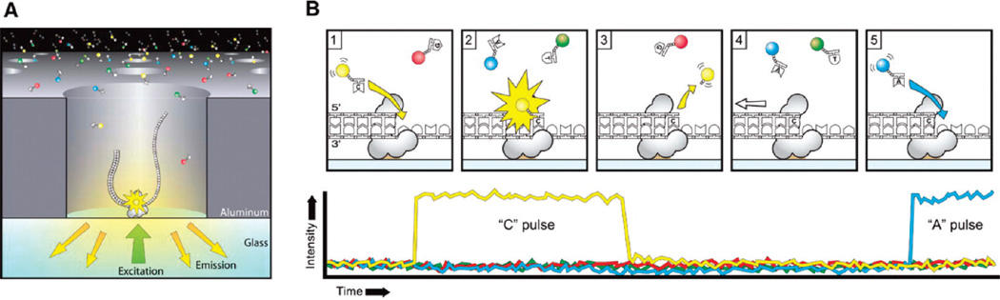
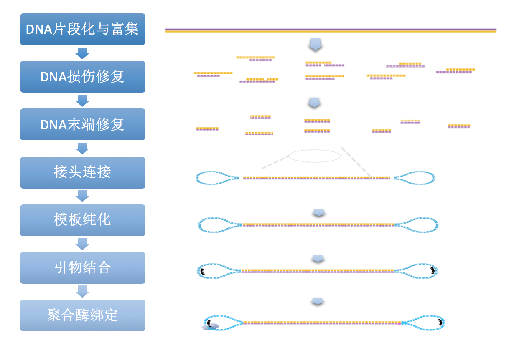
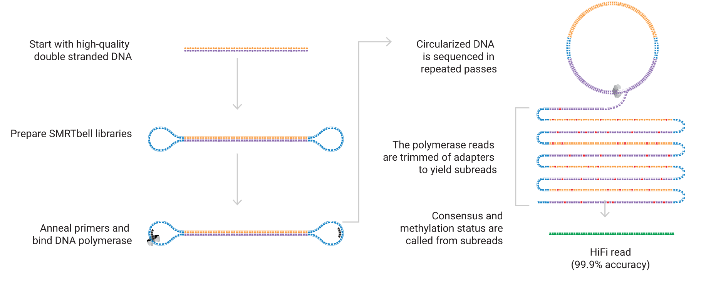
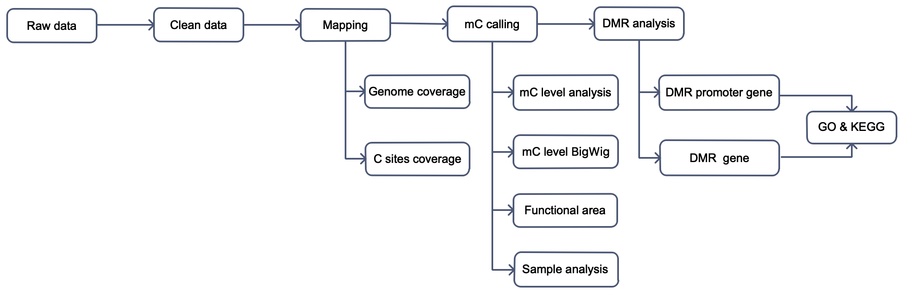
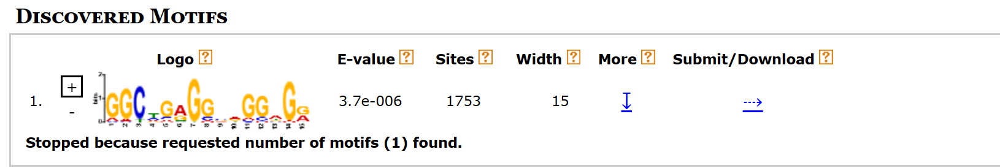
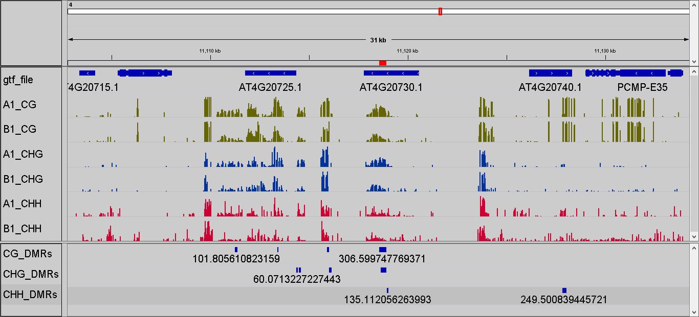

```{r setup, include=FALSE}
# set global chunk options
library(knitr)

# description of echo
opts_chunk$set(echo=FALSE)

# description of warning
opts_chunk$set(warning=FALSE)

# description of message
opts_chunk$set(message=FALSE)

# description of include
#opts_chunk$set(include=FALSE)

# description of cache
#opts_chunk$set(cache=TRUE)
```


```{r echo=FALSE}
library(knitr)
data <- read.delim('file/project_info.xls',sep='\t',header=T)
kable(data, table.attr = "class=\"nowrap\"","html") %>%
kable_styling(bootstrap_options=c("striped","hover","condensed"))
```

# 总体工作流程概述
## 背景介绍


### Pacbio 技术简介

&emsp;&emsp;近年来，随着高通量测序技术的发展，三代测序逐渐成为基因组研究的新兴手段。由于二代测序读长短，不能跨过高重复和低复杂度区域，而以PacBio为代表的第三代测序技术有效的解决了这个问题。该平台利用单分子实时测序，又称SMRT（Single Molecule Real-Time）测序，构建超长片段的文库，得到超长的reads。Sequel II 和 IIe systems测序仪是美国太平洋生物技术公司（Pacific Biosciences ： http://www.pacb.com），基于Sequel II 和 IIe systems平台最新推出的第三代测序平台，该系统以其测序通量高、数据成本低、周期短等特点优于RSII平台。

### 平台优势

1. 超长的测序读长。平均读长12-15kb，最长可达70kb，轻松跨过高重复和低复杂区域；
2. 超高的测序通量。一个SMRT cell上由原来的15万个ZMW孔增加到100万个，极大的提高了测序通量；
3. 无GC偏好性。在高GC含量区域可以完全跨过，保证序列的均匀覆盖度；
4. 无PCR扩增偏向性。DNA建库过程中不需要进行PCR扩增，避免了覆盖度不均一和PCR冗余；
5. 直接检测碱基修饰。根据不同类型的修饰碱基具有不同的DNA聚合酶动力学特征，直接判断碱基的甲基化类型。

### 测序原理

SMRT(Single-Molecule,Real-Time)测序即单分子实时测序（边合成边测序），
其原理是：
&emsp;&emsp;当DNA与聚合酶形成的复合物被ZMW（零模波导孔）捕获后，4种不同荧光标记的dNTP通过布朗运动随机进入检测区域并与聚合酶结合，与模板匹配的碱基生成化学键的时间远远长于其他碱基停留的时间。因此统计荧光信号存在时间的长短，可区分匹配的碱基与游离碱基。通过统计4种荧光信号与时间的关系，即可测定DNA模板序列。



## 测序流程

### DNA样品检测

诺禾致源对DNA样品的检测主要包括2种方法：

1. 琼脂糖凝胶电泳分析DNA降解程度以及是否有RNA、蛋白质污染；
2. Qubit对DNA浓度进行精确定量。

### 文库构建

将基因组DNA经26G Needle片段化，使用BluePippin选择20kb以上的片段，经末端修复和加A尾后，再在片段两端分别连接接头，制备DNA 文库，如图所示。



### 上机测序

库检合格，根据文库的有效浓度及数据产出需求运用PacBio Sequel IIe 平台进行测序。

### HiFi reads获取

PacBio数据下机后，使用仪器自带的SMRTLINK（v11）进行一致性CCS序列（circular consensus sequencing）的获得，CCS序列的准确性达到99.9%单分子水平。



### 引言

&emsp;&emsp;DNA甲基化是一种被广泛研究的表观遗传修饰方式，与组蛋白修饰等方式一起，在调控基因表达和染色质构象等方面发挥了重要作用。通常甲基化DNA指5-甲基胞嘧啶（5mC），它是在DNA甲基转移酶（DNMT）的作用下将甲基基团添加到胞嘧啶的5’C位置上形成的结构（Vertino PM, 1996）。哺乳动物细胞中甲基化主要发生在CG双核苷酸的胞嘧啶上（Goldberg AD, 2007），植物细胞中则存在很大比例的non-CG（CHH、CHG，H代表A、C、T）甲基化（Jackson JP, 2002）。

&emsp;&emsp;一般来说，高DNA甲基化水平会抑制基因表达，去甲基化则可以使得基因重新表达。DNA甲基化参与了众多的细胞生命活动，包括细胞分化、组织特异性基因表达、基因组印记、X染色体失活等（Bird A, 2002; Jones PA, 2001; Reik W, 2003）。异常的DNA甲基化会导致发育异常、肿瘤等疾病的发生。因此，DNA甲基化的研究对于深入理解基因表达、个体发育以及疾病的发生、发展机制都具有重要意义。


### 生物信息分析流程



<p class='mark'>图 1-1 生物信息分析流程图</p>

信息分析分以下几个步骤：

&emsp;&emsp;1 原始下机数据处理 此步骤过滤测序质量值低的reads，保留带有甲基化信号的高质量reads；

&emsp;&emsp;2 参考基因组比对，根据比对质量过滤掉部分低质量比对，并将比对结果输出；

&emsp;&emsp;3 甲基化水平分析 根据比对位置和比对的质量值，统计甲基化位点信息，对于鉴定出的甲基化位点，计算其甲基化水平 ；

&emsp;&emsp;4 甲基化位点motif识别 使用全基因组该序列环境位点信息和鉴定为甲基化的位点序列信息作Logo Plots，研究不同context下甲基化胞嘧啶上下游的序列特征；

&emsp;&emsp;5 差异甲基化修饰区域(Differentially Methylated Region，DMR)鉴定与注释:对不同样 本的甲基化位点进行聚类得到DMR，并进行注释; 

&emsp;&emsp;6 DMR相关基因功能分析:通过注释结果确定DMR相关基因，对其进行功能分类富集分 析和信号通路及网络富集分析。 

&emsp;&emsp;注:此分析流程包括该产品的所有分析内容，本项目具体分析内容以此报告为准。


<h6 style="text-align:right">北京诺禾致源科技股份有限公司</h6>
<hr/>
</p>

# 结果展示及说明

## 数据概况 

&emsp;&emsp;1. 原始的测序reads是包含两端接头的哑铃型结构序列，称为Polymerase reads。原始数据从接头处打断并过滤掉接头序列后得到subreads，subreads按照标准Filtering subreads by minimum length >=50 进行过滤。

&emsp;&emsp;2. 在subreads基础上，采用ccs软件产生高精度的HiFi reads，在这里我们设定的标准是min-passes=3，min-rq=0.99，--hifi-kinetics，即所有consensus reads质量值都在Q20以上，且每条序列都有对应的4个kinetics标签。

&emsp;&emsp;3. 采用SMRTLink 11.x及以上版本直接运行primrose软件，将移除CCS reads包含的4个kinetics标签，生成包含2个碱基修饰相关标签（Mm和Ml）hifi reads序列信息。

&emsp;&emsp;一般来说，该部分数据为下游分析的有效输入数据，统计结果如下：

<p class='mark'>表1.1 HIFI测序数据统计</p>

```{r echo=FALSE}
library(DT)
data <- read.delim('file/01.primrose/all_sample.ccs_stat.xls',sep='\t',header=T)
datatable(data,rownames=FALSE,extensions=c('KeyTable','Buttons','FixedColumns'),options=list(keys=T,scrollX=T,dom = 'Bfrtip',buttons = list('copy', 'print', list(extend = 'collection',buttons = c('csv', 'excel', 'pdf'),text = 'Download')),initComplete = JS("function(settings, json) {","$(this.api().table().header()).css({'background-color':'#4682B4','color': 'white'});","}")),class='nowrap')
```

- Sample：样品名称
- CCS_bases：聚类之后得到的一致性序列的碱基数
- CCS_number：聚类之后得到的一致性序列的reads数
- Min_length：最短的CCS长度
- Max_length：最长的CCS长度
- Mean_length：CCS的平均长度
- N50：将得到的CCS按照长度从长到短排序，依次累加CCS的长度直至不小于总长50%时的CCS read的长度。

&emsp;&emsp;统计各个样品CCS序列的长度分布图如下：

```{r echo=FALSE}
library(stringr)
library(bsselectR)
state_plots <- paste0(list.files("file/01.primrose/","*ccs_distri.png",full.names=TRUE))
names(state_plots) <- str_replace_all(state_plots,c("\\.ccs_distri.png"="","file/01.primrose//"=""))
bsselect(state_plots,type="img",height='40%',width='60%',live_search=TRUE,show_tick=TRUE,style='btn-info')

```

<p class='mark'>图1.1 CCS reads长度分布的，对应长度reads条数（纵坐标）；CCS序列长度（横坐标）</p>

&emsp;&emsp;结果文件目录：Result/01.primrose/*

<p>
<br/>

<h6 style="text-align:right">北京诺禾致源科技股份有限公司</h6>
<hr/>
</p>


## 参考基因组比对分析

### 比对结果统计


&emsp;&emsp;采用SMRT Link 11.x及以上版本直接运行primrose软件，将移除CCS reads包含的4个kinetics标签，生成包含2个碱基修饰相关标签（Mm和Ml）hifi reads序列信息，使用minimap2软件将序列比对到参考基因组上，根据比对位置和比对的质量值，统计比对到参考基因组上的覆盖度和深度。测序覆盖深度是指测序得到的碱基总量（bp）与基因组大小（Genome）的比值，它是评价测序量的指标之一。测序覆盖度可以理解为检测到全基因组的多少区域，反映了一个区域被平均多少个reads检测到。

<p class='mark'>表2.1  各样本与参考基因组比对结果统计</p>

```{r echo=FALSE}
library(DT)
data <- read.delim('file/02.mapping/all_sample.mapping_summary.xls',sep='\t',header=T)
datatable(data,rownames=FALSE,extensions=c('KeyTable','Buttons','FixedColumns'),options=list(keys=T,scrollX=T,dom = 'Bfrtip',buttons = list('copy', 'print', list(extend = 'collection',buttons = c('csv', 'excel', 'pdf'),text = 'Download')),initComplete = JS("function(settings, json) {","$(this.api().table().header()).css({'background-color':'#4682B4','color': 'white'});","}")),class='nowrap')
```

<p class='mark'>注：我们对该表格设置了<font face="Arial">Copy/Print/Download</font>以及<font face="Arial">Search</font>功能，点击<font face="Arial">Copy</font>可以复制表格中数据，用户可以任意新建<font face="Arial">excel</font>或文本文档，可以将数据粘贴其中，并保留原有的行和列的格式；点击<font face="Arial">Print</font>则可以打印表格中数据（链接打印机的情况下）；点击<font face="Arial">Download</font>可以以<font face="Arial">CSV、Excel、PDF</font>的三种格式下载表格中数据。在<font face="Arial">Search</font>方框中输入指定信息，则会在下方表格中显示包含该信息的所有内容。以下表格中涉及的<font face="Arial">Copy/Print/Search</font>功能与此处相同。</p>

- Samples： 样品名称
- avg_depth: 基因组所有位点的平均覆盖深度
- coverage1X: 基因组上大于等于1×测序深度的bases数占基因组总长的比例
- coverage4X：基因组上大于等于4×测序深度的bases数占基因组总长的比例
- coverage10X: 基因组上大于等于10×测序深度的bases数占基因组总长的比例
- coverage20X: 基因组上大于等于20×测序深度的bases数占基因组总长的比例
- all_reads: CCS序列的reads数
- mapped_reads: 比对到参考基因组上的reads的数目
- unmapped_reads: 未比对到参考基因组上的reads的数目
- mapped_rate: 比对上的reads数占总reads数的比例
- unmapped_rate: 未比对上的reads数占总reads数的比例
- mapped_readlength_n50: 比对上的reads长度的N50
- mapped_Mean_Concordance: 比对上的reads的平均质量值

```{r echo=FALSE}
#library(slickR)
library(stringr)
library(bsselectR)
state_plots <-  paste0(list.files("file/02.mapping/","*.accumulative.png",full.names=TRUE))
names(state_plots) <- str_replace_all(state_plots,c("\\.accumulative.png"="","file/02.mapping//"=""))
bsselect(state_plots,type="img",height='40%',width='60%',live_search=TRUE,show_tick=TRUE,style='btn-info')

```
<p class='mark'>图2.1 各样本的CCS reads比对至参考基因组的深度分布图</p>

<p class='mark'>说明： 横坐标表示参考序列上每个位点的测序深度，左纵坐标对应图中Sequencing depth统计，表示不同测序深度的比例统计；右纵坐标对应图中Cumulative sequencing depth统计，表示测序深度比例的累加值分布，从高深度到低深度统计分布情况。</p>


```{r echo=FALSE}
#library(slickR)
library(stringr)
library(bsselectR)
state_plots <-  paste0(list.files("file/02.mapping/","*.mapped_concordance_vs_read_length.png",full.names=TRUE))
names(state_plots) <- str_replace_all(state_plots,c("\\.mapped_concordance_vs_read_length.png"="","file/02.mapping//"=""))
bsselect(state_plots,type="img",height='40%',width='60%',live_search=TRUE,show_tick=TRUE,style='btn-info')

#ggplotly(p)

```
<p class='mark'>图2.2 各样本的CCS reads比对至参考基因组的长度和质量分布图 </p>

<p class='mark'>说明：横坐标表示mapping至参考基因组的ccs reads长度分布，左纵坐标对表示mapping上ccs reads的质量分布；右纵坐标对应reads数量统计，表示比对到参考基因组上相应的长度和质量的ccs reads的数量统计。</p>


```{r echo=FALSE}
#library(slickR)
library(stringr)
library(bsselectR)
state_plots <-  paste0(list.files("file/02.mapping/","*.chrom_RCP.png",full.names=TRUE))
names(state_plots) <- str_replace_all(state_plots,c("\\.chrom_RCP.png"="","file/02.mapping//"=""))
bsselect(state_plots,type="img",height='40%',width='60%',live_search=TRUE,show_tick=TRUE,style='btn-info')

```
<p class='mark'>图2.3 Reads在各染色体的分布柱状图</p>
<p class='mark'>图2.3 横轴为各染色体的名称，纵轴：左边是比对到相应染色体reads的平均深度，对应的是柱状图；右边是每条染色体被reads覆盖的比例，对应的是散点图。</p>

&emsp;&emsp;结果文件目录：Result/02.mapping/

<br/>

<h6 style="text-align:right">北京诺禾致源科技股份有限公司</h6>
<hr/>
</p>
## 甲基化位点覆盖度分析

&emsp;&emsp;通过上面的比对、位点calling；以及对甲基化数据的基因组覆盖度/深度、C位点覆盖度/深度统计评估后，接着将进行甲基化的C位点分析，筛选鉴定可靠的甲基化位点，对于鉴定出的甲基化位点，计算其甲基化水平，公式为：ML=mC/(mC+umC)。其中ML为甲基化水平，mC和umC分别代表甲基化C和未甲基化C的位点支持的reads个数比对结果。

### 甲基化位点检测

<p class='mark'>表3.1 C位点甲基化水平列表</p>

```{r echo=FALSE}
library(DT)
data <- read.delim('file/03.methystat/all_sample.methylation_summary.stat.txt',sep='\t',header=T)
datatable(data,rownames=FALSE,extensions=c('KeyTable','Buttons','FixedColumns'),options=list(keys=T,scrollX=T,dom = 'Bfrtip',buttons = list('copy', 'print', list(extend = 'collection',buttons = c('csv', 'excel', 'pdf'),text = 'Download')),initComplete = JS("function(settings, json) {","$(this.api().table().header()).css({'background-color':'#4682B4','color': 'white'});","}")),class='nowrap')
```

<p class='mark'>注：我们对该表格设置了<font face="Arial">Copy/Print/Download</font>以及<font face="Arial">Search</font>功能，点击<font face="Arial">Copy</font>可以复制表格中数据，用户可以任意新建<font face="Arial">excel</font>或文本文档，可以将数据粘贴其中，并保留原有的行和列的格式；点击<font face="Arial">Print</font>则可以打印表格中数据（链接打印机的情况下）；点击<font face="Arial">Download</font>可以以<font face="Arial">CSV、Excel、PDF</font>的三种格式下载表格中数据。在<font face="Arial">Search</font>方框中输入指定信息，则会在下方表格中显示包含该信息的所有内容。以下表格中涉及的<font face="Arial">Copy/Print/Search</font>功能与此处相同。</p>

- Chr_nums：染色体编号
- POS：该位点在染色体上的位置；
- Strand:该位点在染色体上的链信息；
- Methylation_Level：甲基化水平，计算公式为：甲基化的C/(甲基化的C+非甲基化的C)；
- mC_count：甲基化C的个数；
- umC_count：非甲基化C的个数
- Context：C位点类型

<p class='mark'>表3.2 C位点的覆盖度水平</p>

```{r echo=FALSE}
library(DT)
data <- read.delim('file/03.methystat/all_sample.mC_level_Identification_stat.xls',sep='\t',header=T)
datatable(data,rownames=FALSE,extensions=c('KeyTable','Buttons','FixedColumns'),options=list(keys=T,scrollX=T,dom = 'Bfrtip',buttons = list('copy', 'print', list(extend = 'collection',buttons = c('csv', 'excel', 'pdf'),text = 'Download')),initComplete = JS("function(settings, json) {","$(this.api().table().header()).css({'background-color':'#4682B4','color': 'white'});","}")),class='nowrap')
```

<p class='mark'>注：我们对该表格设置了<font face="Arial">Copy/Print/Download</font>以及<font face="Arial">Search</font>功能，
点击<font face="Arial">Copy</font>可以复制表格中数据，用户可以任意新建<font face="Arial">excel</font>或文本文档，可以将数据粘
贴其中，并保留原有的行和列的格式；点击<font face="Arial">Print</font>则可以打印表格中数据（链接打印机的情况下）；点击<font face="Arial">Download</font>可以以<font face="Arial">CSV、Excel、PDF</font>的三种格式下载表格中数据。在<font face="Arial">Search</font>方框中输入指定信息，则会在下方表格中显示包含该信息的所有内容。以下表格中涉及的<font face="Arial">Copy/Print/Search</font>功能与此处相同。</p>
- Sample：样品名称
- C_covgMean：甲基化C位点的平均覆盖度
- CpG：CpG区域甲基化位点总数
- CpGIsland： CpGIsland区域甲基化位点总数
- other_CG：除去CpGIsland区域剩余的甲基化位点
- MeanCpG(%)：CpG区域甲基化位点平均甲基化水平
- MeanCpGIsland(%)：CpGIsland区域甲基化位点平均甲基化水平
- mC_percent(%)：CpG区域甲基化位点占全基因组的比例
- mCpG_percent(%)： CpGIsland区域甲基化位点占全基因组的比例


```{r echo=FALSE}
#library(slickR)
library(stringr)
library(bsselectR)
state_plots <- paste0(list.files("file/03.methystat/","*.line.methylevel_stat.png",full.names=TRUE))
names(state_plots) <- str_replace_all(state_plots,c("\\.line.methylevel_stat.png"="","file/03.methystat//"=""))
bsselect(state_plots,type="img",height='40%',width='60%',live_search=TRUE,show_tick=TRUE,style='btn-info')
```
<p class='mark'>图3.1 所有样本甲基化位点水平分布图</p>
<p class='mark'>说明：横坐标为甲基化水平，纵坐标为所占该序列环境甲基化位点的百分比。（ 对于甲基化水平小于5%以0%表示，甲基化水平大于等于95%以100%表示，中间10%一个阶级以中间值表示 ）</p>


### 单样本甲基化分析
&emsp;&emsp;单样本甲基化分析：主要是在单个样本层面进行整体水平甲基化水平密度、染色体水平甲基化水平密度、基因功能区域
甲基化水平分布和基因上下游2K甲基化水平分布，这个几个方面来展现物种甲基化模式，构建物种甲基化谱。分析结果如下：

```{r echo=FALSE}
#library(slickR)
library(stringr)
library(bsselectR)
state_plots <- paste0(list.files("file/03.methystat/","*violin.methylevel_stat.png",full.names=TRUE))
names(state_plots) <- str_replace_all(state_plots,c("\\.violin.methylevel_stat.png"="","file/03.methystat//"=""))
bsselect(state_plots,type="img",height='40%',width='60%',live_search=TRUE,show_tick=TRUE,style='btn-info')
```

<p class='mark'>图3.2 不同样本全基因组范围甲基化位点水平分布</p>
<p class="mark">说明：横坐标代表不同样本/组别名称，纵坐标代表甲基化水平。以10kb为一个bin，每个violin的宽度代表处于该甲基化水平下的bin的多少。</p>


```{r echo=FALSE}
#library(slickR)
library(stringr)
library(bsselectR)
state_plots <- paste0(list.files("file/03.methystat/","*violin.density.methylevel_stat.png",full.names=TRUE))
names(state_plots) <- str_replace_all(state_plots,c("\\.violin.density.methylevel_stat.png"="","file/03.methystat//"=""))
bsselect(state_plots,type="img",height='40%',width='60%',live_search=TRUE,show_tick=TRUE,style='btn-info')
```
<p class='mark'>图3.3 不同样本全基因组范围甲基化位点密度分布</p>
<p class="mark">说明：横坐标代表不同样本/组别名称，纵坐标代表甲基化密度，以10kb为一个bin。每个violin的宽度代表处于该甲基化密度下的bin的多少</p>


```{r echo=FALSE}
#library(slickR)
library(stringr)
library(bsselectR)
state_plots <- paste0(list.files("file/03.methystat/","*circos_level.png",full.names=TRUE))
names(state_plots) <- str_replace_all(state_plots,c("\\.circos_level.png"="","file/03.methystat//"=""))
bsselect(state_plots,type="img",height='40%',width='60%',live_search=TRUE,show_tick=TRUE,style='btn-info')
```

<p class='mark'>图3.4 单样本甲基化水平circos图</p>
<p class="mark">说明：采用circos图方式展示甲基化密度在染色体上的分布情况，由外向内依次表示：CG序列环境甲基化密度，TE原件所占比例密度热图，gene数目密度热图；内部标尺：MC密度热标：由绿转黄到红依次表示甲基化密度由低到高，TE比例热标：由绿转黑到红依次表示repeat序列比例由低到高，gene密度热标：由灰白到黑表示基因数目由低到高。TE密度计算方式：计算TE（repeat原件）比例，为该bin内repeat所占的总长度比（没有repeat则不进行该分析）；gene密度计算：计算各个bin所含基因数目的多少。</p>

```{r echo=FALSE}
library(stringr)
library(bsselectR)
state_plots <- paste0(list.files("file/03.methystat/","*.circos_density.level.png",full.names=TRUE))
names(state_plots) <- str_replace_all(state_plots,c("\\.circos_density.level.png"="","file/03.methystat//"=""))
bsselect(state_plots,type="img",height='40%',width='60%',live_search=TRUE,show_tick=TRUE,style='btn-info')
```


<p class='mark'>图3.5 单样本甲基化密度circos图</p>
<p class="mark">说明：采用circos图方式展示甲基化密度在染色体上的分布情况，由外向内依次表示:甲基化水平线性展示,gene数目密度热图,甲基化密度线性展示; gene密度热标：由灰白到黑表示基因数目由低到高。</p>

### 功能区域甲基化水平分布
&emsp;&emsp;对每种context中C位点在各种基因组功能区域（如promoter，exon，intron，CGI，CGI shore，repeat等。 其中，promoter区为TSS位点上游2kb的区域；通常哺乳动物的CGI和CGI shore使用cpgIslandExt进行预测，repeat使用RepeatMasker预测本物种或其近源物种。）的平均甲基化水平进行统计，每个样本的基因组功能元件的平均甲基化水平分布:

```{r echo=FALSE}
library(stringr)
library(bsselectR)
state_plots <- paste0(list.files("file/03.methystat/","*.mC_genomic_feature_level.png",full.names=TRUE))
names(state_plots) <- str_replace_all(state_plots,c("\\.mC_genomic_feature_level.png"="","file/03.methystat//"=""))
bsselect(state_plots,type="img",height='40%',width='60%',live_search=TRUE,show_tick=TRUE,style='btn-info')

```
<p class='mark'>图3.6 样本甲基化水平在不同基因组元件上的分布</p>
<p class="mark">说明：横坐标代表不同区域，纵坐标代表甲基化水平。将每个基因的各个区域分别等分成50个bin，然后对所有区域的对应的bin的C位点水平取平均值，颜色代表CpG区域的序列context。</p>

```{r echo=FALSE}
library(stringr)
library(bsselectR)
state_plots <- paste0(list.files("file/03.methystat/","*.gene_updown_2K_level.png",full.names=TRUE))
names(state_plots) <- str_replace_all(state_plots,c("\\.gene_updown_2K_level.png"="","file/03.methystat//"=""))
bsselect(state_plots,type="img",height='40%',width='60%',live_search=TRUE,show_tick=TRUE,style='btn-info')

```
<p class='mark'>图3.7 样本甲基化水平在genebody上下游2K的分布</p>
<p class="mark">说明：横坐标代表不同区域，纵坐标代表甲基化水平。将每个基因的各个区域分别等分成50个bin，然后对所有区域的对应的
bin的C位点水平取平均值，颜色代表CpG区域的序列context。</p>

```{r echo=FALSE}
library(stringr)
library(bsselectR)
state_plots <- paste0(list.files("file/03.methystat/","*.mc_cgi_region_level.png",full.names=TRUE))
names(state_plots) <- str_replace_all(state_plots,c("\\.mc_cgi_region_level.png"="","file/03.methystat//"=""))
bsselect(state_plots,type="img",height='40%',width='60%',live_search=TRUE,show_tick=TRUE,style='btn-info')

```
<p class='mark'>图3.8 样本甲基化水平在CGI和CGI shore的分布</p>
<p class="mark">说明：横坐标代表不同区域，纵坐标代表甲基化水平。将每个基因的各个区域分别等分成50个bin，然后对所有区域的对应的
bin的C位点水平取平均值，颜色代表CpG区域的序列context。</p>

&emsp;&emsp;结果文件目录：Result/03.methystat/*

<p>
<br/>

<h6 style="text-align:right">北京诺禾致源科技股份有限公司</h6>
<hr/>
</p>

##  甲基化位点motif识别

 
&emsp;&emsp;Motif 表示包含mC位点在内的上下游9bp 的碱基分布特征，可以表征序列保守性，其可能在基因表达调控中发挥作用。motif 分析对DNA-protein binding sites等的发现有重要的意义。对于各个序列环境（CG，CHG，CHH），我们使用全基因组该序列环境位点信息和鉴定为甲基化的位点序列信息（取包括位点在内的9bp的碱基）作Logo Plots  ( Lister R , Pelizzola M , Dowen RH  et al. (2009) )，研究不同context下甲基化胞嘧啶上下游的序列特征。


<p class='mark'>图4.1 不同序列环境下甲基化C位点相邻碱基的logo图</p>

<p class='mark'>说明： 横坐标表示参考序列上每个位点的测序深度，左纵坐标对应图中Sequencing depth统计，表示不同测序深度的比例统计；右纵坐标对应图中Cumulative sequencing depth统计，表示测序深度比例的累加值分布，从高深度到低深度统计分布情况。</p>

&emsp;&emsp;我们提供BS-Seq检测的C位点甲基化水平的bw格式文件，以反应全基因各个位置的甲基化水平分布 ，部分物种还提供相应的参考基因组和注释文件，并推荐使用IGV（Integrative Genomics Viewer） 浏览器对bw文件进行可视化浏览（浏览示意图如下所示）（ James T. Robinson et al . Nature Biotechnology (2011) ）。
- (1) 在不同尺度下显示单个或多个样本在基因组上特定位置的甲基化情况，包括在各个染色体和在注释的外显子、内含子、剪接接合区、基因间区的甲基化水平、位点分布等；
- (2) 在不同尺度下显示不同区域的甲基化位点密度、水平
- (3) 显示基因的注释信息；
- (4) 既可以从远程服务器端下载各种注释信息，又可以从本地加载注释信息。


<p class='mark'>图4.2  甲基化位点IGV可视化 </p>
<p class='mark'>IGV可视化示意图:在IGV确定后保存为SVG格式然后使用AI编辑为如下形式,在IGV基础下通过AI编辑后展示结果（ 客户自己调整）</p>


<p>
<br/>

<h6 style="text-align:right">北京诺禾致源科技股份有限公司</h6>
<hr/>
</p>

##  比较组合甲基化水平联合作图

&emsp;&emsp;上面我们对单个样本甲基化情况进行作图展示，对于大多数研究比较关注的是样本间甲基化水平差异情况，在此我们进行比较组>合分析；比较组合分析主要从整体甲基化水平、基因功能区域甲基化水平分布、基因上下游2Kbp 层面展示组合间甲基化变化情况。
###  DMR显著性circos图
DMR在基因组上分布以及显著性作图分析 ，以circos图的形式反映（ Krzywinski , M. et al. 2009 . Circos ）。

经过统计检验后会有一个统计值areaStat ，以表示DMR区域差异显著情况 。在此以circos图的形式反映特定染色体上DMR的显著性 ，以及DMR在染色体上的分布情况 

&emsp;&emsp;对CG序列环境DMR显著性整体Circos展示，如图所示

```{r echo=FALSE}
library(stringr)
library(bsselectR)
state_plots <- paste0(list.files("file/05.DMR/","*.circos.png",full.names=TRUE))
names(state_plots) <- str_replace_all(state_plots,c("\\.circos.png"="","file/05.DMR//"=""))
bsselect(state_plots,type="img",height='40%',width='60%',live_search=TRUE,show_tick=TRUE,style='btn-info')
```

<p class='mark'>图5.1 DMR整体Circos展示</p>

<p class='mark'>说明：从外到内3圈依次表示：处理组甲基化水平，样本组间甲基化水平差异，对照组甲基化水平；内部标尺：颜色分级图（DNA methylation level）表示甲基化水平高低，热图（DNA methylation difference) 表示样本间甲基化水平差异程度。</p>

### 比较组合CG序列在基因功能原件上甲基化水平的分布

&emsp;&emsp;在此我们对比较组合基因功能区域甲基化水平进行作图分析，对每种context中C位点在各种基因组功能区域（如promoter，exon，intron，CGI，CGI shore，repeat等。 其中，promoter区为TSS位点上游2kb的区域）的平均甲基化水平进行统计，展示形式不同于单样本分析。

```{r echo=FALSE}
library(stringr)
library(bsselectR)
state_plots <- paste0(list.files("file/03.methystat/","*.mC_genomic_feature_level.png",full.names=TRUE))
names(state_plots) <- str_replace_all(state_plots,c("\\.mC_genomic_feature_level.png"="","file/03.methystat//"=""))
bsselect(state_plots,type="img",height='40%',width='60%',live_search=TRUE,show_tick=TRUE,style='btn-info')
```

<p class='mark'>图5.2 比较组合CG序列在基因功能原件上甲基化水平的分布  </p>
<p class='mark'>说明：横坐标代表不同基因组元件，纵坐标代表甲基化水平。将每个基因的各个区域分别等分成20个bin，然后对所有区域的对应的bin的C位点水平取平均值。</p>

### DMR分析
&emsp;&emsp;在多种样本（组织、细胞、个体等）的基因组里甲基化状态有可能不尽相同，涉及到的差异甲基化区域被认为可能参与基因的转录水平调控。鉴定差异甲基化可以综合考察不同组织中表观遗传学的差异。众所周知，DNA甲基化与细胞分化及增殖有关，现已发现在胚胎重编程阶段（R-DMRs）及发育阶段（D-DMRs）中存在的许多DMRs（Reik, 2001; Meissner, 2008; Doi, 2009）。癌症与正常样品相比也展示出整体的甲基化缺失和局部区域如抑癌基因promoter区CpG islands的过度甲基化情况（Irizarry, 2009）。在此我们在比较组合间进行DMR分析。

&emsp;&emsp;在该分析流程中我们使用DSS分析软件进行DMR（differentially methylated regions）鉴定（Hao Feng，Hao Wu, 2014；Hao Wu，2015；Yongseok Park，Hao Wu，2016）。

对于差异甲基化区域分析考虑因素：

(1) 甲基化位点的距离相关性（ spatial correlation）：适当的使用临近的甲基化位点的信息可以提高每个位点甲基化水平的评估，提高DMR的鉴定；使用smoothing的方式能够鉴定相对较长的DMRs ;

(2) 位点测序深度（read depth of the sites）： 位点的测序深度可以提高精确的信息，提高DMR鉴定统计值 ；

(3) 生物学重复异质性（the variance among biological replicates）：忽略生物学重复的差异会导致假阳性， DSS软件基于beta-binomial distribution ，考虑到生物学重复间的异质性；对于无生物学重复样本分析时，DSS使用smoothing后临近的位点作为生物学重复位点进行分析 。

使用DSS(DSS-single)分析DMR结果如下 :

```{r echo=FALSE}
library(DT)
data <- read.delim('file/05.DMR/all_sample.DMR.result.txt',sep='\t',header=T)
datatable(data,rownames=FALSE,extensions=c('KeyTable','Buttons','FixedColumns'),options=list(keys=T,scrollX=T,dom = 'Bfrtip',buttons = list('copy', 'print', list(extend = 'collection',buttons = c('csv', 'excel', 'pdf'),text = 'Download')),initComplete = JS("function(settings, json) {","$(this.api().table().header()).css({'background-color':'#4682B4','color': 'white'});","}")),class='nowrap')
```

(1) chr ：染色体ID
(2) start ：DMR起始位点
(3) end ：DMR终止位点
(4) DMR_length ：DMR长度
(5) C_number ：DMR区域位点数目
(6) group1_meanMethy ：case组平均甲基化水平
(7) group2_meanMethy ：control组平均甲基化水平
(8) diff.Methy ：差异甲基化水平
(9) areaStat ：统计显著值，其绝对值越高表明区域差异越明显
(10) C_context ：序列环境类型

###  DMR注释结果

对于DMR使用区域注释（如promoter，exon，intron，CGI，CGI shore，repeat，TSS，TES 等）; 并且对有genename的基因区域进行信息添加，结果如下：

```{r echo=FALSE}
library(DT)
data <- read.delim('file/05.DMR/all.DMR.result.annotation.txt',sep='\t',header=T)
datatable(data,rownames=FALSE,extensions=c('KeyTable','Buttons','FixedColumns'),options=list(keys=T,scrollX=T,dom = 'Bfrtip',buttons = list('copy', 'print', list(extend = 'collection',buttons = c('csv', 'excel', 'pdf'),text = 'Download')),initComplete = JS("function(settings, json) {","$(this.api().table().header()).css({'background-color':'#4682B4','color': 'white'});","}")),class='nowrap')
```

(1) chr ：染色体ID
(2) start ：DMR起始位点
(3) end ：DMR终止位点
(4) DMR_length ：DMR长度
(5) C_number ：DMR区域位点数目
(6) group1_meanMethy ：case组平均甲基化水平
(7) group2_meanMethy ：control组平均甲基化水平
(8) diff.Methy ：差异甲基化水平
(9) areaStat ：统计显著值，其绝对值越高表明区域差异越明显
(10) C_context ：序列环境类型
(11) regionID ：区域ID(可能是基因ID，repeatID，CGI位置信息)
(12) region : 区域类型
(13) Gene name : 若为基因ID相关区域，并且有基因名称和相关描述
(14) Gene description : 基因相关描述


###  DMR长度分布 

有文章表明：DMR长度分布在几百到几千bp，并且服从正态分布模型 （Deqiang Sun ，2015；Yalu Wen ，2016）。对3种序列环境DMR长度分布作图，展示如下：

```{r echo=FALSE}
library(stringr)
library(bsselectR)
state_plots <- paste0(list.files("file/05.DMR/","*.DMRs_length.distribution.png",full.names=TRUE))
names(state_plots) <- str_replace_all(state_plots,c("\\.DMRs_length.distribution.png"="","file/05.DMR//"=""))
bsselect(state_plots,type="img",height='40%',width='60%',live_search=TRUE,show_tick=TRUE,style='btn-info')
```

<p class='mark'>图5.3 CpG序列环境DMR长度分布展示</p>

<p class='mark'>横坐标代表DMR长度，纵坐标代表在各个长度的密度值，黑色为分布拟合曲线（ 由于在DMR较多时选择较为显著的DMR其长度分布区间可能会不一致）。</p>


##  DMR甲基化水平分布展示作图

对于DMR甲基化水平，DSS软件给出差异甲基化区域的平均甲基化水平，用以绘制甲基化水平分布violin_boxplot 。 结果如下 ：

```{r echo=FALSE}
library(stringr)
library(bsselectR)
state_plots <- paste0(list.files("file/05.DMR/","*.DMR.boxplot.CG.png",full.names=TRUE))
names(state_plots) <- str_replace_all(state_plots,c("\\.DMR.boxplot.CG.png"="","file/05.DMR//"=""))
bsselect(state_plots,type="img",height='40%',width='60%',live_search=TRUE,show_tick=TRUE,style='btn-info')
```

<p class='mark'>图5.4 CpG序列环境DMR甲基化水平分布展示</p>


<p class='mark'>横坐标代表比较组合组别，纵坐标代表甲基化水平值，以小提琴图的形式展示DMR甲基化水平的分布（内为boxplot，侧翼为该甲基化水平下的数量分布情况）。</p>

##  DMR甲基化水平聚类热图

聚类分析有助于分析不同样本间的相关性和差异趋势。对于DMR甲基化水平，根据DSS软件给出的差异甲基化区域的平均甲基化水平绘制聚类热图，以展示组合间甲基化情况和差异情况，其中横向为不同的比较组合，纵向为DMR甲基化水平以及聚类结果。

```{r echo=FALSE}
library(stringr)
library(bsselectR)
state_plots <- paste0(list.files("file/05.DMR/","*.DMR.heatmap.CG.png",full.names=TRUE))
names(state_plots) <- str_replace_all(state_plots,c("\\.DMR.heatmap.CG.png"="","file/05.DMR//"=""))
bsselect(state_plots,type="img",height='40%',width='60%',live_search=TRUE,show_tick=TRUE,style='btn-info')
```

<p class='mark'>图5.5 CG序列环境DMR甲基化水平聚类热图展示</p>

<p class='mark'>横坐标代表比较组合组别，纵坐标代表甲基化水平值聚类效果，由蓝到红表示甲基化水平由低到高。（ 展示为PNG格式由于DMR较多可能图片质量不太好，结果文件中有PDF版本可供使用 ）</p>

##  DMR锚定区域分布

对于DMR锚定区域（ 如promoter，exon，intron，CGI，CGI shore，repeat，TSS，TES 等 ） ，进行区分hyper （ 高甲基化DMR ） , hypo （ 低甲基化DMR ）统计作图展示 。结果如下 ：

```{r echo=FALSE}
library(stringr)
library(bsselectR)
state_plots <- paste0(list.files("file/05.DMR/","*.DMRs_generegion.distribution.png",full.names=TRUE))
names(state_plots) <- str_replace_all(state_plots,c("\\.DMRs_generegion.distribution.png"="","file/05.DMR//"=""))
bsselect(state_plots,type="img",height='40%',width='60%',live_search=TRUE,show_tick=TRUE,style='btn-info')
```
<p class='mark'>图5.6 CG序列环境DMR锚定区域展示</p>

<p class='mark'>横坐标代表各个区域类别，纵坐标代表hyper/hypo DMR在各个区域的DMR的数目 。</p>


## GO富集分析

基于DMR在基因组上的分布，对 gene body 区域 ( 从TSS到TES ) 与DMR（ 分序列环境CG 、CHG 、CHH ）有交叠的基因进行功能富集分析。
Gene Ontology（简称 GO,http://www.geneontology.org/）是基因功能国际标准分类体系。对DMR区域相关基因做GO富集分析，可以挖掘出所研究的生物学问题相关的生物学过程。GO富集分析方法采用GOseq（Young et al, 2010）, 此方法基于 Wallenius non-central hyper-geometric distribution。其特点是从某个类别中抽取个体的概率与从某个类别之外抽取一个个体的概率是不同的，这种概率的不同是通过对基因长度的偏好性进行估计得到的，从而能更为准确地计算出GO Term 被DMR相关基因富集的概率。下面展示的是DMR相关基因GO富集的结果。( 结果文件中有详细分序列环境，区分DMR锚定基因ALL/Hyper/Hypo，富集分析结果 )

<p class='mark'>表 DMR相关基因GO富集列表</p>


DMR相关基因 ( 分序列环境 ) GO富集柱状图，直观的反映出在生物过程(biological process)、细胞组分(cellular component)和分子功能(molecular function)富集的GO term上DMR相关基因的个数分布情况。

该部分展示图形主要有：1、富集的GO相关的基因的分类统计图（横向柱形图）； 2、显著富集的term做分布注释（纵向柱形图）； 3、显著富集的term分布注释与背景基因比较（纵向柱形图）

GO富集结果展示如下：（ 结果文件中有详细分序列环境，区分DMR锚定基因ALL/Hyper/Hypo，富集作图pdf格式结果 ）


## KEGG谢通路富集分析

在生物体内，不同基因相互协调行使其生物学功能，通过Pathway显著性富集能确定DMR相关基因参与的最主要生化代谢途径和信号转导途径。KEGG（Kyoto Encyclopedia of Genes and Genomes）是有关Pathway的主要公共数据库（Kanehisa,2008）。Pathway显著性富集分析以KEGG Pathway为单位，应用超几何检验，找出与整个基因组背景相比，在DMR相关基因中显著性富集的Pathway。KEGG代谢通路富集的结果如下：( 结果文件中有详细分序列环境，区分DMR锚定基因ALL/Hyper/Hypo，富集分析结果 )


表9.1 DMR相关基因KEGG富集列表


<p>
<br/>

<h6 style="text-align:right">北京诺禾致源科技股份有限公司</h6>
<hr/>
</p>
# 方法描述
&emsp;&emsp;以下为默认情况下流程方法描述，请老师根据实际情况加以更新。


[信息分析方法说明](src/analysis_method.readme.pdf)

[结果文件目录说明](src/Result_file_directory.pdf)

[常见问题解答](src/FAQ.pdf)

# 参考文献


- **[1] Casey AG, Michael JZ, Hongcang Gu, et al.(2013) Transcriptional and Epigenetic Dynamics during Specification of Human Embryonic Stem Cells. Cell, 153:1149-1163.**
- **[2] Schultz MD, Schmitz RJ, Ecker JR. (2012)  ‘Leveling’  the playing field for analyses of single-base resolution DNA methylomes. Trends Genet. 2012;28:583–5.  ( Weighted methylation level )**
- **[3] Lister R, Pelizzola M, Dowen RH, et al. (2009) Human DNA methylomes at base resolution show widespread epigenomic differences. Nature, 462(7271): 315-22**
- **[4] Lister R, Mukamel EA, Nery JR, Urich M, Puddifoot CA, Johnson ND, Lucero J, Huang Y, Dwork AJ, Schultz MD, et al. (2013) Global epigenomic reconfiguration during mammalian brain development. Science 341:1237905.**
- **[5] Mao X, Cai T, Olyarchuk JG, et al. (2005). Automated genome annotation and pathway identification using the KEGG Ortholotf1 (KO) as a controlled vocabulary. Bioinformatics, 21(19): 3787-93.(KOBAS)**
- **[6] Goldberg AD, Allis CD, Bernstein E, et al. (2007) Epigenetics: a landscape takes shape. Cell, 128(4): 635-8..**
- **[7] Reiner J, Pisani L, Qiao W, et al. Cytogenomic identification and long-read single molecule real-time (SMRT) sequencing of aBardet–Biedl Syndrome 9(BBS9) deletion:[J]. Npj Genomic Medicine, 2018, 3(1).**
- **[8] Kanehisa M, Araki M, Goto S, et al. (2008). KEGG for linking genomes to life and the environment. Nucleic Acids Res, 36(Database issue): D480-4.(KEGG)**
- **[9] Marta Kulis , Simon Heath , Elías Campo , José I Martín-Subero et al. (2012) Epigenomic analysis detects widespread gene-body DNA hypomethylation in chronic lymphocytic leukemia. Nature Genetics.**
- **[10] Silin Zhong, Zhangjun Fei,  Ying Shao & James J Giovannoni et al.(2013) single-base resolution methylomes of tomato fruit development reveal epigenome modifications associated with ripening. nature biotechnology.**
- **[11] Hao Feng, Karen N. Conneely, Hao Wu. (2014) A Bayesian hierarchical model to detect differentially methylated loci from single nucleotide resolution sequencing data. Nucleic Acids Research, 2014, Vol. 42, No. 8 (DSS)**
- **[12] >Qiang Song, Benjamin Decato,Jun Zhou, Andrew D. Smith et al. (2013) A Reference Methylome Database and Analysis Pipeline to Facilitate Integrative and Comparative Epigenomics . PLOS ONE**
- **[13] Lu Wang,Jun Zhang,Xingxu Huang,Jiang Liu et al. (2014) Programming and Inheritance of Parental DNA Methylomes in Mammals. Cell 157, 979–991, May 8, 2014**
- **[14] James T. Robinson, Helga Thorvaldsdóttir, Wendy Winckler, Mitchell Guttman, Eric S. Lander, Gad Getz, Jill P. Mesirov. Integrative Genomics Viewer. Nature Biotechnology 29, 24–26 (2011) (IGV)**
- **[15] Helga Thorvaldsdóttir, James T. Robinson, Jill P. Mesirov. Integrative Genomics Viewer (IGV): high-performance genomics data visualization and exploration.  Briefings in Bioinformatics 14, 178-192 (2013).( IGV )**
- **[16] Krzywinski, M. et al. Circos: an Information Aesthetic for Comparative Genomics. Genome Res (2009) 19:1639-1645 （Circos）**
- **[17] Sébastien A Smallwood, Wolf Reik , Gavin Kelsey  et al. (2014) single-cell genome-wide bisulfte sequencing for assessing epigenetic heterogeneity. nature methods **
